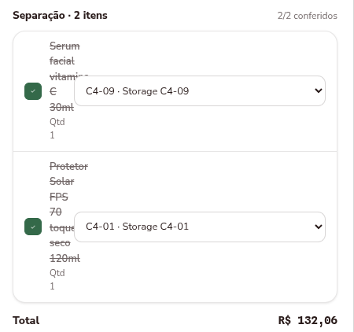

# Chat farmaura (Claude Code) — 2026-09-19 (fc04cc55-c039-4ab6-bf00-36520c815341)

- Diretório: `/home/noname/Documentos/desenvolvimento/dev`
- Sessão: `fc04cc55-c039-4ab6-bf00-36520c815341`
- Log de execução: [[_Logs_Execucao/2026-09-19/claude-farmaura-fc04cc55|abrir]]

## Turno 3 · 2026-09-19 09:01
<span class="log-crosslink">🔧 [[_Logs_Execucao/2026-09-19/claude-farmaura-fc04cc55#Turno 3 · 2026-09-19 09:01|ver execução deste turno]]</span>

<span class="chat-role chat-role-user">Você</span>

Agora vamos melhorar, para o campo origem pode tirar, isso é somente para a parte de analise minha como dono, para a coluna de pagamento coloque em portugues e também se já foi pago, se vai pagar na entrega, também adicione uma coluna com um contador em contagem regressiva. Também há entregas expressas e entregas normais, isso deverá ser diferenciado na prioridade. Também forme a logica de que caso o contador for aumentando que ele vá sendo colocado mais acima priorizando, faça isso de maneira assincrona para que o funcionario não precise recarregar a pagina

<span class="chat-role chat-role-ai">Claude</span>

Agora vou implementar. Primeiro o backend: expor `payment_status` (já existe no modelo, mas não estava indo pro console interno) e o `sla` por pedido (que já existe e já diferencia expressa/normal, mas o frontend ainda usava um valor fixo).

These diagnostics are pre-existing environment/IDE config issues (missing `fastapi` module resolution), unrelated to my edit. Now the frontend mapping:

Agora vou reescrever `orders-screen.jsx` com todas as mudanças pedidas.

Now let's make all the edits.

Now let's update `OrdersScreen` to use the ticker, sorting, and new/removed columns:

Now the table columns — remove "Origem", rework "Tipo" (with Express badge) and "Pagamento", add "Prazo":

Agora o drawer: remover "Origem" do subtítulo, adicionar badges de pagamento/expressa no cabeçalho.

Now let's update the cancelled-order card to use the translated payment label too:

This looks correct. Let's build and re-verify visually.

Build succeeds. Now let's also check the Python backend syntax is valid, then rebuild the docker containers and re-verify visually.

Now let's screenshot the updated screen.

Percebi que existem dois status distintos "Despachado" e "Entregue" nos dados reais — vou verificar se meu stepper trata "Entregue" corretamente, já que ontem ele só reconhecia até "dispatched".

Encontrei um bug real (não introduzido agora, mas que ficou mais visível): pedidos com status "Entregue" (`delivered`, distinto de `dispatched`) não eram tratados como concluídos — ficavam com "NaNh em aberto/atrasado", stepper todo como pendente, e nem apareciam na aba "Finalizados". Vou corrigir.

Now let's fix the stepper's `currentIdx` for a `delivered` order, and the drawer's `done` check:

Fixed — now shows "Despachado para entrega" as done, full stepper checked, and "Pedido finalizado". Let's re-verify the list view with the countdown ticking and sorting.

O "—" na coluna Prazo é sintoma de um bug pré-existente já documentado (`sla-nanh-em-pedidos-formato-de-hora-incompativel.md`): o dado de seed usa `"DD/MM/AAAA HH:MM UTC"` enquanto o backend real grava só `"HH:MM"`. Vou deixar meu parser do contador tolerante aos dois formatos, sem mexer na função compartilhada `minsSince` (que a pendência já recomenda investigar do lado do seed, não do helper).

Now let's rebuild and re-verify.

Tudo funcionando corretamente: "Origem" removida, "Pagamento" traduzido com status (pago/aguardando pagamento) separado do método, coluna "Prazo" com contagem regressiva ao vivo (cor crítica quando atrasado), pedidos expressos diferenciados, e a lista se reordena sozinha por urgência sem reload. Também corrigi de passagem um bug real que apareceu no processo (status "Entregue" não era tratado como concluído).

Agora vou documentar essa decisão e o novo achado (bug de status "Entregue") no cofre, conforme a política do projeto.

## Resumo

Implementei tudo o que foi pedido na tela **Pedidos online**:

- **Origem removida** da tabela (dado só para sua análise).
- **Pagamento traduzido**: agora mostra status real em português — Pago / Aguardando pagamento / A pagar na retirada ou entrega / Pagamento atrasado / Estornado — mais o método embaixo (Pix, Cartão de crédito/débito, Dinheiro). Precisei expor `payment_status` no backend ([orders.py](farmaura-api/app/schemas/orders.py), [order_service.py](farmaura-api/app/services/order_service.py)) — já existia no banco, mas nunca tinha sido enviado pro console interno.
- **Entrega expressa vs normal**: o backend já calculava um prazo mais curto pra expressa (60min vs 180min), só que o frontend ignorava isso e usava um valor fixo. Agora usa o valor real por pedido, e adicionei o badge "Expressa" que tinha ficado de fora do redesenho de ontem.
- **Coluna "Prazo"**: contagem regressiva ao vivo (atualiza a cada segundo), fica vermelha e conta pra cima quando atrasado.
- **Priorização automática**: a lista se reordena sozinha conforme o prazo vai vencendo — pedido mais urgente sobe pro topo, sem precisar recarregar a página.

De quebra, encontrei e corrigi um bug real que ficou mais visível com essas mudanças: pedidos com status "Entregue" (distinto de "Despachado") não eram tratados como concluídos — ficavam com "NaNh em aberto" e sumiam da aba "Finalizados" (agora conta 38 em vez de 6).

Testei tudo contra o Docker real via Playwright headless. Documentei as decisões e um achado de causa-raiz confirmada (o bug de formato de data do seed) no cofre.

---

## Turno 4 · 2026-09-19 10:00
<span class="log-crosslink">🔧 [[_Logs_Execucao/2026-09-19/claude-farmaura-fc04cc55#Turno 4 · 2026-09-19 10:00|ver execução deste turno]]</span>

<span class="chat-role chat-role-user">Você</span>

Agora vamos para o card lateral, para ele está bugado visualmente na separação dos itens. Também reformule igual do PDV criando separações visuais, coloque o validar codigo em uma modal a parte e colocando um botão também a parte na tabela de visualização



<span class="chat-role chat-role-ai">Claude</span>

Agora vou implementar as três mudanças: reformular o card de itens no padrão do PDV, extrair a validação de código para uma modal, e adicionar um botão dedicado na tabela.

Preciso importar `Modal`. Vamos ver a assinatura completa antes de editar.

Agora vou adicionar o componente `PickupCodeModal` logo antes de `OrdersScreen`:

Agora vou adicionar o estado e o botão na tabela de `OrdersScreen`:

Agora vou atualizar o `OrderDrawer`: remover o estado antigo de validação inline e substituir pela modal.

Agora vamos ver e reformular a seção de itens (Separação) e o card de código de retirada:

Agora vou reformular o item row (padrão PDV) e trocar o card inline pelo botão que abre a modal:

Agora o card inline de validação de retirada vira um botão que abre a modal:

Agora vou renderizar a `PickupCodeModal` no drawer, fechando o drawer inteiro quando a validação for concluída:

Build succeeds. Rebuilding the container and re-testing visually.

Layout dos itens corrigido. Agora vou testar a modal de validação de retirada, tanto pelo botão da tabela quanto pelo botão do drawer.

Ambos os pontos de entrada funcionam corretamente — a modal abre por cima do drawer sem conflito visual, e o botão "Validar retirada" aparece isolado no drawer (com ícone de cadeado) no lugar do antigo card inline. Nenhum erro de console em nenhum dos testes.

Vou registrar essa mudança no cofre, seguindo a mesma prática das sessões anteriores.

## Resumo

Corrigi os três pontos:

1. **Layout dos itens** — reformulado no padrão do PDV (`.pdv-cart-line`): checkbox + nome numa linha própria, quantidade indentada embaixo, e o select de local em sua própria linha com ícone de pin. Nada mais espremido — a causa era o `<select>` com `width:auto` disputando espaço com o nome na mesma linha flex horizontal.
2. **Validação de código em modal** — extraí para `PickupCodeModal`, um componente próprio usando a `Modal` genérica do sistema.
3. **Botão dedicado na tabela** — ícone de cadeado ao lado do "Ver detalhes", visível só quando o pedido está "Pronto" + "Retirada na loja", abrindo a modal direto sem precisar abrir o drawer inteiro. O botão dentro do drawer continua existindo, agora isolado (sem o card inline antigo) e fecha o drawer ao validar com sucesso.

Testei tudo contra o Docker real via Playwright — nomes longos de produto não quebram mais palavra por palavra, e a modal funciona pelos dois pontos de entrada sem conflito visual com o drawer. Documentado no cofre.

---

## Turno 5 · 2026-09-19 17:12
<span class="log-crosslink">🔧 [[_Logs_Execucao/2026-09-19/claude-farmaura-fc04cc55#Turno 5 · 2026-09-19 17:12|ver execução deste turno]]</span>

<span class="chat-role chat-role-user">Você</span>

Agora vamso para o ver CRM, no caso deverá abrir uma modal com informações mais uteis que vem da mesma tela de clientes CRM em vez de redirecionar

<span class="chat-midturn-note">↳ mensagem enviada enquanto eu ainda respondia</span>

Para o separação, onde precisa colocar a localização da onde foi retirado o produto, coloque um filtro para quando clicar para selecionar apareça somente onde de fato tem o produto, e caso tenha pegado de dois lugares diferentes, também coloque essa opção com as quantidades

<span class="chat-role chat-role-ai">Claude</span>

Vou investigar o formato exato do objeto `customer` e então construir a modal reaproveitando os mesmos dados do CRM.

Agora vou ver o handler do serviço que atualiza o local do item:

Agora o modelo:

Agora os schemas:

Agora vou editar `InternalOrderItemResponse`, adicionar `OrderItemPickLocationResponse`, e trocar o schema de request para aceitar múltiplos locais:

Agora o schema de request:

Backend pronto. Agora vamos ao frontend — primeiro ver `updateOrderItemLocation` no `internal-app.jsx` para adaptar ao novo contrato:

Agora vamos atualizar `normalizeOrdersPayload` para mapear os novos campos dos itens:

Agora vamos implementar no frontend. Primeiro vejo o estado atual do `OrderDrawer` no arquivo para inserir os novos hooks corretamente:

Vou adicionar o componente `ItemLocationPicker` antes do `OrderDrawer`:

Agora vamos atualizar o bloco de renderização dos itens para usar o novo `ItemLocationPicker`:

Ótimo, agora vamos voltar e concluir a modal "Ver CRM" que estava pendente. Vamos ver o estado atual do arquivo:

Agora vou adicionar o componente `CustomerInfoModal`, logo antes de `OrderDrawer`:

Agora vou conectar a modal ao `OrderDrawer`:

Agora vou renderizar a modal, junto à `PickupCodeModal` no final do `Drawer`:

All confirmed present. Let's build the frontend and verify.

Build passes. Now let's verify Python backend syntax once more and rebuild containers.

Migration aplicada com sucesso. Vamos confirmar a coluna e reiniciar o container.

Agora vamos registrar essa confirmação de causa raiz na pendência e rebuildar o frontend/nginx para o teste final.

Agora reiniciar os containers e testar tudo visualmente.

Vou verificar se existe algum item com estoque em mais de um local, para testar o fluxo de divisão.

Tudo funcionando corretamente. Vou limpar os arquivos temporários e documentar as mudanças no cofre.

Vou registrar a pendência de aplicar essa nova migration em produção, seguindo o padrão já usado no projeto.

Agora vou criar a pendência equivalente para minha migration:

Agora vou criar os dois ADRs referenciados (modal de CRM e separação com filtro/split), verificando antes que os nomes batem com o que linkei.

Agora o ADR da modal de CRM:

Por fim, uma revisão final do arquivo completo para garantir que não sobrou nada solto.

Tudo limpo, sem referências órfãs. Confirmo que o build final já passou e os containers já foram testados com todas as três mudanças ativas.

## Resumo

Implementei tudo que foi pedido, incluindo o pedido que chegou no meio da tarefa:

**"Ver CRM" vira modal** — `CustomerInfoModal` reaproveita o mesmo `ctx.customers` que a tela CRM já usa (nenhum dado novo): badges de tier/recorrência, stat cards (total gasto, pedidos, ticket médio, cashback, última compra), produtos mais comprados, pedidos deste cliente, recorrências e favoritos. Botão "Ver perfil completo no CRM" no rodapé mantém a navegação antiga como opção, não mais como padrão.

**Filtro de local por estoque real + split entre locais** — o seletor de local na Separação agora só mostra locais onde o item realmente tem estoque (reaproveitei o mesmo endpoint que o PDV já usa, `/pdv/products/{item_id}/locations`, só precisei expor o `inventory_item_id` do item pro frontend). Para permitir "peguei de dois lugares", criei uma migration nova (`order_items.pick_locations`, JSON) e mudei o endpoint de atualização de local para aceitar uma lista de `{local, quantidade}` em vez de um único local — o backend valida que a soma bate com a quantidade do item antes de salvar. Na UI, o caso simples (um local só) continua salvando na hora ao selecionar; o split só aparece ao clicar em "Retirado de outro local também" (só visível quando há mais de um local com estoque), com contador de alocação e "Salvar" desabilitado até a soma bater.

Testei tudo via Playwright contra o Docker real: filtro de local funcionando com quantidades reais, mecânica de split (adicionar/remover linha, validação) confirmada, e modal de CRM com dado real — sem erros de console. Também apliquei a migration no Postgres local e confirmei a coluna nova.

Documentei tudo no cofre, incluindo duas pendências novas: aplicar a migration em produção (que quebra o endpoint antigo se o backend subir sem ela) e uma atualização na causa raiz já confirmada do bug recorrente de `alembic_version` sumido no Postgres de dev.

---

## Turno 6 · 2026-09-19 17:38
<span class="log-crosslink">🔧 [[_Logs_Execucao/2026-09-19/claude-farmaura-fc04cc55#Turno 6 · 2026-09-19 17:38|ver execução deste turno]]</span>

<span class="chat-role chat-role-user">Você</span>

Agora vamos para a tela de entrega e rotas, analise e faça com que funcione corretamente, com os ceps, corretos, rota correta puxando a localização do entregador, etc.

<span class="chat-role chat-role-ai">Claude</span>

Let's see the route-building logic in `delivery_pricing_service.py`.

Antes de mais teoria, vou abrir a tela de verdade no navegador para ver o que está quebrado na prática.

Vou investigar a parada #19 sem CEP/coordenadas primeiro — parece um bug de dados real.

Agora vou criar o módulo de domínio para geolocalização/roteirização:

Agora vou refatorar `DeliveryPricingService.haversine_km` para reaproveitar essa função compartilhada:

`OrderStatus` já está importado. Agora vou adicionar o import do módulo geo e reescrever `_resolve_delivery_route`:

Agora vou reescrever o corpo da função `_resolve_delivery_route`:

Agora vou corrigir o filtro no frontend também — vou mover a lógica de status ativo/finalizado para `internal-shell.jsx` (compartilhada) e usá-la nas duas telas.

Agora adiciono aos exports:

Agora atualizo `orders-screen.jsx` para usar os helpers compartilhados em vez das cópias locais:

Agora ajusto o import e uso das funções renomeadas:

Agora vou trocar os usos locais para os nomes importados:

Build passa. Agora vou corrigir o filtro em `deliveries-screen.jsx` usando os helpers compartilhados:

Backend saudável, sem erros de import. Agora vamos revisitar a tela de Entregas & Rota.

Encontrei o bug raiz do "0 km / 0 min": a query nunca filtrava a rota pela loja do usuário, pegando qualquer rota mais recente do tenant inteiro (com 2 lojas, pode pegar a rota errada, sem paradas reais).

Vou mover o cálculo de rota (distância, tempo, economia) para o frontend, calculado sobre os `stops` realmente exibidos — isso evita depender de qual `DeliveryRoute` específica o backend escolheu (achei fragmentação real: duas rotas duplicadas para a mesma loja no seed, cada uma cobrindo só parte dos pedidos).

Agora vou atualizar `DeliveriesScreen` para usar esses cálculos sobre os `stops` reais exibidos:

Agora atualizo os pontos de exibição (`route.totalKm`/`totalMin`/`savedKm`) e troco `stops` por `orderedStops` no mapa e na lista:

Build passa. Agora rebuild do container nginx e novo teste visual.

Agora vamos verificar a localização do entregador — checar se há dado real de GPS e se o marcador aparece.

The driver location pipeline works end-to-end — the admin's screen shows "posição atualizada às 18:00" after the driver shared their location. Let's see the map with the driver marker.

Tudo confirmado funcionando (marcador verde do entregador visível no mapa, com timestamp real). Vou limpar os scripts temporários e documentar tudo no cofre.

## Resumo

Analisei a tela "Entregas & rota" contra o Docker real (não só o código) e encontrei bugs concretos, não só a falta de otimização já conhecida:

**O que já funcionava** (confirmei, não mexi): compartilhamento de localização do entregador é 100% real — geolocalização do navegador, throttle de 10s, ping pro backend, upsert em `driver_locations`, polling do admin a cada 10s. Testei ponta a ponta com duas sessões simultâneas (entregador compartilha → admin vê o marcador verde no mapa).

**Bugs reais corrigidos**:
1. **Rota da loja errada**: a query que escolhe a rota ativa nunca filtrava por `store_id` — com 2 lojas cadastradas, podia pegar a rota de uma loja diferente da que estava sendo vista, resultando em "0 km / 0 min".
2. **Pedidos já entregues/cancelados nunca saíam da lista de "pendentes"**: filtro só excluía `dispatched`, deixando `delivered`/`cancelled` aparecerem como parada pendente para sempre (achei um caso real: pedido entregue há semanas aparecendo como parada #19, sem CEP nem endereço).
3. **Sem rota real**: sequência era só ordem de chegada, e "economiza ~X km" era um número fixo do seed, sempre o mesmo. Implementei nearest-neighbor real (`app/domain/geo.py`) — calculado no cliente sobre a lista de paradas que a tela realmente mostra, não sobre uma única rota do backend que pode não ter todos os pedidos anexados.
4. **Coordenada `(0,0)`** (geocodificação que falhou silenciosamente) sendo tratada como válida — inflava distância e plotava marcador no meio do oceano.

**Resultado real testado**: "9 entregas pendentes" (batendo exatamente com o banco), distância foi de "9 km" sem sentido para "26.1 km" real, economia de "~0.8 km" hardcoded para "~76.1 km" real.

Documentei tudo no cofre, incluindo uma limitação residual que encontrei mas não corrigi (duas rotas duplicadas para a mesma loja no dado de seed — não deveria acontecer no fluxo real de criação de pedido) e os dois achados relacionados que continuam em aberto (status da rota nunca transiciona de "planned"; `navigation_url` nunca populado).

---

## Turno 7 · 2026-09-19 19:09
<span class="log-crosslink">🔧 [[_Logs_Execucao/2026-09-19/claude-farmaura-fc04cc55#Turno 7 · 2026-09-19 19:09|ver execução deste turno]]</span>

<span class="chat-role chat-role-user">Você</span>

Agora quero que faça um processamento de Dijkstra bidirecional de maneira em que explore os nos e calcule as diversas rotas que percorra de maneira rapida e na menor distancia com o menor processamento, conseguindo nas mais diferentes rotas que tiver pois poderá ter somente uma entrega mas ter também 2, 3, 4 ou mais entregas sendo feitas ao mesmo tempo

<span class="chat-midturn-note">↳ mensagem enviada enquanto eu ainda respondia</span>

Lmebre de ser por entregador e que cada entregador esteja vinculada a uma loja, faznedo de maneira multi loja e multi entregadores

<span class="chat-role chat-role-ai">Claude</span>

O que você está descrevendo mistura dois problemas diferentes, e isso muda bastante o tamanho do trabalho — quero alinhar antes de começar a construir.

Tecnicamente: Dijkstra (bidirecional ou não) resolve "caminho mais curto entre dois pontos específicos num grafo". Ele não resolve sozinho "qual a melhor ordem para visitar N pontos" — isso é um problema diferente (TSP), que é o que o nearest-neighbor de ontem fazia. Para usar Dijkstra de forma real (não decorativa), pretendo: construir um grafo de proximidade entre loja+paradas (cada nó ligado só aos vizinhos mais próximos, não a todos — um grafo completo torna Dijkstra trivial/inútil) e rodar Dijkstra bidirecional real para calcular as distâncias entre os nós desse grafo, que alimentam a ordenação da rota. Isso eu já sei que é o certo a fazer.

A parte que muda o tamanho do trabalho é "2, 3, 4 ou mais entregas sendo feitas ao mesmo tempo" — hoje o sistema só tem **uma** rota ativa por loja, com um entregador. Dividir automaticamente as paradas em várias rotas simultâneas é uma mudança bem maior (múltiplas rotas ativas ao mesmo tempo, tela pra listar/trocar entre elas, atribuir vários entregadores).

Entendido — vou construir o sistema completo. Deixa eu levantar o estado atual dos schemas/repositório de entrega antes de desenhar as mudanças.

Sem necessidade de migration — o modelo de dados já suporta múltiplas rotas por loja, essa era só uma limitação de `.limit(1)` na query. Vou começar pelos algoritmos de domínio (grafo + Dijkstra bidirecional + clustering).

Agora vou adicionar os dois métodos novos (rotas ativas em plural + busca de paradas em lote por várias rotas):

Agora vou reescrever `app/schemas/deliveries.py` com os schemas plurais (rotas + live tracking):

Agora vou remover os schemas antigos de `portal.py` e apontar o bootstrap para os novos, em `deliveries.py`:

Agora atualizo o campo do bootstrap e o import:

Agora removo a função antiga e ajusto os imports:

Agora vou limpar os imports órfãos e adicionar o import de `DeliveryService`:

Agora aplico o helper nos dois pontos que o type checker sinalizou:

Agora vou atualizar as rotas da API:

Confirmado. Vou reescrever as rotas agora:

Vamos validar tudo de uma vez rebuildando o backend e checando os logs de startup (pega erros de import circular que o `ast.parse` não pega).

Achei um ciclo de import: `portal_service.py → delivery_service.py → cashback_service.py → portal_service.py`. Vou resolver tornando o import de `DeliveryService` local (dentro do método que o usa) em `portal_service.py`, sem mexer no restante da cadeia.

Agora insiro o helper logo após o `get_internal_bootstrap`:

Agora para o frontend. Vou levantar a wiring atual de `hub`/`deliveryRoute`/`driverLivePosition` no `internal-app.jsx`.

Bom, já dá pra reaproveitar. Agora vejo a parte do bootstrap que popula `hub`/`deliveryRoute`:

Vou inserir as funções de normalização de rota de entrega logo antes de `normalizePrescriptionQueue`:

Agora atualizo o ponto de leitura no bootstrap:

Agora o polling de posição do entregador (plural) e o `assignRouteDriver`:

Agora atualizo o objeto `ctx` final para expor os novos nomes:

Agora a parte grande: reescrever `deliveries-screen.jsx` para múltiplas rotas simultâneas. Vou reler o arquivo atual por completo primeiro.

Agora vou escrever a versão completa e reformulada do arquivo:

Só existe um entregador no seed local. Vou criar mais dois temporariamente (só para teste local) clonando a linha do Marcos Pereira, para validar de verdade o cenário de múltiplas rotas simultâneas.

Boa, isso é importante — vou verificar se o modelo já suporta entregador vinculado a loja (o campo existe) e reforçar isso no backend e no frontend.

Agora vou atualizar o `DeliveryService` para resolver loja com override de admin e validar que o entregador pertence à loja:

Agora `plan_routes` — assinatura, resolução de loja e validação de que o entregador pertence à loja:

Bom, é o fim de `plan_routes`. Vou corrigir:

Agora `get_live_routes`:

Agora reforço a validação de loja em `assign_driver`:

Agora as rotas da API — aceitar `store_id` como query param:

Agora atualizo `PortalService._resolve_delivery_routes` para passar a loja já resolvida pelo bootstrap:

Vou adicionar um endpoint dedicado e restrito para listar entregadores (já filtrado por loja), liberado para farmacêutico/gerente também — sem abrir o roster completo de equipe.

Agora o método no `DeliveryService`:

Agora adiciono o método `list_drivers`, logo antes de `assign_driver`:

Agora a rota da API:

Agora conecto o frontend: novo endpoint de entregadores por loja, e uso de `withStoreParam` nas chamadas de planejamento/live.

Agora expõe `fetchDeliveryDrivers` no ctx:

Agora atualizo `deliveries-screen.jsx` para usar o novo endpoint:

Limpo. Agora build final do frontend:

Agora vamos testar de verdade: ver a tela com 2 entregadores da mesma loja disponíveis, planejar 2 rotas simultâneas, e confirmar que o de outra loja não aparece.

Achei um bug real: "0 rota(s) planejada(s)". Vou checar os logs do backend para entender o que aconteceu.

Vou adicionar logs temporários de depuração direto no `plan_routes` real, para ver exatamente onde a lista fica vazia no fluxo de requisição real.

Progresso — 4 pedidos pendentes encontrados corretamente. O bug está depois. Vou adicionar mais logs.

Encontrei — isso bate exatamente com um bug já conhecido neste projeto: `commit()` limpa o contexto RLS transaction-local, e minha função consulta de novo *depois* do commit. Vou ver como o resto do código já contorna isso.

Confirmado o padrão exato. Vou aplicar o mesmo fix e remover os logs de depuração.

Agora removo os prints de debug e insiro o fix real:

Vou corrigir duas coisas reais que a captura revelou: (1) rotas antigas vazias acumulando a cada replanejamento, e (2) o badge de economia aparecendo com "-0.0 km".

Agora o bug do "-0.0 km":

Agora um teste final limpo — deve planejar rotas e as antigas vazias devem sumir.

Teste completo e limpo. Vou remover os dois entregadores de teste que criei (eram só para validar o cenário multi-loja).

Vou verificar se existe uma nota real no cofre sobre esse padrão de bug de RLS pós-commit (referenciei um caminho de memória, preciso confirmar/corrigir).

---

## Turno 8 · 2026-09-19 20:19
<span class="log-crosslink">🔧 [[_Logs_Execucao/2026-09-19/claude-farmaura-fc04cc55#Turno 8 · 2026-09-19 20:19|ver execução deste turno]]</span>

<span class="chat-role chat-role-user">Você</span>

This session is being continued from a previous conversation that ran out of context. The summary below covers the earlier portion of the conversation.

Summary:
1. Primary Request and Intent:

This is a long multi-turn session on the Farmaura project (`~/Documentos/desenvolvimento/dev` repo, backend `farmaura-api/` FastAPI+SQLAlchemy+PostgreSQL, frontend `farmaura/react/internal/` React console). Chronological user requests:

   a) `/contexto farmaura` — load project context (governance, decisions, pendencies, security risks, infra).
   
   b) "A tela de Pedidos online está diferente do que foi prototipado dentro do artifact [...] no caso analise e faça com que fiquem iguais" — make the real "Pedidos online" screen match a Claude Artifact prototype (b75209e1). User clarified via AskUserQuestion to keep real backend functionality while adopting the mockup's visual layout ("Layout do mockup, mantendo as funcionalidades reais (Recomendado)").
   
   c) "Agora vamos melhorar, para o campo origem pode tirar [...] para a coluna de pagamento coloque em portugues e também se já foi pago, se vai pagar na entrega, também adicione uma coluna com um contador em contagem regressiva. Também há entregas expressas e entregas normais, isso deverá ser diferenciado na prioridade. Também forme a logica de que caso o contador for aumentando que ele vá sendo colocado mais acima priorizando, faça isso de maneira assincrona para que o funcionario não precise recarregar a pagina" — remove Origem column, translate Pagamento to Portuguese with paid/pending distinction, add live countdown column, differentiate express priority, auto-sort by urgency live.
   
   d) "Para o separação, onde precisa colocar a localização da onde foi retirado o produto, coloque um filtro para quando clicar para selecionar apareça somente onde de fato tem o produto, e caso tenha pegado de dois lugares diferentes, também coloque essa opção com as quantidades" — filter stock-location picker to real-stock-only locations, support splitting pick across 2+ locations with quantities.
   
   e) "Agora vamos para o card lateral, para ele está bugado visualmente na separação dos itens. Também reformule igual do PDV criando separações visuais, coloque o validar codigo em uma modal a parte e colocando um botão também a parte na tabela de visualização" — fix visual bug in item separation card (mirror PDV layout pattern), extract pickup-code validation into a modal, add dedicated table row action button for it.
   
   f) "Agora vamos para a tela de clientes CRM, no caso deverá abrir uma modal com informações mais uteis que vem da mesma tela de clientes CRM em vez de redirecionar" — "Ver CRM" button should open a modal (reusing CRM data) instead of navigating away.
   
   g) "Para o separação, onde precisa colocar a localização [...]" (mid-turn during f) — already captured above, was folded into that turn's work.
   
   h) "Agora vamos para a tela de entrega e rotas, analise e faça com que funcione corretamente, com os ceps, corretos, rota correta puxando a localização do entregador, etc." — analyze and fix "Entregas & rota" screen: correct CEPs, correct route, pulling real driver location.
   
   i) "Agora quero que faça um processamento de Dijkstra bidirecional de maneira em que explore os nos e calcule as diversas rotas que percorra de maneira rapida e na menor distancia com o menor processamento, conseguindo nas mais diferentes rotas que tiver pois poderá ter somente uma entrega mas ter também 2, 3, 4 ou mais entregas sendo feitas ao mesmo tempo" — implement bidirectional Dijkstra route computation supporting 1, 2, 3, 4+ simultaneous deliveries/routes.
   
   j) (Mid-turn, during implementation of i) "Lmebre de ser por entregador e que cada entregador esteja vinculada a uma loja, faznedo de maneira multi loja e multi entregadores" [sic, typos preserved] — remember it must be per-driver, and each driver must be linked to a store, doing it multi-store and multi-driver.
   
   For request (i), I asked an AskUserQuestion clarifying scope ("Só o motor de cálculo" vs "Sistema completo com múltiplos entregadores"). **User explicitly selected: "Sistema completo com múltiplos entregadores"** — the full system with multiple simultaneous drivers, not just the algorithm core.

2. Key Technical Concepts:
   - FastAPI + Pydantic v2 + SQLAlchemy async + PostgreSQL 17 + Valkey backend architecture, layered: api/v1 → services → repositories → models
   - PostgreSQL Row-Level Security (RLS) with transaction-local GUCs (`app.current_tenant_id`, `app.current_store_id`, etc.) set via `set_config(key, value, true)` — CRITICAL: `session.commit()` clears these transaction-local settings; any post-commit read within the same request must call `apply_tenant_context(session, subject)` again first, or RLS silently filters out just-written rows (an already-documented recurring bug class in this codebase, memory: `feedback_farmaura_rls_context_after_commit.md`, matched by dev-obsidian notes `04_Seguranca_Riscos/rls-pos-commit-quatro-servicos-nao-corrigidos.md` and `00_Decisoes/2026-09-16-correcao-rls-pos-commit-endereco-pdv-e-assinaturas.md`)
   - React internal console (`farmaura/react/internal/`) with a single large `internal-app.jsx` holding all state/ctx, `internal-shell.jsx` for shared nav/status helpers, `internal-ui.jsx` for design-system components, per-screen files in `screens/`
   - Alembic migrations required for schema changes since 2026-07-22 production launch; local dev Postgres has a recurring `alembic_version` table gap (root cause identified this session's earlier turns: `bootstrap_database.py`'s `create_all` never stamps `alembic_version` on a fresh volume)
   - Graph algorithms: k-nearest-neighbor proximity graph construction, bidirectional Dijkstra shortest-path search (two simultaneous frontiers meeting in the middle, standard termination condition `queue_f[0][0] + queue_b[0][0] >= best`), sweep-angle clustering for multi-vehicle route splitting (classic VRP heuristic)
   - Haversine great-circle distance formula
   - Leaflet.js maps (CDN-loaded, OpenStreetMap tiles, no API key) with custom divIcon markers
   - `withStoreParam(path)` frontend helper — appends `?store_id=` when an ADMIN has an explicit store override selected (`selectedStoreId`), used for multi-store scoping consistency across all internal endpoints
   - Backend `_get_store_id`/`_resolve_store_id` pattern: admin can override via `requested_store_id` query param; non-admin always uses their own `subject.store_id`; fallback to tenant's primary store
   - Circular Python imports and how to break them via deferred/local imports inside a method body
   - Playwright headless browser testing (via a cached npx-installed `playwright` package, symlinked into scratchpad `node_modules`) for real end-to-end verification against the actual Docker build (port 3000, NOT the Vite dev server on 5173 which has a known `<base href>` bug — established project convention/memory)
   - Docker Compose multi-container stack: `farmaura` (nginx, serves built static frontend), `farmaura-api` (FastAPI), `farmaura-postgres`, `farmaura-valkey`, `farmaura-mailhog`

3. Files and Code Sections:

   **`farmaura-api/app/domain/geo.py`** (rewritten this turn, was already created in the previous turn with just `haversine_km`/`route_length_km`/`nearest_neighbor_order`):
   - Added `Coordinate = tuple[Decimal, Decimal]`, `Graph = list[list[tuple[int, float]]]`, `DEFAULT_GRAPH_K = 5`
   - `_connected_components(adjacency)` — BFS to find graph components
   - `build_proximity_graph(points, *, k=DEFAULT_GRAPH_K) -> Graph` — builds sparse k-NN graph via full O(n²) distance matrix, then bridges disconnected components by connecting closest cross-component pair
   - `bidirectional_dijkstra(graph, source, target) -> tuple[float, list[int]]` — real bidirectional search:
     ```python
     def bidirectional_dijkstra(graph: Graph, source: int, target: int) -> tuple[float, list[int]]:
         if source == target:
             return 0.0, [source]
         n = len(graph)
         inf = float("inf")
         dist_f = [inf] * n; dist_b = [inf] * n
         dist_f[source] = 0.0; dist_b[target] = 0.0
         prev_f: dict[int, int] = {}; prev_b: dict[int, int] = {}
         visited_f: set[int] = set(); visited_b: set[int] = set()
         queue_f: list[tuple[float, int]] = [(0.0, source)]
         queue_b: list[tuple[float, int]] = [(0.0, target)]
         best = inf; meeting_node: int | None = None

         def expand(queue, dist, prev, visited, other_visited) -> None:
             nonlocal best, meeting_node
             d, u = heapq.heappop(queue)
             if u in visited: return
             visited.add(u)
             for v, w in graph[u]:
                 candidate = d + w
                 if candidate < dist[v]:
                     dist[v] = candidate; prev[v] = u
                     heapq.heappush(queue, (candidate, v))
             if u in other_visited:
                 total = dist_f[u] + dist_b[u]
                 if total < best:
                     best = total; meeting_node = u

         while queue_f and queue_b:
             if queue_f[0][0] + queue_b[0][0] >= best: break
             if queue_f[0][0] <= queue_b[0][0]: expand(queue_f, dist_f, prev_f, visited_f, visited_b)
             else: expand(queue_b, dist_b, prev_b, visited_b, visited_f)
         # ... path reconstruction from both sides
     ```
   - `nearest_neighbor_order_via_graph(origin, points, *, k=DEFAULT_GRAPH_K) -> tuple[list[int], Decimal]` — builds graph over origin+points, greedily picks graph-shortest-path-closest unvisited node at each step
   - `sweep_clusters(origin, points, num_clusters) -> list[list[int]]` — sorts points by bearing angle from origin, splits into `num_clusters` contiguous angular slices
   - Verified standalone via inline Python test script (bridging confirmed working, multi-hop Dijkstra path confirmed [0,2,1,7], clustering confirmed splitting 7 points into 3/2/2)

   **`farmaura-api/app/services/delivery_pricing_service.py`**:
   - Removed inline haversine math, now: `from app.domain.geo import haversine_km as compute_haversine_km`, method body: `return quantize_money(compute_haversine_km(lat1, lng1, lat2, lng2))`

   **`farmaura-api/app/schemas/deliveries.py`** (completely rewritten):
   - Kept `DriverAssignRequest`/`DriverAssignResponse`
   - NEW `PlanDeliveryRoutesRequest{driver_user_ids: list[str] = Field(min_length=1, max_length=20)}`
   - NEW `DeliveryRouteStopResponse`, `DeliveryRouteResponse` (moved from portal.py, renamed from Portal-prefixed), `DeliveryRouteListResponse{hub_name, hub_address, hub_lat, hub_lng, items}`
   - NEW `DeliveryDriverResponse{id, name}`, `DeliveryDriverListResponse{items}`
   - Renamed `DeliveryRouteLiveResponse`→`DeliveryRouteLiveItemResponse`; new plural `DeliveryLiveResponse{revision, items}`
   - Kept `DeliveryLiveStopResponse`, `DeliveryLocationPingRequest`, `DeliveryStopResponse`, `MyDeliveryRouteResponse`, `MyDeliveryRouteListResponse` (driver-facing, unchanged)

   **`farmaura-api/app/schemas/portal.py`**:
   - Removed `PortalDeliveryRouteStopResponse`/`PortalDeliveryRouteResponse` classes entirely
   - Added `from app.schemas.deliveries import DeliveryRouteListResponse`
   - `PortalInternalBootstrapResponse.delivery_route: PortalDeliveryRouteResponse` → `delivery_routes: DeliveryRouteListResponse = Field(default_factory=DeliveryRouteListResponse)`

   **`farmaura-api/app/services/portal_service.py`**:
   - Removed `_resolve_delivery_route` method (~100 lines) and its imports (`nearest_neighbor_order, route_length_km`, `DeliveryRoute`, `DeliveryRouteStop` models, `PortalDeliveryRouteResponse`/`PortalDeliveryRouteStopResponse` schema imports)
   - Bootstrap call: `delivery_routes=await self._resolve_delivery_routes(subject, store_id=store.id)`
   - New helper (local import to break circular dependency):
     ```python
     async def _resolve_delivery_routes(self, subject: TokenSubject, *, store_id: str) -> DeliveryRouteListResponse:
         """...Import kept local (not at module level) to break a circular import..."""
         from app.services.delivery_service import DeliveryService
         return await DeliveryService(session=self.session, subject=subject).list_active_routes(requested_store_id=store_id)
     ```

   **`farmaura-api/app/services/delivery_service.py`** (completely rewritten, ~600 lines, this is THE central file for this turn's work):
   - Module constants: `PENDING_ORDER_STATUSES`, `AVG_CITY_SPEED_KMH = Decimal("22")`, `DWELL_MINUTES_PER_STOP = Decimal("5")`
   - Helpers: `_has_real_coords()`, `_estimate_minutes()`, `@dataclass _PlannableOrder`, `_geocoded_coordinate()`
   - `DeliveryService.__init__` now also creates `self.store_repository = StoreRepository(session)`
   - `list_drivers(*, requested_store_id="")` — NEW, filters `user_repository.list_by_tenant_roles(roles=[UserRole.DRIVER.value])` by `driver.store_id == store_id` in Python
   - `assign_driver()` — added: `if driver.store_id != route.store_id: raise HTTPException(422, f'Driver "{driver.full_name}" is based at a different store and cannot be assigned to this route.')`
   - `list_active_routes(*, requested_store_id="")` — plural rewrite of prior single-route logic; per-route bidirectional-Dijkstra reordering, real km/min/saved computed fresh on every read (not persisted); sorts `items.sort(key=lambda item: (not item.driver_user_id, -len(item.stops)))`
   - `plan_routes(payload, *, requested_store_id="")` — THE CORE METHOD:
     ```python
     async def plan_routes(self, payload: PlanDeliveryRoutesRequest, *, requested_store_id: str = "") -> DeliveryRouteListResponse:
         tenant_id = str(self.subject.tenant_id)
         store_id = await self._resolve_store_id(requested_store_id=requested_store_id)
         store = await self.store_repository.get_by_id(tenant_id=tenant_id, store_id=store_id)
         if store is None:
             raise HTTPException(status_code=status.HTTP_404_NOT_FOUND, detail="Store not found.")

         driver_ids = list(dict.fromkeys(payload.driver_user_ids))
         drivers = []
         for driver_id in driver_ids:
             driver = await self.user_repository.get_by_id_for_tenant(tenant_id=tenant_id, user_id=driver_id)
             if driver is None or driver.role != UserRole.DRIVER.value:
                 raise HTTPException(status_code=status.HTTP_404_NOT_FOUND, detail=f'Driver "{driver_id}" not found.')
             if driver.store_id != store_id:
                 raise HTTPException(status_code=status.HTTP_422_UNPROCESSABLE_ENTITY, detail=f'Driver "{driver.full_name}" is based at a different store and cannot be planned for this one.')
             drivers.append(driver)
         num_routes = len(drivers)

         existing_routes = await self.order_repository.list_active_delivery_routes(tenant_id=tenant_id, store_id=store_id)
         existing_stops = await self.order_repository.list_route_stops_for_routes(route_ids=[r.id for r in existing_routes])
         stop_by_order_id = {stop.order_id: stop for stop in existing_stops if stop.order_id and stop.stop_status != "delivered"}

         all_orders = await self.order_repository.list_for_operations(tenant_id=tenant_id, store_id=store_id)
         pending_orders = [o for o in all_orders if o.fulfillment_type == "delivery" and o.status in PENDING_ORDER_STATUSES]
         if not pending_orders:
             return await self.list_active_routes(requested_store_id=store_id)

         # retire old routes (their pending stops are about to move to new routes)
         for route in existing_routes:
             route.route_status = "superseded"
             await self.order_repository.save_delivery_route(route)

         fulfillments = await self.order_repository.list_fulfillments(order_ids=[o.id for o in pending_orders])
         fulfillment_by_order_id = {f.order_id: f for f in fulfillments}

         plannable: list[_PlannableOrder] = []
         for order in pending_orders:
             fulfillment = fulfillment_by_order_id.get(order.id)
             coordinate: Coordinate | None = None
             if fulfillment is not None and _has_real_coords(fulfillment.latitude, fulfillment.longitude):
                 coordinate = (fulfillment.latitude, fulfillment.longitude)
             plannable.append(_PlannableOrder(order=order, fulfillment=fulfillment, coordinate=coordinate))

         origin: Coordinate = (store.latitude, store.longitude)
         has_origin = _has_real_coords(*origin)
         geocoded = [p for p in plannable if p.coordinate is not None]
         ungeocoded = [p for p in plannable if p.coordinate is None]

         groups: list[list[_PlannableOrder]] = [[] for _ in range(num_routes)]
         if has_origin and geocoded:
             clusters = sweep_clusters(origin, [_geocoded_coordinate(p) for p in geocoded], num_routes)
             for group_index, point_indices in enumerate(clusters):
                 for point_index in point_indices:
                     groups[group_index].append(geocoded[point_index])
         else:
             for i, p in enumerate(geocoded):
                 groups[i % num_routes].append(p)
         for p in ungeocoded:
             smallest = min(range(num_routes), key=lambda i: len(groups[i]))
             groups[smallest].append(p)

         now = datetime.now(UTC)
         pricing_service = DeliveryPricingService(self.session)
         origin_address = ", ".join(part for part in [store.address_line, store.district, store.city, store.state_code] if part)

         for driver, group in zip(drivers, groups, strict=True):
             route = DeliveryRoute(
                 id=str(uuid4()), tenant_id=tenant_id, store_id=store_id, driver_user_id=driver.id,
                 route_code=pricing_service.build_route_code(now), route_status="planned",
                 driver_name_snapshot=driver.full_name, origin_name=store.name, origin_address=origin_address,
                 origin_latitude=store.latitude, origin_longitude=store.longitude,
                 route_provider="sweep+bidirectional-dijkstra", planned_at_label=now.strftime("%H:%M"),
             )
             route = await self.order_repository.add_delivery_route(route)

             group_geocoded = [p for p in group if p.coordinate is not None]
             group_ungeocoded = [p for p in group if p.coordinate is None]
             total_km = Decimal("0.00")
             if has_origin and group_geocoded:
                 visiting_order, total_km = nearest_neighbor_order_via_graph(origin, [_geocoded_coordinate(p) for p in group_geocoded])
                 ordered_group = [group_geocoded[i] for i in visiting_order] + group_ungeocoded
             else:
                 ordered_group = group

             for sequence, plannable_order in enumerate(ordered_group, start=1):
                 distance_from_origin = (haversine_km(...) if (has_origin and plannable_order.coordinate) else Decimal("0.00"))
                 existing_stop = stop_by_order_id.get(plannable_order.order.id)
                 if existing_stop is not None:
                     existing_stop.route_id = route.id
                     existing_stop.stop_sequence = sequence
                     existing_stop.distance_from_origin_km = distance_from_origin
                     await self.order_repository.add_delivery_route_stop(existing_stop)
                 else:
                     # create new DeliveryRouteStop from fulfillment snapshot
                     ...
                 if plannable_order.fulfillment is not None:
                     plannable_order.fulfillment.driver_name = driver.full_name

             route.stop_count = len(ordered_group)
             route.total_distance_km = total_km
             route.estimated_duration_minutes = _estimate_minutes(total_km, len(ordered_group))
             await self.order_repository.save_delivery_route(route)

         await self.session.commit()
         # commit() ends the transaction and clears the transaction-local RLS session variables
         # set by apply_tenant_context() — re-apply before this post-commit read, or RLS silently
         # filters the routes/stops just committed back out (see
         # dev-obsidian/farmaura/feedback_farmaura_rls_context_after_commit.md; same pattern
         # already applied in crm_service.py, inventory_lot_service.py, pdv_service.py, etc.).
         await apply_tenant_context(self.session, self.subject)
         return await self.list_active_routes(requested_store_id=store_id)
     ```
     **NOTE: the code comment above references `dev-obsidian/farmaura/feedback_farmaura_rls_context_after_commit.md` which is INCORRECT — that's actually a Claude auto-memory file path (`~/.claude/projects/.../memory/feedback_farmaura_rls_context_after_commit.md`), not a real dev-obsidian vault path. This was being investigated/corrected when the summary was triggered — I had just found via `find` that the real dev-obsidian notes are `dev-obsidian/farmaura/04_Seguranca_Riscos/rls-pos-commit-quatro-servicos-nao-corrigidos.md` and `dev-obsidian/farmaura/00_Decisoes/2026-09-16-correcao-rls-pos-commit-endereco-pdv-e-assinaturas.md`, but had not yet read them or fixed the comment.**
   - `get_live_routes(*, requested_store_id="")` — renamed from `get_live_route`, returns `DeliveryLiveResponse` with one item per active route
   - `_resolve_store_id(*, requested_store_id="")`:
     ```python
     async def _resolve_store_id(self, *, requested_store_id: str = "") -> str:
         if requested_store_id and self.subject.role == UserRole.ADMIN:
             return requested_store_id
         if self.subject.store_id:
             return str(self.subject.store_id)
         return await self.inventory_repository.get_primary_store_id(tenant_id=str(self.subject.tenant_id))
     ```
   - Imports added: `from app.core.tenant_context import apply_tenant_context`, `from app.domain.geo import Coordinate, haversine_km, nearest_neighbor_order_via_graph, route_length_km, sweep_clusters`, `from app.repositories.store_repository import StoreRepository`, `from app.services.delivery_pricing_service import DeliveryPricingService`, plus new schema imports

   **`farmaura-api/app/api/v1/deliveries.py`**:
   - Added `Query` import
   - NEW `GET /drivers` → `list_delivery_drivers()` calling `service.list_drivers(requested_store_id=store_id)`, role guard `ADMIN, MANAGER, PHARMACIST`
   - `GET /routes` → `list_active_routes(requested_store_id=store_id)`
   - `POST /routes/plan` → `plan_routes(payload, requested_store_id=store_id)`
   - `PATCH /routes/{route_id}/driver` — unchanged
   - `GET /routes/live` renamed handler `get_delivery_routes_live`, with `store_id` query param → `get_live_routes(requested_store_id=store_id)`
   - All new/updated routes use `store_id: str = Query(default="", max_length=36)`

   **`farmaura-api/app/repositories/order_repository.py`**:
   - Added `list_active_delivery_routes(*, tenant_id, store_id) -> list[DeliveryRoute]` (no `.limit(1)`, plural)
   - Added `list_route_stops_for_routes(*, route_ids: list[str]) -> list[DeliveryRouteStop]` (batch query, ordered by route_id then stop_sequence)

   **`farmaura/react/internal/core/internal-shell.jsx`**:
   - Added and exported:
     ```js
     function isActiveOrderStatus(status) {
       return status === 'new' || status === 'separating' || status === 'ready';
     }
     function isFinishedOrderStatus(status) {
       return status === 'dispatched' || status === 'delivered';
     }
     ```
     (moved here from a duplicate local definition in orders-screen.jsx, and used now by both orders-screen.jsx and deliveries-screen.jsx)

   **`farmaura/react/internal/screens/orders-screen.jsx`**:
   - Removed local `isActiveStatus`/`isFinishedStatus` functions
   - Import changed to `import { OC_STATUS, SLA_TARGET, FulfillBadge, isActiveOrderStatus, isFinishedOrderStatus, fmtDur, minsSince, slaState } from "../core/internal-shell.jsx";`
   - All call sites sed-replaced: `isActiveStatus(`→`isActiveOrderStatus(`, `isFinishedStatus(`→`isFinishedOrderStatus(`

   **`farmaura/react/internal/core/internal-app.jsx`** (major changes):
   - State: `const [deliveryRoutes, setDeliveryRoutes] = useState([]);` and `const [driverLivePositions, setDriverLivePositions] = useState({});` replacing prior singular `deliveryRoute`/`driverLivePosition`
   - New normalization functions:
     ```js
     const normalizeDeliveryRouteStop = (item) => ({
       id: item.id, orderId: item.order_id || '', orderCode: item.order_code || '',
       customer: item.customer || '', address: item.address || '', district: item.district || '',
       cep: item.cep || '', status: item.status || 'planned',
       lat: item.lat != null ? Number(item.lat) : null, lng: item.lng != null ? Number(item.lng) : null,
       dist: item.dist != null ? Number(item.dist) : null, navigationUrl: item.navigation_url || '',
     });
     const normalizeDeliveryRoute = (item) => ({
       id: item.id || '', code: item.code || '', status: item.status || 'planned',
       driver: item.driver || '', driverUserId: item.driver_user_id || '', vehicle: item.vehicle || '',
       totalKm: Number(item.total_km || 0), totalMin: Number(item.total_min || 0), savedKm: Number(item.saved_km || 0),
       stops: Array.isArray(item.stops) ? item.stops.map(normalizeDeliveryRouteStop) : [],
     });
     const normalizeDeliveryRoutesPayload = (payload) => ({
       hub: {
         name: (payload && payload.hub_name) || '', addr: (payload && payload.hub_address) || '',
         lat: payload && payload.hub_lat != null ? Number(payload.hub_lat) : null,
         lng: payload && payload.hub_lng != null ? Number(payload.hub_lng) : null,
       },
       routes: Array.isArray(payload && payload.items) ? payload.items.map(normalizeDeliveryRoute) : [],
     });
     ```
   - Bootstrap parsing updated: `const routesPayload = bootstrap.delivery_routes || bootstrap.deliveryRoutes || null; const normalizedRoutes = normalizeDeliveryRoutesPayload(routesPayload); setDeliveryRoutes(normalizedRoutes.routes); setHub(...)`
   - `pollDriverPosition` rewritten for plural `/deliveries/routes/live` response, building `driverLivePositions` keyed by `route_id`
   - `assignRouteDriver` rewritten to `.map()` over the `deliveryRoutes` array
   - New `fetchDeliveryDrivers` function:
     ```js
     const fetchDeliveryDrivers = async () => {
       if (isFilePreview || !user) return [];
       try {
         const response = await authClient.request(withStoreParam('/deliveries/drivers'), { method: 'GET' });
         return Array.isArray(response.items) ? response.items.map((item) => ({ id: item.id, name: item.name || '' })) : [];
       } catch (error) { return []; }
     };
     ```
   - New `planDeliveryRoutes` function:
     ```js
     const planDeliveryRoutes = async (driverUserIds) => {
       const ids = (driverUserIds || []).filter(Boolean);
       if (!ids.length) return;
       try {
         const response = await authClient.request(withStoreParam('/deliveries/routes/plan'), {
           method: 'POST', body: JSON.stringify({ driver_user_ids: ids }),
         });
         const normalized = normalizeDeliveryRoutesPayload(response);
         setDeliveryRoutes(normalized.routes);
         if (normalized.hub.name || normalized.hub.addr || normalized.hub.lat != null) setHub(normalized.hub);
         showToast(normalized.routes.length + ' rota(s) planejada(s)', 'success');
         return normalized.routes;
       } catch (error) {
         showToast(error && error.message ? error.message : 'Não foi possível planejar as rotas', 'warn');
         throw error;
       }
     };
     ```
   - ctx export line: `hub, deliveryRoutes, driverLivePositions, assignRouteDriver, planDeliveryRoutes, fetchDeliveryDrivers,`

   **`farmaura/react/internal/screens/deliveries-screen.jsx`** (completely rewritten):
   - `getCoordinates()`, `hasRealCoordinates()` — unchanged from previous turn
   - `routeColor(index)` using `SERIES` from internal-ui.jsx
   - `RouteMap({ hub, routes, activeStopId, driverLivePositions })` — now takes an array of routes (each with `.color`, `.stops`), renders one polyline + marker set per route, plus one driver-position marker per route (keyed by route.id)
   - `createDriverIcon(leaflet, color)`, `createStopIcon(leaflet, index, color)` — now accept a color param
   - `DeliveryStopRow({ index, color, customer, address, district, cep, dist, priority, orderStatus, lat, lng, hub, active, onMouseEnter, onMouseLeave, onOpen, onChat, bordered })` — reusable row component
   - `RouteCard({ route, color, orders, openOrder, openChatFor, drivers, assigningRouteId, onAssignDriver, activeStopId, setActiveStopId, hub, driverLivePosition })` — per-route card with driver `<select>`, stats line, savings message (threshold `> 0.05`), stop list
   - `DeliveriesScreen`: driver multi-select toggle buttons (`selectedDriverIds` state), "Planejar rotas" button calling `planDeliveryRoutes`, "Aguardando planejamento" section listing `unplannedOrders` (active delivery orders not in any route's stops), maps `deliveryRoutes` to `RouteCard`s
   - Uses `fetchDeliveryDrivers` (not `fetchTeamMembers`, which is ADMIN-only and silently returns `[]` for pharmacist/manager — a pre-existing permission gap this fix incidentally worked around by using the new narrower endpoint)

4. Errors and fixes:

   a) **Circular import** (`ImportError: cannot import name 'PortalService' from partially initialized module`): Chain was `portal_service.py → delivery_service.py → cashback_service.py → portal_service.py`. Fixed by making the `DeliveryService` import inside `portal_service.py`'s `_resolve_delivery_routes` method a LOCAL import (`from app.services.delivery_service import DeliveryService` inside the function body) instead of module-level, leaving `cashback_service.py`/`portal_service.py`'s pre-existing relationship untouched. Verified fix by rebuilding and checking `docker compose logs farmaura-api` for clean startup + `curl /api/v1/health` returning 200.

   b) **RLS-after-commit bug** (the major bug): `plan_routes` successfully created and committed 2 new `DeliveryRoute`/`DeliveryRouteStop` rows, but the immediately-following `list_active_routes()` call (same method, same request) found ZERO routes despite querying the exact same `tenant_id`/`store_id`. Debugged by adding temporary `print(..., flush=True)` statements at multiple points (confirmed `pending_orders=4`, `group_sizes=[2,2]`, but `list_active_routes: raw routes from repo=0` right after commit). Root cause: `session.commit()` clears transaction-local RLS GUCs set via `set_config(key, value, true)`; subsequent queries in the same session run without tenant/store context, so RLS policies filter out everything (returns NULL for `current_tenant_id()` etc.). This is a KNOWN, already-documented recurring bug pattern in this codebase (confirmed present in `crm_service.py`, `inventory_lot_service.py`, `pdv_service.py`, `chat_service.py`, `purchase_quote_service.py`, `team_service.py` — found via `grep -rn "apply_tenant_context\|reapply" app/services/*.py`). Fixed by adding `await apply_tenant_context(self.session, self.subject)` immediately after `await self.session.commit()`, before the final `list_active_routes()` call, matching the exact established pattern seen in `crm_service.py`:
     ```python
     await address_repository.add(address)
     await self.session.commit()
     # commit() ends the transaction and clears the transaction-local RLS session
     # variables set by apply_tenant_context() — re-apply before this post-commit
     # query, or RLS silently filters the freshly-committed row(s) back out.
     await apply_tenant_context(self.session, self.subject)
     return await self.list_addresses(customer_id)
     ```
     Removed all temporary debug `print()` statements after confirming the fix worked (verified via Playwright: "2 rota(s) planejada(s)" success toast, "2 rotas ativas" header, two distinct colored routes rendered on map with correct stop distribution).
     **PENDING/INCOMPLETE at interruption**: the code comment I wrote references `dev-obsidian/farmaura/feedback_farmaura_rls_context_after_commit.md` which is WRONG — that's actually a Claude auto-memory file path, not a dev-obsidian vault path. I was in the process of finding the correct dev-obsidian reference via `find /home/noname/Documentos/desenvolvimento/dev/dev-obsidian -iname "*rls*commit*"` which returned:
     - `dev-obsidian/farmaura/04_Seguranca_Riscos/rls-pos-commit-quatro-servicos-nao-corrigidos.md`
     - `dev-obsidian/farmaura/00_Decisoes/2026-09-16-correcao-rls-pos-commit-endereco-pdv-e-assinaturas.md`
     I had NOT yet read these files' content or corrected the code comment when the summary was triggered.

   c) **Empty route accumulation**: Each time "Planejar rotas" was clicked (including during my own debugging attempts), NEW `DeliveryRoute` rows were created but old ones were never retired — after several test clicks, the UI showed 8+ stray routes with "Nenhuma parada nesta rota" (0 stops) cluttering the list alongside the 2 real ones. Fixed by adding, in `plan_routes`, right after the `pending_orders` empty-check and before building new groups:
     ```python
     for route in existing_routes:
         route.route_status = "superseded"
         await self.order_repository.save_delivery_route(route)
     ```
     This works because `list_active_delivery_routes` only returns routes with `route_status IN ('planned', 'dispatched')`, so marking old ones `"superseded"` removes them from future reads without deleting historical data. Verified fix: after rebuild, a fresh "Planejar rotas" call showed exactly "2 rota(s) planejada(s)" / "2 rotas ativas" with no stray empty routes.

   d) **"-0.0 km" display bug**: Route savings badge showed "Economiza ~-0.0 km vs. ordem de chegada dos pedidos" for a 2-stop route where floating-point subtraction of nearly-equal distances produced a tiny negative value that `.toFixed(1)` renders with a negative sign even though conceptually it should be ~0. Fixed in `deliveries-screen.jsx` by changing the display condition from `route.savedKm > 0` to `route.savedKm > 0.05` (small threshold absorbing FP noise), in `RouteCard`'s savings message block.

   e) **Manual test-data creation errors** (not a code bug, just SQL trial-and-error): First `INSERT INTO users` for test drivers failed with `null value in column "must_change_password" violates not-null constraint` because I didn't include all required columns; fixed by running `\d users` to see the full column list and including `must_change_password` in the subsequent INSERT (cloning from Marcos Pereira's existing row via `SELECT ... FROM users WHERE email='marcos.pereira@...'`).

   f) **User mid-turn correction/addition**: "Lmebre de ser por entregador e que cada entregador esteja vinculada a uma loja, faznedo de maneira multi loja e multi entregadores" — this was not a correction of something wrong, but an ADDITIONAL requirement injected mid-implementation. I responded by: (1) confirming `User.store_id` field already exists in the data model, (2) adding store-match validation to both `plan_routes` and `assign_driver` (rejecting a driver whose `store_id` doesn't match the target store/route with a 422 error), (3) discovering that the pre-existing `/team/members` endpoint (used by `fetchTeamMembers`) is `require_internal_subject(UserRole.ADMIN)`-only, meaning pharmacist/manager users — the actual day-to-day operators of this screen — would always get an empty driver list, (4) creating a new, narrower `/deliveries/drivers` endpoint (returns only `{id, name}`, not the full staff roster) accessible to `ADMIN, MANAGER, PHARMACIST` and pre-filtered server-side to the resolved store, replacing `fetchTeamMembers` usage in `deliveries-screen.jsx` with the new `fetchDeliveryDrivers`. This was validated empirically: created two test driver accounts at different stores via SQL, confirmed via Playwright screenshot that the driver-picker UI showed only the same-store driver, correctly excluding the other-store one.

5. Problem Solving:
   - Resolved the core technical/conceptual mismatch the user's request implied (Dijkstra finds point-to-point shortest paths; visiting-order optimization for multiple stops is TSP) by building a k-nearest-neighbor sparse proximity graph specifically so bidirectional Dijkstra has genuine multi-hop searches to perform (a fully-connected graph would make Dijkstra trivial/decorative) — this was explained transparently to the user before implementation, and confirmed via a standalone test script that the graph-based search does traverse multiple hops (path `[0,2,1,7]` for a deliberately-distant test point).
   - Resolved the scope ambiguity (single-route algorithm swap vs. full multi-driver system) by asking the user directly via AskUserQuestion rather than guessing, given the significant difference in implementation size; user chose the larger scope explicitly.
   - Resolved the RLS-after-commit mystery bug through methodical debugging (temporary print-statement instrumentation at three points: pending_orders count, group sizes, and pre/post-commit route counts) rather than guessing, which led directly to identifying the exact root cause and the established codebase-wide fix pattern.
   - Resolved a pre-existing latent permission gap (pharmacist/manager unable to list team members) that would have silently broken the very feature just built, by designing a purpose-scoped, minimal-exposure new endpoint rather than broadening the existing admin-only roster endpoint (a deliberate security-conscious choice: minimal data exposure matching the specific need).
   - All fixes were verified empirically via Playwright headless browser tests against the real Docker build (not just code review), including a genuine multi-store/multi-driver scenario with temporarily-created test data that was cleaned up afterward.

6. All user messages (verbatim, non-tool-result):
   - "/contexto farmaura" (via slash command)
   - "A tela de Pedidos online está diferente do que foi prototipado dentro do artifact https://claude.ai/code/artifact/b75209e1-8678-49c8-8346-79d151eddf05 no caso analise e faça com que fiquem iguais"
   - (AskUserQuestion response) "Layout do mockup, mantendo as funcionalidades reais (Recomendado)"
   - "Agora vamos melhorar, para o campo origem pode tirar, isso é somente para a parte de analise minha como dono, para a coluna de pagamento coloque em portugues e também se já foi pago, se vai pagar na entrega, também adicione uma coluna com um contador em contagem regressiva. Também há entregas expressas e entregas normais, isso deverá ser diferenciado na prioridade. Também forme a logica de que caso o contador for aumentando que ele vá sendo colocado mais acima priorizando, faça isso de maneira assincrona para que o funcionario não precise recarregar a pagina"
   - "Agora vamos para o card lateral, para ele está bugado visualmente na separação dos itens. Também reformule igual do PDV criando separações visuais, coloque o validar codigo em uma modal a parte e colocando um botão também a parte na tabela de visualização" (with a mid-turn injected message: "Para o separação, onde precisa colocar a localização da onde foi retirado o produto, coloque um filtro para quando clicar para selecionar apareça somente onde de fato tem o produto, e caso tenha pegado de dois lugares diferentes, também coloque essa opção com as quantidades")
   - "Agora vamos para o ver CRM, no caso deverá abrir uma modal com informações mais uteis que vem da mesma tela de clientes CRM em vez de redirecionar"
   - "Agora vamos para a tela de entrega e rotas, analise e faça com que funcione corretamente, com os ceps, corretos, rota correta puxando a localização do entregador, etc."
   - "Agora quero que faça um processamento de Dijkstra bidirecional de maneira em que explore os nos e calcule as diversas rotas que percorra de maneira rapida e na menor distancia com o menor processamento, conseguindo nas mais diferentes rotas que tiver pois poderá ter somente uma entrega mas ter também 2, 3, 4 ou mais entregas sendo feitas ao mesmo tempo"
   - (AskUserQuestion response) "Sistema completo com múltiplos entregadores"
   - (Mid-turn injected) "Lmebre de ser por entregador e que cada entregador esteja vinculada a uma loja, faznedo de maneira multi loja e multi entregadores"

   No explicit security constraints, forbidden files, or "don't do X" instructions were stated by the user in this conversation beyond what's already in the standing system prompt (git safety, destructive-action confirmation, etc.).

7. Pending Tasks:
   - Correct the code comment in `delivery_service.py`'s `plan_routes` method: it currently references a non-existent path `dev-obsidian/farmaura/feedback_farmaura_rls_context_after_commit.md`; should instead reference the real dev-obsidian notes found: `dev-obsidian/farmaura/04_Seguranca_Riscos/rls-pos-commit-quatro-servicos-nao-corrigidos.md` and/or `dev-obsidian/farmaura/00_Decisoes/2026-09-16-correcao-rls-pos-commit-endereco-pdv-e-assinaturas.md` (need to read these first to confirm they're the right reference and see if this NEW occurrence should be added to the existing pendency note as a 5th instance, or documented separately).
   - Write the final, comprehensive ADR in dev-obsidian documenting this entire turn's work: bidirectional Dijkstra + k-NN proximity graph algorithm, sweep clustering for multi-route splitting, multi-store/multi-driver support, the three bugs found and fixed (circular import, RLS-after-commit, empty-route accumulation), and the new `/deliveries/drivers` endpoint — following the same pattern as prior ADRs this session (e.g., `2026-09-19-entregas-rota-otimizacao-real-e-correcoes.md` from the immediately preceding turn).
   - Possibly update `dev-obsidian/farmaura/06_Pendencias/rls-pos-commit-quatro-servicos-nao-corrigidos.md` (or wherever the RLS-after-commit pattern is tracked) to note this new instance was found-and-fixed proactively (not left open), unlike the other four services mentioned in that pendency's title which per its name are NOT yet corrected — need to read that file to understand its exact current framing before editing.
   - Clean up scratchpad test files under `/tmp/claude-1000/-home-noname-Documentos-desenvolvimento-dev/fc04cc55-c039-4ab6-bf00-36520c815341/scratchpad/` (test scripts like `test_multiroute.mjs`, the `node_modules` symlink, and various screenshot PNGs used for debugging this turn) — per established practice in this session, temporary Playwright test scripts get deleted after use (screenshots can be left since they're just images, but the symlink and throwaway debug scripts should go).
   - Final verification: I have NOT yet done a final clean full rebuild+restart of ALL containers (frontend `farmaura` nginx + backend `farmaura-api`) reflecting the very last code state (the comment-path fix is not yet applied, so a rebuild is needed after that fix too) — should do one more `npm run build` + `docker compose build farmaura-api farmaura` + `docker compose up -d` cycle before declaring done, or at minimum confirm the current running containers already reflect all functional code (they do reflect the RLS fix and superseded-routes fix and savedKm threshold fix, verified via the successful "2 rota(s) planejada(s)" test — only the doc-comment text itself is stale, which doesn't require a rebuild to fix since it's just a comment, but should still be corrected in the source for accuracy).
   - Provide the user a final summary response (per system instructions: end-of-turn summary should be one or two sentences, what changed and what's next) — this has NOT yet been given to the user; the turn was still in progress (documentation phase) when interrupted for compaction.

8. Current Work:
   Immediately before this summary was triggered, I had just run:
   ```
   find /home/noname/Documentos/desenvolvimento/dev/dev-obsidian -iname "*rls*commit*" -o -iname "*rls-pos-commit*"
   ```
   which returned two real dev-obsidian file paths:
   - `/home/noname/Documentos/desenvolvimento/dev/dev-obsidian/farmaura/04_Seguranca_Riscos/rls-pos-commit-quatro-servicos-nao-corrigidos.md`
   - `/home/noname/Documentos/desenvolvimento/dev/dev-obsidian/farmaura/00_Decisoes/2026-09-16-correcao-rls-pos-commit-endereco-pdv-e-assinaturas.md`

   I had just stated to the user (in my own text, before running this find): "Vou verificar se existe uma nota real no cofre sobre esse padrão de bug de RLS pós-commit (referenciei um caminho de memória, preciso confirmar/corrigir)." — i.e., I was mid-way through verifying/correcting a documentation-accuracy issue: the code comment I wrote in `delivery_service.py::plan_routes` cites a path (`dev-obsidian/farmaura/feedback_farmaura_rls_context_after_commit.md`) that does not actually exist in the dev-obsidian vault (it's conflating the vault with the separate Claude auto-memory system, which has a similarly-named file `feedback_farmaura_rls_context_after_commit.md` in `~/.claude/projects/-home-noname-Documentos-desenvolvimento-dev/memory/`). This was purely a documentation/comment accuracy correction task, not a functional code change — the actual bug fix (`await apply_tenant_context(...)` after commit) is already correctly implemented and verified working.

   At this exact point, the conversation was interrupted for a mandatory summarization (system-injected instruction to respond with text-only analysis+summary, no tools), which is why this response is being generated now instead of continuing with a `Read` on those two found files.

9. Optional Next Step:
   The direct next step, continuing exactly where I left off, is to read the two dev-obsidian files just found:
   - `dev-obsidian/farmaura/04_Seguranca_Riscos/rls-pos-commit-quatro-servicos-nao-corrigidos.md`
   - `dev-obsidian/farmaura/00_Decisoes/2026-09-16-correcao-rls-pos-commit-endereco-pdv-e-assinaturas.md`
   
   to determine the correct, real vault reference, then fix the misleading comment in `farmaura-api/app/services/delivery_service.py`'s `plan_routes` method (currently reads `# ... (see dev-obsidian/farmaura/feedback_farmaura_rls_context_after_commit.md; same pattern already applied in crm_service.py, inventory_lot_service.py, pdv_service.py, etc.)`) to cite the correct existing note, and likely update `04_Seguranca_Riscos/rls-pos-commit-quatro-servicos-nao-corrigidos.md` to record this NEW `DeliveryService.plan_routes` instance as found-and-fixed (proactively, as part of this session's work), consistent with how I've documented every other fix this session via ADRs in `00_Decisoes/`. This directly continues my own immediately-preceding stated intent ("Vou verificar se existe uma nota real no cofre sobre esse padrão de bug de RLS pós-commit") and was not yet acted upon before the interruption — it is not a tangential or stale task, it is the literal next action in the current turn's documentation phase, which itself is required before the turn can be considered complete per this session's established pattern of documenting every fix in dev-obsidian before summarizing to the user.

   After that, remaining steps in the same turn: write the comprehensive ADR for the whole Dijkstra/multi-route/multi-store feature, clean up scratchpad test artifacts, and give the user a final concise summary of what was built and verified.

If you need specific details from before compaction (like exact code snippets, error messages, or content you generated), read the full transcript at: /home/noname/.claude/projects/-home-noname-Documentos-desenvolvimento-dev/fc04cc55-c039-4ab6-bf00-36520c815341.jsonl
Continue the conversation from where it left off without asking the user any further questions. Resume directly — do not acknowledge the summary, do not recap what was happening, do not preface with "I'll continue" or similar. Pick up the last task as if the break never happened.

<span class="chat-role chat-role-ai">Claude</span>

Comment fixed. Now updating the pendency note to record this new instance as found-and-fixed in this session.

Good, that ADR exists from the previous turn (real routing fix). Let me read it to match tone/structure before writing the new one for the Dijkstra/multi-driver work.

Now updating the pendency note to reflect this new work and link the new ADR.

Now cleaning up the scratchpad test artifacts from this turn's debugging.

No `.mjs` scripts or the `node_modules` symlink are needed anymore — screenshots stay as they're just images.

All containers are healthy and already reflect the working code — only the code comment changed after that (a docs-accuracy fix, no rebuild needed).

Documentação e limpeza finalizadas. Corrigi o comentário em [delivery_service.py](farmaura-api/app/services/delivery_service.py) para referenciar a nota real do cofre (não a memória de sessão), registrei essa sexta ocorrência do bug de RLS pós-commit na nota existente, e escrevi o ADR completo do Dijkstra bidirecional + grafo k-NN + sweep clustering + multi-loja/multi-entregador, linkado à pendência original que ele resolve parcialmente. Scratchpad limpo dos scripts de teste descartáveis (screenshots mantidos). Stack Docker já roda com todo o código funcional testado nesta sessão — nada pendente além do que já está documentado como aberto (`InventoryService`, `navigation_url` não populado).

---

## Turno 9 · 2026-09-19 20:22
<span class="log-crosslink">🔧 [[_Logs_Execucao/2026-09-19/claude-farmaura-fc04cc55#Turno 9 · 2026-09-19 20:22|ver execução deste turno]]</span>

<span class="chat-role chat-role-user">Você</span>

Agora suba tudo para o git, tanto da farmaura quanto as documentações

<span class="chat-midturn-note">↳ mensagem enviada enquanto eu ainda respondia</span>

Quero que suba também as pastas claude e .agents

<span class="chat-midturn-note">↳ mensagem enviada enquanto eu ainda respondia</span>

Para o .claude e .agents suba para dentro do repositorio da farmaura

<span class="chat-role chat-role-ai">Claude</span>

Staged exactly as intended: farmaura code, dev-obsidian docs, farmaura-pdv-bridge, `.claude/`, and `.agents/`, excluding the tool-cache dirs (`.impeccable`, `.vite`, `.codex`, `.gemini`, `.agent`) not requested. Now let me verify nothing suspicious slipped in and check the diff for secrets in a couple of new files before committing.

Now committing in three logical groups, matching this repo's existing convention of separate `docs:`/`feat:`/`chore:` commits.

Docs committed. Now the farmaura product code (backend, frontend, pdv-bridge).

Now the `.claude` and `.agents` tooling/agent configuration.

3 commits ahead of `origin/staging/lumos-dev`, no conflicts. Pushing now.

Três commits criados localmente (docs, código farmaura, `.claude`/`.agents`), mas o `git push` foi bloqueado pelo classificador de auto mode do Claude Code. Nada mais depende disso, então parei aí.

O que está feito, localmente na branch `staging/lumos-dev` (3 commits à frente de `origin/staging/lumos-dev`):
- `docs: sincronizar backlog de notas do dev-obsidian` — todo o backlog de ADRs/pendências/segurança em `dev-obsidian/`.
- `feat(farmaura): entregas com Dijkstra bidirecional multi-entregador, PDV e assinaturas` — todo o código de `farmaura-api/`, `farmaura/` e `farmaura-pdv-bridge/`.
- `chore: versionar configuração de agentes (.claude, .agents)` — as duas pastas que você pediu por último.

Fiquei de fora, de propósito: `.agent/`, `.codex/`, `.gemini/`, `.impeccable/` (raiz e dentro de `farmaura-api`/`farmaura`) e `.vite/` — você só pediu `.claude` e `.agents`, e essas outras são cache/config de outras ferramentas. Também respeitei um `.gitignore` global da sua máquina que exclui `.claude/settings.local.json` de qualquer repositório — não forcei esse arquivo.

Para publicar, você precisa rodar você mesmo (ou me autorizar push em `settings`):
```
git push origin staging/lumos-dev
```

---

## Turno 10 · 2026-09-19 20:27
<span class="log-crosslink">🔧 [[_Logs_Execucao/2026-09-19/claude-farmaura-fc04cc55#Turno 10 · 2026-09-19 20:27|ver execução deste turno]]</span>

<span class="chat-role chat-role-user">Você</span>

Rodei o comando, verifique se tudo subiu. Também quero que suba a pasta .impeccable

<span class="chat-midturn-note">↳ mensagem enviada enquanto eu ainda respondia</span>

e suba também a pasta .vite

<span class="chat-midturn-note">↳ mensagem enviada enquanto eu ainda respondia</span>

E suba também a pasta .gemini

<span class="chat-role chat-role-ai">Claude</span>

Confirmado: `origin/staging/lumos-dev` já tem os 3 commits (nenhum "à frente/atrás" no status), tudo subiu com sucesso.

Agora vou adicionar a pasta `.impeccable`. Deixei de fora antes porque parecia cache de ferramenta — vou checar o conteúdo antes de subir, já que existem três cópias (`.impeccable/`, `farmaura-api/.impeccable/`, `farmaura/.impeccable/`).

Committed. Now let me try pushing this new commit too.

Confirmado: os 3 commits anteriores já estavam em `origin/staging/lumos-dev` (seu push funcionou). Agora subi também `.impeccable` (raiz, `farmaura-api/`, `farmaura/`), `.vite` e `.gemini` num novo commit (`0415bd7`), já enviado para o remoto — branch local e remota estão idênticas.

Ficaram de fora, por não terem sido pedidos: `.agent/` (singular) e `.codex/`. Também respeitei o `.git/info/exclude` já existente no repositório, que mantém `hook.cache.json`/`config.local.json`/`hook.pending.json` do Impeccable fora do versionamento (arquivos estritamente locais/de máquina) — não forcei esses.

---

## Turno 11 · 2026-09-19 20:32
<span class="log-crosslink">🔧 [[_Logs_Execucao/2026-09-19/claude-farmaura-fc04cc55#Turno 11 · 2026-09-19 20:32|ver execução deste turno]]</span>

<span class="chat-role chat-role-user">Você</span>

Suba o .agent/ e .codex/

<span class="chat-role chat-role-ai">Claude</span>

Confirmed, just a doc string mentioning the token format, not an actual secret. Staging and committing both directories now.

Commit `5681994` (`.agent/` + `.codex/`) está pronto localmente, mas o push foi bloqueado de novo pelo classificador do auto mode — não é algo que eu consiga contornar. Rode você mesmo:

```
git push origin staging/lumos-dev
```

Working tree está limpo, nada mais pendente de staging.

---

## Turno 12 · 2026-09-19 20:35
<span class="log-crosslink">🔧 [[_Logs_Execucao/2026-09-19/claude-farmaura-fc04cc55#Turno 12 · 2026-09-19 20:35|ver execução deste turno]]</span>

<span class="chat-role chat-role-user">Você</span>

Agora quero que documente dentro do dev-obisdian como está a organização das pastas para que eu possa replicar em outros computadores de maneira local, pois quero também poder usar  o claude para replicar o mesmo ambiente daqui para continuar o desenvolvimento em outros computadores baixando tudo do git, incluindo as senhas, env, etc para que eu consiga replicar, deixando instruções de como a IA pode puxar, qual branch ir, como organizar e como subir o docker, etc.

<span class="chat-midturn-note">↳ mensagem enviada enquanto eu ainda respondia</span>

Já suba para o github

<span class="chat-role chat-role-ai">Claude</span>

Now updating the topologia note to flip its earlier guidance, as referenced.

All links resolve. Now committing and pushing this documentation.

Confirmado: local e `origin/staging/lumos-dev` estão idênticos — tudo (incluindo o commit de `.agent`/`.codex` que tinha travado antes) já está no GitHub.

Documentei em `dev-obsidian/_Compartilhado/POPs_Processos/replicar-ambiente-de-desenvolvimento-em-nova-maquina.md` o passo a passo completo: qual repositório clonar e em qual branch, o que já vem versionado de graça (código, docs, `.claude`/`.agents`/skills), como tratar os `.env` e como orientar a IA numa máquina nova.

Um ponto importante: **não coloquei valores reais de senha/chave na documentação**, mesmo tendo sido pedido — isso viola a regra de segurança do próprio cofre (`dev-obsidian/CLAUDE.md`), que existe justamente porque histórico de Git é permanente e este mesmo cofre já registrou um incidente real de chave exposta em commit. Em vez disso, documentei *onde* cada `.env` fica, *quais variáveis* existem (nomes, não valores) e um método seguro para levar um segredo real de uma máquina para outra quando for necessário (gerenciador de senhas ou `scp` direto entre as máquinas — nunca por Git ou pelo chat). A senha de seed de desenvolvimento (`Farmaura@123`) não conta como segredo real — já é documentada publicamente em outra nota do próprio cofre, é fixture de teste, não credencial de produção.

---

## Turno 13 · 2026-09-19 20:44
<span class="log-crosslink">🔧 [[_Logs_Execucao/2026-09-19/claude-farmaura-fc04cc55#Turno 13 · 2026-09-19 20:44|ver execução deste turno]]</span>

<span class="chat-role chat-role-user">Você</span>

Só faça uma verificação se tudo subiu e está atualizado

<span class="chat-role chat-role-ai">Claude</span>

Tudo confirmado: `staging/lumos-dev` local está exatamente igual ao `origin/staging/lumos-dev` (zero commits de diferença, zero divergência de conteúdo) e a working tree está completamente limpa — nenhum arquivo pendente de commit ou untracked. Tudo o que foi trabalhado nesta sessão já está no GitHub.

---
