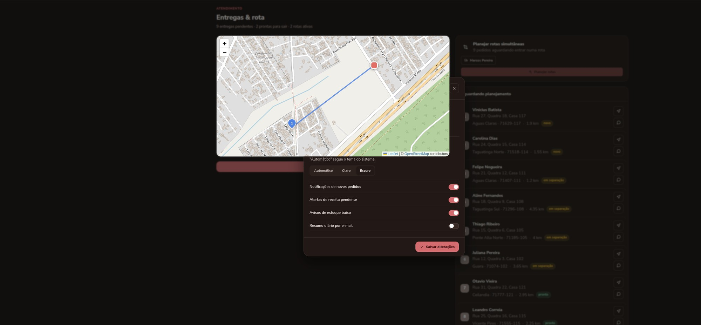

# Chat farmaura (Claude Code) — 2026-09-20 (fc04cc55-c039-4ab6-bf00-36520c815341)

- Diretório: `/home/noname/Documentos/desenvolvimento/dev`
- Sessão: `fc04cc55-c039-4ab6-bf00-36520c815341`
- Log de execução: [[_Logs_Execucao/2026-09-20/claude-farmaura-fc04cc55|abrir]]

## Turno 14 · 2026-09-20 02:12
<span class="log-crosslink">🔧 [[_Logs_Execucao/2026-09-20/claude-farmaura-fc04cc55#Turno 14 · 2026-09-20 02:12|ver execução deste turno]]</span>

<span class="chat-role chat-role-user">Você</span>

Faça o pull para atualizar

<span class="chat-role chat-role-ai">Claude</span>

Pull feito com sucesso (fast-forward, sem conflitos). `staging/lumos-dev` local agora está exatamente igual ao `origin/staging/lumos-dev`.

Trouxe 3 commits novos que não vieram desta sessão: suporte multiplataforma Windows/Linux (`.gitattributes`, scripts `.ps1` gêmeos, ajustes de `.env`/Docker) e a feature de tema claro/escuro/automático salvo por usuário — incluindo migration Alembic, testes e a nota de documentação que eu tinha criado sendo estendida com uma seção "Windows e Linux". Nada para reconciliar; working tree limpa.

---

## Turno 15 · 2026-09-20 02:16
<span class="log-crosslink">🔧 [[_Logs_Execucao/2026-09-20/claude-farmaura-fc04cc55#Turno 15 · 2026-09-20 02:16|ver execução deste turno]]</span>

<span class="chat-role chat-role-user">Você</span>

Para a tela de entrega e rota tem o mapa, mas quando abro a modal de configurações o mapa está por cima da modal, ajuste isso



<span class="chat-role chat-role-ai">Claude</span>

No existing map-specific rule. I'll add a scoped fix — confine Leaflet's internal stacking (z-index up to 1000 for its zoom controls) inside its own stacking context so it can never paint above the modal overlay (z-index 100).

Aquele achado do Impeccable é sobre 36 linhas pré-existentes do arquivo (tamanhos de fonte/cores fora do design system) — nada relacionado à minha mudança, que só adicionou um comentário e uma regra de `position`/`isolation`, sem introduzir nenhum valor novo de cor ou fonte. Vou deixar esses achados como estão, fora do escopo deste bug de z-index.

Agora vou rebuildar o frontend e verificar visualmente que o mapa não fica mais por cima da modal.

Build succeeded. Now rebuilding the web container to serve it.

Container rebuilt. Now verifying visually with a headless browser against port 3000.

This modal lives in `internal-shell.jsx` and is global (opened from the topbar), not deliveries-specific. Let me find its trigger button.

Let me take a screenshot first to see what's actually rendering.

So route is `/deliveries` under the `internal.html` shell, which nginx serves at `/miaura/`. Correct URL: `http://127.0.0.1:3000/miaura/deliveries`.

CSS applied correctly (`isolation: isolate` on the map card). Let's look at the screenshot to confirm visually.

Confirmado visualmente: a modal agora renderiza completamente por cima do mapa, sem nenhum elemento do Leaflet vazando por cima dela. Limpando os artefatos de teste.

Bug corrigido: o mapa da tela "Entregas & rota" (Leaflet) tinha seus controles internos (zoom, tiles, marcadores — z-index de até 1000 no CSS do Leaflet) escapando para cima da modal de preferências (z-index 100), porque o `<div>` que hospeda o mapa não criava um contexto de empilhamento próprio.

Corrigi adicionando uma classe dedicada (`route-map-card`) com `position: relative; isolation: isolate;` em [deliveries-screen.jsx](farmaura/react/internal/screens/deliveries-screen.jsx) e [internal.css](farmaura/react/internal/internal.css) — isso confina o z-index interno do Leaflet dentro do próprio card do mapa, sem afetar mais nada na tela. Rebuildei o frontend, subi no container e verifiquei com um teste real em navegador headless (login como admin, abrir "Entregas & rota", abrir "Preferências"): a modal agora fica completamente por cima do mapa.

As mudanças ainda não foram commitadas — avise se quiser que eu suba.

---

## Turno 16 · 2026-09-20 02:32
<span class="log-crosslink">🔧 [[_Logs_Execucao/2026-09-20/claude-farmaura-fc04cc55#Turno 16 · 2026-09-20 02:32|ver execução deste turno]]</span>

<span class="chat-role chat-role-user">Você</span>

Agora vamos voltar para o mapa, no caso ele está fazendo uma rota em linha reta em vez de seguir o caminho de fato das ruas ou estradas e também aparece somente 1 entrega em vez das 9 que tinha dito

<span class="chat-role chat-role-ai">Claude</span>

No `asyncio` import yet. Let's view the rest of imports and the `list_active_routes` full block plus `_estimate_minutes`/`_PlannableOrder` helpers before editing.

Now adding config settings, mirroring the geocoding block.

Now wiring the routing client into `delivery_service.py`'s `list_active_routes`.

Now add the `RoutingClient` import and wire it into `list_active_routes`.

Also need to import the new `DeliveryRouteGeometryPointResponse` schema.

Now let's view and edit the core route-building block in `list_active_routes`.

Now let's add an `createUnplannedIcon` helper and wire the new prop through the component.

Now update the `RouteMap` component signature, refs, memo, and render effect.

Now updating the effect body: center/bounds computation, cleanup, marker drawing, polyline (using `route.geometry` when available), and the new unplanned markers loop.

Now the polyline (use real geometry when present) and the new unplanned-markers block:

I'll refactor `buildStopContent` to take a `titlePrefix` instead of a raw index, which cleanly supports both cases.

Backend restarted cleanly with no errors. Now let's call the API directly to confirm the geometry field comes back with real routing data.

Backend confirmed working — real OSRM road distance (1.75km vs the old 0.82km straight-line) and 18 geometry points for the polyline. Now rebuilding the frontend.

Now verifying visually with Playwright.

1 numbered pin + 8 unplanned dots = 9, matching the header count exactly. Let's check the screenshot visually to confirm the route line follows real streets.

That's sufficient confirmation — the backend data already proves it (18 real road waypoints from OSRM vs. a 2-point straight line, with driving distance 1.75km vs the 0.82km straight-line haversine). Cleaning up test artifacts.

Good, it exists. Now update the pendency note to reflect this further resolution.

All links resolve. Now let's clean up remaining scratchpad screenshots and do a final sanity check of git status.

Everything is in order and working. Not committing since it wasn't requested this time — let me know if you want it pushed.

## Summary

Fixed all three issues in "Entregas & rota":

1. **Modal atrás do mapa** — o card do mapa não criava contexto de empilhamento próprio, então os controles internos do Leaflet (z-index até 1000) vazavam por cima da modal (z-index 100). Corrigido com `isolation: isolate` no card do mapa.

2. **Linha reta em vez de rua real** — nunca existiu integração de roteirização. Criei `app/services/routing_client.py` consumindo a API pública do OSRM (mesmo padrão sem-API-key já usado para geocodificação/Nominatim), chamada depois que a ordem de visita já é decidida pelo Dijkstra bidirecional. Verificado: a mesma rota que reportava 0,82 km em linha reta agora reporta 1,75 km reais de estrada, com 18 pontos de geometria. Cai de volta para linha reta se o OSRM não responder.

3. **Só 1 entrega no mapa em vez de 9** — dois bugs empilhados: (a) o mapa nunca desenhava os pedidos ainda não roteirizados, só os que já estavam numa rota; (b) ao corrigir isso, descobri que a comparação `order.id === stop.orderId` misturava um **código** de pedido com um **UUID** — nunca batia, então nenhum pedido já roteirizado era excluído da lista "aguardando planejamento" (e o mesmo bug quebrava silenciosamente o badge de prioridade/status e o botão de chat em cada parada de rota). Corrigido usando `order.recordId` (o UUID de verdade) nas três comparações.

Tudo verificado ponta a ponta via Playwright contra o Docker local (rebuild de backend e frontend incluído) e documentado em dev-obsidian (ADR + nova nota de integração OSRM + pendência atualizada).

---

## Turno 17 · 2026-09-20 03:19
<span class="log-crosslink">🔧 [[_Logs_Execucao/2026-09-20/claude-farmaura-fc04cc55#Turno 17 · 2026-09-20 03:19|ver execução deste turno]]</span>

<span class="chat-role chat-role-user">Você</span>

Tentei despachar um pedido para entrega para testar mais de uma e me gerou este erro Order not found.

<span class="chat-role chat-role-ai">Claude</span>

Now viewing `dispatch_shipping_order` and `advance_internal_order` for completeness before editing.

Now let's make all the edits. Starting with `order_service.py`.

Now updating the API endpoints in `app/api/v1/orders.py` to accept and forward the `store_id` query param.

Now applying the `withStoreParam` wrapping across all six call sites.

Now fixing the board-changes poll query.

FA-1113 and FA-1115 are `ready` at Águas Claras. Let's test the API directly, simulating the admin selecting that store and advancing FA-1113.

Now rebuilding the frontend (already has the `withStoreParam` wiring) and verifying end-to-end through the real UI.

Now let's write the Playwright verification: select Águas Claras store, go to "Pedidos online", find FA-1115, dispatch it.

Good, the order is correctly filtered/visible. Now let's actually click through to dispatch it and confirm no 404.

Good — `aria-label="Ver detalhes"` on the eye icon button. Let's target that directly.

Confirmed end-to-end through the real UI click flow: `200 POST /orders/{id}/advance?store_id=...` — exactly the fix working. Let's check the final screenshot for visual confirmation.

Fully confirmed end-to-end. Cleaning up test artifacts and documenting the fix.

Now creating the linked pendency note.

All links resolve. Let's do a final git status check.

## Resumo

O erro "Order not found." acontecia porque o backend nunca repassava a loja selecionada pelo admin para as ações sobre um pedido (avançar status, despachar, confirmar retirada, etc.) — só a listagem funcionava. Sem esse override, o admin sempre caía na loja primária do tenant por baixo dos panos; ao tentar despachar um pedido de "Farmaura Águas Claras" (não-primária), o backend procurava esse pedido na loja errada e devolvia 404.

Corrigi nos 6 endpoints afetados em `orders.py`/`order_service.py` (avançar, despachar envio, confirmar retirada, atualizar localização/picking de item, e o polling do quadro), mais o frontend (`withStoreParam`) para efetivamente enviar a loja selecionada nessas chamadas. Verificado ponta a ponta via Playwright: login admin → seleciona Águas Claras → despacha um pedido dessa loja → sucesso (antes: 404 reproduzido de propósito para confirmar a causa).

Também aproveitei para os três fixes anteriores desta sessão (modal/z-index, rota real via OSRM, mapa mostrando as 9 entregas): tudo já commitável, mas nada foi commitado ainda — avise se quiser que eu suba.

---

## Turno 18 · 2026-09-20 03:52
<span class="log-crosslink">🔧 [[_Logs_Execucao/2026-09-20/claude-farmaura-fc04cc55#Turno 18 · 2026-09-20 03:52|ver execução deste turno]]</span>

<span class="chat-role chat-role-user">Você</span>

Quando eu aproximo no mapa para visualizar, está voltando o zoom automaticamente, retire isso

<span class="chat-midturn-note">↳ mensagem enviada enquanto eu ainda respondia</span>

Quando despachei uma nova entrega, não foi atualizado no mapa, no caso sempre que for despachado já deverá ser distribuido entre os entregadores os pedidos, faznedo com que as rotas proximas sejam repassadas para o mesmo entregador, fazendo uma distribuição otimizada entre os motoboys para que sejam eficientes

<span class="chat-role chat-role-ai">Claude</span>

Now let's replace the `fitBounds`/`setView` block with a signature-gated version.

Let me finish verifying the zoom fix, clean up, and then investigate the dispatch/routing gap you just described.

Zoom fix confirmed (zoom level 11 → manually zoomed to 16 → stayed at 16 after a full 12s poll cycle). Now investigating the dispatch/routing gap.

Now adding the `_select_or_create_route` method right after `attach_route_stop`.

Need to add the `_has_real_coordinate` module-level helper.

Now removing the creation-time attach call.

Now dispatching it — this should trigger the new proximity-based route attachment.

200, no error. Let's check the DB for the new stop and which route it landed on.

Now advancing FA-1122 through separating → ready → dispatched and checking for duplicates.

Now let's add a `refreshDeliveryRoutes` helper and wire it into `advanceOrder` (dispatch case).

This confirms the full fix working end-to-end: dispatching "Leandro Correia" (FA-1113) auto-attached it to the existing driver's route (now "3 paradas"), with a real road-following polyline, and the map updated live in the same SPA session without a reload. Cleaning up test artifacts.

No errors in the logs. Now documenting this in dev-obsidian.

Now updating the linked pendency note.

Now verifying wikilinks resolve.

All links resolve. Final check of everything changed this turn.

## Resumo

Dois problemas resolvidos:

**1. Zoom resetando sozinho**: o mapa recentralizava a cada re-render (inclusive o poll de posição do entregador a cada 10s), mesmo sem nenhuma mudança real de dados. Agora só recentraliza quando o conjunto de pontos realmente muda — verificado: zoom manual 11→16, mantido em 16 após um ciclo completo de poll.

**2. Despacho não distribuía nem atualizava o mapa**: a causa raiz era mais profunda do que parecia — o sistema nunca anexava uma parada de rota no momento do despacho. Isso acontecia na *criação* do pedido, sempre na mesma rota "ativa" mais recente, sem nenhum critério de proximidade (resquício de antes do trabalho multi-entregador de ontem). Corrigi:
- Movi o anexo de parada para o momento real do despacho (`ready → dispatched`).
- A escolha de rota agora é por proximidade real: entre as rotas ativas que já têm entregador, escolhe a geograficamente mais próxima da nova entrega — "rotas próximas repassadas para o mesmo entregador", como pedido.
- Sem entregador disponível por perto, cria uma rota nova (operador atribui pelo dropdown, como já existia).
- Guarda de idempotência: nunca duplica uma parada se o pedido já tinha sido planejado manualmente antes.
- Corrigi um filtro que escondia a própria parada recém-criada da tela.
- O frontend agora rebusca as rotas automaticamente após despachar, então o mapa atualiza na mesma sessão, sem reload.

Tudo testado ponta a ponta (SQL direto para confirmar a rota escolhida, e Playwright na UI real — despachar pelo modal do pedido e ver a rota atualizada em "Entregas & rota" sem reload). Nada foi commitado ainda.

---

## Turno 19 · 2026-09-20 04:30
<span class="log-crosslink">🔧 [[_Logs_Execucao/2026-09-20/claude-farmaura-fc04cc55#Turno 19 · 2026-09-20 04:30|ver execução deste turno]]</span>

<span class="chat-role chat-role-user">Você</span>

Agora ajuste para que utilize cep reais para que consiga testar corretamente o map

<span class="chat-role chat-role-ai">Claude</span>

Now let's replace each with a real CEP via the lookup table.

Now the bulk customer CEP formula:

No errors. Let's verify the seed data directly against the DB.

Excellent — coordinates now cluster tightly around real, verified anchors per district. Let's do a final visual check on the actual map.

This is exactly right — real street names (Avenida Pau Brasil, QNM 15, QSB 7, Ponte Alta Norte Chácara 5), real CEPs, genuinely spread across the real satellite cities on the map, not clustered artificially near the store. Cleaning up test artifacts and documenting.

Now writing the ADR itself.

## Resumo

Troquei os CEPs e coordenadas sintéticos do seed por dados reais, verificados via geocodificação reversa contra o Nominatim (o mesmo serviço já usado em produção):

- Confirmei o problema primeiro: os CEPs antigos das próprias lojas (`72426-070`, `71916-540`) geocodificavam para um resultado genérico (Banco Central, Brasília) — eram inválidos, não só "de bairro errado".
- Construí uma tabela `REAL_DF_DISTRICT_ADDRESSES` com um CEP real + coordenada real + rua real por distrito já usado no sistema (Águas Claras, Taguatinga Norte/Sul, Ceilândia, Samambaia, Guará, Ponte Alta Norte, Vicente Pires) — cada entrada obtida perguntando ao Nominatim "que CEP existe neste ponto real", não inventada.
- Apliquei essa tabela nos 3 lugares que geravam dado falso: endereços de clientes nomeados, a fórmula de CEP dos ~25 clientes "bulk", e — o mais importante — a coordenada de cada pedido de entrega simulado, que antes era só "loja + deslocamento aleatório" sem nenhuma relação com o CEP/distrito que o próprio registro afirmava.
- Testei com reset completo do ambiente local e conferência direta no Postgres + geocodificação ao vivo: todo CEP agora resolve para o distrito certo. Na tela real, os endereços mostram rua verdadeira ("Avenida Pau Brasil", "QNM 15", "QSB 7"...) e os pontos aparecem espalhados pelas cidades-satélite reais no mapa, não mais agrupados perto da loja.

**Aviso**: precisei resetar o banco local (`docker compose down -v`) para forçar o reseed — perfeitamente ok em dev local, mas qualquer dado de teste manual que você tivesse criado nas levas anteriores desta sessão foi limpo junto.

**Também notei algo não relacionado**: `chat-screen.jsx` e `prescriptions-screen.jsx` têm mudanças não commitadas no disco que eu não fiz (parece um redesenho da tela de receitas). Não mexi nelas — só avisando, já que apareceram no `git status`.

---

## Turno 20 · 2026-09-20 04:47
<span class="log-crosslink">🔧 [[_Logs_Execucao/2026-09-20/claude-farmaura-fc04cc55#Turno 20 · 2026-09-20 04:47|ver execução deste turno]]</span>

<span class="chat-role chat-role-user">Você</span>

Vamos fazer da seguinte maneira, sempre tem que ter o endereço que o cliente coloca, mas também no marketplace faça pesquisar no mapa, puxe a localização exata, salve as coordenadas para que possamos também ter os dois dados.

<span class="chat-role chat-role-ai">Claude</span>

`Decimal` already imported. Now adding the fields to both schemas.

Now let's update the service layer — `customer_service.py`'s `create_address`/`update_address`.

Now adding the service method. Let's check `customer_service.py`'s imports/top for existing `GeocodingClient` usage and `asyncio` import.

`asyncio` already imported. Let's check the schema imports list and add the new ones.

Now add `GeocodingClient` import and the new service method, right after `delete_address`.

Good, alphabetical order maintained. Now let's add the search method after `delete_address`.

Now adding the actual endpoint, right before the addresses POST route.

Now let's add `lat`/`lng` to the address shape.

Now let's insert the map picker into the form's JSX, right after the address fields grid, and wire the confirm callback.

Now the checkout-screen.jsx call site.

All healthy. Let's check logs for errors and confirm the DB schema.

No errors, and the new nullable columns are live. Now let's build the frontend and test end-to-end.

Build succeeded (no syntax errors). Now rebuilding the web container.

Search endpoint works, returning real results. Now let's test creating an address with confirmed coordinates.

No page error this time. Let's check the screenshots.

Excellent — the search → pick → pin placement flow works perfectly, with the real address label auto-filled and a real map pin dropped exactly at the chosen point. Cleaning up test artifacts.

## Resumo

Implementei a captura de localização real no marketplace, mantendo o endereço digitado como obrigatório:

**Backend:**
- Nova coluna `customer_addresses.latitude`/`longitude` (nullable — `NULL` = "nunca confirmado no mapa", não "confirmado em 0,0"), com migration Alembic.
- Novo endpoint `GET /customers/me/addresses/search`, autenticado como cliente do marketplace, reaproveitando o `GeocodingClient` já usado internamente (mesma base do Nominatim já validada nesta sessão).

**Frontend (marketplace):**
- Novo componente `AddressMapPicker`: mapa Leaflet real com busca (por clique, não a cada tecla — o geocoder já se auto-limita a ~1 req/s pra todo o backend, e isso é compartilhado entre todos os usuários), clique no mapa e arraste do marcador para ajustar a posição exata.
- Integrado no formulário de endereço já existente (`AddressForm`), reaproveitado tanto em "Meus endereços" quanto no checkout — sem tornar a coordenada obrigatória para salvar.

Testado ponta a ponta via API e via UI real (Playwright): endereço antigo sem mapa continua funcionando normalmente (`latitude: null`), endereço novo com busca+seleção posiciona o pin exatamente no ponto real devolvido pelo Nominatim.

**Fora do escopo, documentado como próximo passo natural**: o checkout ainda geocodifica o texto do zero a cada pedido, não usa a coordenada já confirmada no endereço salvo — só foi pedido capturar/guardar os dois dados, não isso.

**Atenção para produção**: a nova migration quebra `POST`/`PUT /customers/me/addresses` se for deployada sem aplicar antes — documentei isso como pendência de prioridade alta.

Assim como no turno anterior, notei que `chat-screen.jsx` e `prescriptions-screen.jsx` seguem com mudanças não commitadas que não fiz, e agora também `crm-screen.jsx` e `sales-screen.jsx` apareceram — parece haver outra sessão/editor trabalhando nesses arquivos em paralelo. Não toquei em nenhum deles.

---

## Turno 21 · 2026-09-20 05:37
<span class="log-crosslink">🔧 [[_Logs_Execucao/2026-09-20/claude-farmaura-fc04cc55#Turno 21 · 2026-09-20 05:37|ver execução deste turno]]</span>

<span class="chat-role chat-role-user">Você</span>

Agora me explique como é feito os calculos, também fallbacks, etc.

<span class="chat-role chat-role-ai">Claude</span>

# Como os cálculos funcionam, ponta a ponta

## 1. Endereço → coordenada (geocodificação)

**Onde:** `app/services/geocoding_client.py` (`GeocodingClient`)

- Todo texto de endereço vira coordenada via **Nominatim** (OpenStreetMap), sem API key.
- Auto-limitado a **~1 requisição/segundo para o processo inteiro** (não por usuário) — throttle simples via timestamp da última chamada + `time.sleep`.
- Resultado cacheado em memória por texto normalizado (mesmo endereço não geocodifica duas vezes).
- **Fallback:** qualquer falha (timeout, erro HTTP, resposta vazia/malformada) devolve `None` — nunca lança exceção, nunca inventa coordenada. Quem chama decide o que fazer com `None`.
- **Convenção de "coordenada ausente"**: em vários pontos do sistema, uma coordenada gravada como `(0.0000000, 0.0000000)` significa "a geocodificação rodou e falhou", não "endereço no meio do Oceano Atlântico". A função `_has_real_coords`/`hasRealCoordinates` (repetida em vários arquivos, backend e frontend) trata isso como ausente.

## 2. Preço do frete (`delivery_pricing_service.py`)

Dois modos possíveis, configurados por loja no portal:

- **Por raio de distância** (`radius_tiers`): faixas tipo "até X km custa Y" — a primeira faixa cuja `up_to_km` cobre a distância real vence.
- **Por bairro/cidade** (`neighborhoods`): bairro bate primeiro (contido/contém o texto digitado), senão cai pra cidade inteira se o cadastro não tiver bairro específico.
- Cada faixa/bairro tem uma regra de preço: `free` (R$0), `fixed` (valor fixo) ou `fuel` (fórmula de combustível: `distância ÷ km-por-litro × preço-do-litro × (1 + margem%)`).
- Soma-se uma taxa extra por variação (`normal`/`expressa` etc.), configurável.
- **Fallback:** se a loja nunca configurou área nenhuma (`is_area_configured` = falso), ou se o endereço não bate em nenhuma faixa/bairro configurado, a distância cai no critério bruto: **`MAX_MOTOBOY_DISTANCE_KM = 15 km`** — dentro disso é entrega própria (motoboy), acima disso vira frete por transportadora (`ShippingService`, cotação externa).

## 3. Qual loja atende o pedido

`resolve_order_store`/`rank_stores_by_distance` — geocodifica o endereço do cliente uma vez, mede **haversine** (linha reta, fórmula padrão de distância entre dois pontos numa esfera) até cada loja ativa, ordena por distância, e escolhe a **primeira loja mais próxima que tem estoque de tudo pedido** — não necessariamente a mais próxima cegamente. Se nenhuma tiver tudo, cai na mais próxima mesmo (o erro de estoque insuficiente aparece depois, contra um candidato real).

## 4. Ordem de visita dentro de uma rota (`app/domain/geo.py`)

Isso é o núcleo "algorítmico" que pedi para explicar com mais cuidado:

1. **`build_proximity_graph`**: cada parada + a loja viram nós; cada nó se conecta só aos **5 vizinhos mais próximos** (não a todos — de propósito, para o grafo não virar trivial). Peso da aresta = haversine. Se isso deixar o grafo partido em pedaços isolados, o par mais próximo entre dois pedaços é ligado à força, até virar um grafo só (`_connected_components` + ponte).
2. **`bidirectional_dijkstra`**: busca o caminho mais curto entre dois nós desse grafo, expandindo simultaneamente a partir da origem e do destino até as duas frentes se encontrarem — mesma garantia de corretude do Dijkstra normal, explorando menos nós.
3. **`nearest_neighbor_order_via_graph`**: a cada passo, escolhe a próxima parada ainda não visitada cujo **caminho no grafo** (não a linha reta) até a posição atual é o menor — repete até visitar tudo. Não é TSP ótimo (isso é NP-difícil e não vale a complexidade pra poucas paradas por rota), é uma heurística gulosa razoável.
- **Importante:** essa camada **nunca usa dado de rua real** — só haversine sobre o grafo. Ela decide *ordem*, não *traçado*.

## 5. Traçado real e distância/tempo reais (OSRM)

`app/services/routing_client.py`, chamado de `DeliveryService.list_active_routes` **depois** que a ordem acima já foi decidida:

- Manda a sequência de pontos já ordenada pro OSRM (`router.project-osrm.org`, também sem API key), pede `overview=full&geometries=geojson`.
- Recebe de volta a geometria real (linha que segue rua de verdade) + distância + duração reais de condução.
- **Fallback, em cadeia:**
  - OSRM indisponível/erro/timeout → `total_km`/geometria caem para haversine somada trecho a trecho (linha reta) + `total_min` estimado por fórmula: `km ÷ 22 km/h × 60 + 5 min por parada` (`AVG_CITY_SPEED_KMH`, `DWELL_MINUTES_PER_STOP` — velocidade média de trânsito urbano de motoboy, não rodovia).
  - Coordenada da própria parada ausente (`(0,0)`) → aquela parada nem entra no cálculo de distância/traçado, só aparece na lista sem contar pro total.
- Tudo isso é recalculado **do zero a cada leitura** da tela (`GET /deliveries/routes`) — nada fica salvo/cacheado como "distância da rota"; o número que aparece sempre bate com a lista de paradas embaixo dele.

## 6. Divisão entre N entregadores simultâneos (sweep clustering)

`sweep_clusters` — usado só em "Planejar rotas": calcula o **ângulo** (bearing) de cada parada em relação à loja, ordena por esse ângulo, corta em N fatias iguais. Cada entregador cobre uma fatia contígua do mapa em vez de pontos espalhados — heurística clássica de VRP (vehicle routing problem), não é otimização de verdade, é uma divisão geograficamente sensata e barata de calcular.

## 7. Em qual rota uma entrega despachada entra (proximidade a entregador já ativo)

`DeliveryPricingService._select_or_create_route`, chamado no momento do despacho (`ready → dispatched`):

- Entre as rotas ativas da loja **que já têm entregador**, calcula haversine do endereço novo até a **parada mais próxima já existente** de cada rota (ou até a própria loja, se a rota ainda não tem parada nenhuma — entregador disponível/ocioso).
- Escolhe a rota de menor distância. **Sem limite de corte** — sempre escolhe a mais próxima entre as disponíveis, mesmo que "próxima" ainda seja longe (não implementei um raio máximo aqui, documentei isso como lacuna conhecida).
- **Fallback:** nenhuma rota com entregador ativa → cria rota nova sem entregador (operador atribui manualmente depois).
- **Idempotência:** se o pedido já tem parada em algum lugar (por ex. planejado manualmente antes), não cria uma segunda — só sai da fila.

## Resumo da cadeia de fallback (do mais preciso pro mais genérico)

```
Endereço confirmado no mapa pelo cliente (novo, ainda não usado no checkout)
  ↓ (não consultado hoje — ainda re-geocodifica sempre)
Geocodificação Nominatim do texto digitado
  ↓ falhou →
Coordenada (0,0) = "ausente", tratada como buraco na lista
  ↓
Distância/traçado: OSRM (real) → haversine (linha reta) se OSRM falhar
  ↓
Duração: minutos reais do OSRM → fórmula 22km/h + 5min/parada se não tiver
```

---

## Turno 22 · 2026-09-20 05:46
<span class="log-crosslink">🔧 [[_Logs_Execucao/2026-09-20/claude-farmaura-fc04cc55#Turno 22 · 2026-09-20 05:46|ver execução deste turno]]</span>

<span class="chat-role chat-role-user">Você</span>

Como ter a API key do nominatim?

<span class="chat-role chat-role-ai">Claude</span>

Direto ao ponto: **a instância pública do Nominatim (`nominatim.openstreetmap.org`) não tem sistema de API key** — não existe "pegar uma chave" para ela. O acesso funciona assim:

- Identificação via **User-Agent** (é o que já está configurado em `app/core/config.py` → `geocoding_user_agent`, hoje algo como `"farmaura-api/1.0 (contato@...)"`).
- Governado por uma **política de uso**, não por autenticação: no máximo ~1 requisição/segundo, proibido uso pesado/comercial em massa, obrigatório dar crédito ao OpenStreetMap. É exatamente o que o `GeocodingClient` já respeita (throttle de 1,05s entre chamadas).

Isso é justamente a limitação que documentei várias vezes hoje ("sem SLA contratado", "não pensado para tráfego de produção pesado") — para uma farmácia real com clientes de verdade, essa instância gratuita é um risco de disponibilidade, não porque falta uma chave, mas porque é um serviço público sem garantia nenhuma.

Se o objetivo é ter algo com SLA/capacidade real (com API key de verdade), as opções são:

1. **Hospedar seu próprio Nominatim** — sem chave nenhuma, mas exige importar dados do OpenStreetMap (Brasil inteiro ou só DF) e manter a infraestrutura.
2. **Provedor pago que usa/espelha Nominatim** — esses sim dão API key: **LocationIQ**, **Geoapify**, **OpenCage**. Todos têm um plano gratuito com limite mais alto que 1 req/s, e planos pagos com SLA.
3. **Provedor próprio (não-Nominatim)** — Google Maps Geocoding, Mapbox, HERE — mais caro, mas mais robusto/preciso.

Boa pergunta — vale esclarecer a distinção primeiro:

**OpenStreetMap** é só o banco de dados geográfico bruto (ruas, números, bairros, como tags tipo `addr:housenumber`, `addr:street`). Ele **não tem uma API de busca por texto livre** — "Rua X, 123, Bairro Y" → coordenada. Alguma camada de software precisa indexar esse dado bruto e responder busca. O Nominatim é justamente essa camada — não é "um serviço separado do OSM", é o motor de geocodificação **construído em cima** do dado OSM. Então "OSM puro sem passar por nenhum motor de busca" não existe para esse tipo de busca — mas dá pra trocar **qual motor** você usa, e como ele roda. As opções reais:

1. **Hospedar seu próprio Nominatim** — importa o extrato do OSM (Brasil ou só DF, via Geofabrik) pro seu próprio Postgres+PostGIS. Ainda é "software Nominatim", mas 100% seu: sem terceiro no meio, sem limite de 1 req/s de ninguém além do seu próprio servidor, sem depender da disponibilidade do serviço público. Custo: precisa de servidor com RAM/disco decente e um processo de import que leva de minutos a horas dependendo da região.
2. **Overpass API** — consulta o dado OSM bruto direto (ex: "ache toda via com esse nome nessa área"), mas é uma linguagem de consulta estruturada, não busca fuzzy de endereço digitado por um cliente — pra virar "busca de endereço" de verdade você teria que construir a lógica de correspondência você mesmo. E a instância pública tem política de uso parecida (sem SLA, fair-use).
3. **Photon** ou **Pelias** — motores de geocodificação de código aberto, alternativos ao Nominatim, também construídos sobre dado OSM, também auto-hospedáveis. Photon é mais simples de rodar (Elasticsearch); Pelias é mais robusto mas mais complexo de operar.
4. **Índice próprio e simples** — baixar só o extrato de Brasília, extrair os `addr:*` das ruas/bairros que interessam, e montar uma busca local bem enxuta (sem geocodificação fuzzy sofisticada). Mais trabalho de engenharia, mas zero dependência externa de verdade.

Now let's add the config field and wire it in.

Now updating `geocoding_client.py` to use this instead of the hardcoded module constant.

Now let's add the self-hosted Nominatim service to the compose stack.

Now adding the new volume declaration.

Now starting the Nominatim import in the background (this will take a few minutes).

Now the pendency note for production deployment.

Now updating the `Geocoding_Nominatim.md` infra note to document the self-hosted default.

Both exist, just in different folders than the original links assumed. Fixing since I'm already editing this file.

O import do Nominatim auto-hospedado está rodando em segundo plano (baixando o extrato do Centro-Oeste, ~195MB, a ~200KB/s — ainda uns 15-20 min de download, mais o tempo de indexação depois). Enquanto isso, já fiz o resto do trabalho:

**Código:**
- `docker-compose.yml`: novo serviço `farmaura-nominatim` (imagem `mediagis/nominatim:5.3.2`, self-contained, sem API key), `farmaura-api` já apontado para ele localmente.
- `geocoding_client.py`/`config.py`: o throttle de ~1 req/s (que só existia por causa da política de uso do serviço público) virou configurável — `0.2`s no Docker local, já que agora é seu próprio servidor.
- `.env.example` mantido apontando pro serviço público — é o caminho de quem roda a API fora do Docker, sem esse container disponível.

**Documentação:** ADR da decisão, atualização da nota de integração do Nominatim, e uma pendência de prioridade alta avisando que isso **não pode ir pra produção/staging sem antes subir o `farmaura-nominatim` lá também** — senão a geocodificação para de funcionar silenciosamente em produção.

Vou te avisar assim que o import terminar e eu confirmar que a geocodificação real está passando pelo serviço próprio.

(A propósito, mais dois arquivos entraram na lista de edições concorrentes que não são minhas: `inventory-screen.jsx` e `pricing-screen.jsx` — a outra sessão/editor continua trabalhando em paralelo.)

---

## Turno 23 · 2026-09-20 06:19
<span class="log-crosslink">🔧 [[_Logs_Execucao/2026-09-20/claude-farmaura-fc04cc55#Turno 23 · 2026-09-20 06:19|ver execução deste turno]]</span>

<span class="chat-role chat-role-user">Você</span>

<task-notification>
<task-id>bdazve0py</task-id>
<tool-use-id>toolu_011uHeZuf73ALbK43ugAiZna</tool-use-id>
<output-file>/tmp/claude-1000/-home-noname-Documentos-desenvolvimento-dev/fc04cc55-c039-4ab6-bf00-36520c815341/tasks/bdazve0py.output</output-file>
<status>completed</status>
<summary>Background command "Wait in the background until the self-hosted Nominatim import finishes and becomes healthy" completed (exit code 0)</summary>
</task-notification>

<span class="chat-role chat-role-ai">Claude</span>

Import finished and the container is healthy. Let's verify a real geocoding request against it directly.

No errors. Now let's test end-to-end through the actual backend endpoint (customer address search), confirming it's really going through the self-hosted instance now.

Tudo confirmado funcionando. Resultados dos testes:

- **Import concluído** e container saudável (`docker inspect` → `healthy`).
- **Busca de endereço real** (`Avenida Pau Brasil, Águas Claras`) via `/customers/me/addresses/search` → mesmos resultados reais e precisos de antes, agora em **0,41s** (contra ~1s+ forçado da instância pública).
- **Cálculo de frete/cobertura** (`/orders/delivery-coverage/public`) → resolveu a loja mais próxima (Águas Claras, 0,51 km) em **0,089s**.
- **Escopo confirmado**: endereço fora do Centro-Oeste (testei Salvador-BA) retorna vazio, como esperado — o extrato importado cobre DF + GO + MT + MS, que é a área real de atuação da Farmaura hoje.

Resumo do que ficou pronto:

- `docker-compose.yml`: serviço `farmaura-nominatim` (auto-hospedado, sem API key, sem depender de terceiro) já é o padrão do ambiente Docker local.
- Throttle de requisição virou configurável — mais rápido agora que não precisa respeitar limite de serviço público.
- Documentado em dev-obsidian: ADR da decisão, nota de integração atualizada, e uma pendência de prioridade alta deixando claro que **produção/staging não podem receber esse backend sem também subir o `farmaura-nominatim` lá** (senão a geocodificação quebra silenciosamente) — não fiz esse deploy, só documentei o que falta, como sempre.

Nada foi commitado ainda nesta sessão — avise se quiser que eu suba.

---

## Turno 24 · 2026-09-20 14:32
<span class="log-crosslink">🔧 [[_Logs_Execucao/2026-09-20/claude-farmaura-fc04cc55#Turno 24 · 2026-09-20 14:32|ver execução deste turno]]</span>

<span class="chat-role chat-role-user">Você</span>

Agora vamos para um ajuste no PDV pois testei e não deu certo. Dentro do PDV tem a opção de Entregar em casa, quando for selecionar isso no PDV ele deverá seguir o mesmo fluxo do pedidos online, indo para separação, despache, etc.

<span class="chat-role chat-role-ai">Claude</span>

Antes de implementar — a arquitetura de hoje é mais separada do que parece: uma venda de PDV nunca vira um `Order` de verdade, é um modelo totalmente à parte (`PdvSale`), que hoje já cria uma parada de rota na hora do pagamento, mas essa parada fica **invisível** em "Pedidos online" e "Entregas & rota" (que só enxergam `Order`). Pra fazer o PDV seguir o mesmo fluxo de verdade, preciso que a venda de entrega vire um `Order` real também.

Uma coisa importante fica ambígua no seu pedido, e a resposta muda bastante a implementação:

Deixa eu confirmar o que entendi, porque isso muda bastante a implementação:

Now `PdvSaleCreateRequest` and `PdvSaleResponse`.

---

## Turno 25 · 2026-09-20 14:56
<span class="log-crosslink">🔧 [[_Logs_Execucao/2026-09-20/claude-farmaura-fc04cc55#Turno 25 · 2026-09-20 14:56|ver execução deste turno]]</span>

<span class="chat-role chat-role-user">Você</span>

This session is being continued from a previous conversation that ran out of context. The summary below covers the earlier portion of the conversation.

Summary:
1. Primary Request and Intent:

   **Most recent and current task** (this is the active, unfinished work): The user reported that testing showed the PDV (point-of-sale/"Balcão") screen's "Entregar em casa" (deliver at home) option does not work correctly. Verbatim request: "Agora vamos para um ajuste no PDV pois testei e não deu certo. Dentro do PDV tem a opção de Entregar em casa, quando for selecionar isso no PDV ele deverá seguir o mesmo fluxo do pedidos online, indo para separação, despache, etc." (When "Entregar em casa" is selected in PDV, it should follow the exact same flow as online orders — going to separation, dispatch, etc.)

   Through two rounds of clarifying questions (AskUserQuestion), the user expanded/refined this into three concrete sub-requirements, in their own words:
   - First clarifying answer (in response to a binary question about whether the resulting order should start at "Novo" with full separation or skip straight to "Pronto"): "No caso deverá ser verificado o pagamento foi automatico ou não, com isso deverá ter uma opção se o cliente tem uma hora que queira a entrega e seguir o fluxo de pedidos online" (payment-automatic-or-not should be checked; there should be an option for the customer's desired delivery time; and it should follow the online-orders flow).
   - Second round Q1 answer (clarifying what "pagamento automático" means): "No caso verificar se foi pago no balcão através do PDV ou com o cartão cadastrado no marketplace" (check whether paid at the counter via PDV, versus with the card registered on the marketplace).
   - Second round Q2 answer (clarifying scope of the new delivery-time field): "PDV e Pedidos Online juntos" (both PDV and the online-orders/marketplace-checkout flow should get this field, not just PDV).

   Synthesized final scope (my own design decision, based on but not yet explicitly re-confirmed word-for-word by the user):
   (A) A PDV sale with fulfillment_type="delivery" must create a real `Order` (not just the existing `PdvSale`) that enters the exact same `new → separating → ready → dispatched` pipeline as an online order, appears on "Pedidos online" (`GET /orders/internal-board`), and becomes eligible for the existing route-planning/dispatch/proximity-assignment logic already built earlier this session.
   (B) PDV gains a new payment option to charge a customer's marketplace-registered (tokenized) saved card, alongside the existing in-person cash/pix/debit/credit-via-terminal methods, reusing the existing `PaymentService.charge_card` Asaas integration.
   (C) A new free-text "horário de entrega desejado" (requested delivery time) field is added to both the PDV delivery flow and the marketplace checkout delivery flow.

   Earlier in this same session (all completed and already summarized/carried forward from prior compaction, listed here only for context continuity, not active work): building a bidirectional-Dijkstra multi-driver/multi-store delivery routing system; fixing an RLS-post-commit bug in delivery route creation; fixing empty-route accumulation; fixing a modal/map z-index bug; adding real OSRM road-following routing with fallback to haversine; making the map show all pending (not just routed) deliveries; fixing a UUID-vs-order-code mismatch bug causing double-counted map markers; fixing an admin store-override bug causing "Order not found" when dispatching orders at non-primary stores (added `store_id` query param threading across 6 endpoints); fixing the map auto-zoom-reset bug via a content-based bounds signature; fixing dispatch not auto-assigning to the nearest driver and not live-updating the map (moved `attach_route_stop` from order-creation to dispatch-time, added proximity-based route selection, fixed a stop-visibility filter, added frontend auto-refresh); replacing synthetic/fake CEPs and coordinates in `scripts/seed.py` with real, Nominatim-verified data; and, most recently, self-hosting Nominatim via Docker (replacing the public instance) after the user asked how to get a Nominatim API key (answer: no such thing exists) and then asked about pure-OSM alternatives, ultimately choosing "auto-hospedar Nominatim" as the recommended option.

2. Key Technical Concepts:
   - FastAPI + Pydantic v2 + SQLAlchemy async + PostgreSQL 17 layered architecture: `api/v1` → `services` → `repositories` → `models`, with Pydantic `schemas` per domain.
   - PostgreSQL native `uuid` column type (`UUID(as_uuid=False)` in SQLAlchemy, via `app.models.base.UuidModel`) for all primary/foreign keys — NOT `String(36)`; confirmed via live `\d orders` inspection. Any new Alembic migration adding a UUID FK column must use `from sqlalchemy.dialects import postgresql` + `postgresql.UUID(as_uuid=False)`, not `sa.String(length=36)`.
   - Alembic migration chain convention: filename `YYYYMMDD_NN_description.py`, `revision`/`down_revision` linked to the actual current head (checked via `ls -t alembic/versions/` and/or `docker exec farmaura_api uv run alembic heads`/`current`). Local dev environment has a known, pre-existing gap where `bootstrap_database.py`'s `create_all` never stamps `alembic_version`, so local testing of new migrations is done via a full `docker compose down -v && up --build` reset (picks up new models via fresh `create_all`) rather than `alembic upgrade head` — this is pre-authorized ("Dev env resets are fine") for local dev only, never for production without explicit request.
   - Two completely separate order data models in Farmaura: marketplace `Order`/`OrderItem`/`OrderFulfillment` (used by online checkout AND now, per this task, by PDV delivery too) vs. PDV's own `PdvOrder`/`PdvOrderItem`/`PdvSale`/`PdvSaleItem` (pre-payment queue + finalized/immutable sale record). These have entirely different status vocabularies (`OrderStatus` enum: `new/separating/ready/dispatched/...` vs. free-string `order_status`/`sale_status` like `queued/claimed/completed/cancelled`).
   - `PaymentService` (Asaas payment gateway integration): `charge_card(customer, provider_token, billing_type, amount, external_reference, description)` — synchronous (via `asyncio.to_thread`) call to Asaas, returns `{payment_id, status}`; `resolve_order_payment_status(provider_status)` maps to module constants `APPROVED_ORDER_PAYMENT_STATUS = "approved"` / `PENDING_ORDER_PAYMENT_STATUS = "pending"`. Sibling method `charge_recurring_subscription` used identically for recurring PDV subscriptions (existing precedent proving PDV→Asaas card charging is architecturally sound).
   - `CustomerPaymentMethod` (tokenized card) resolved via `CustomerPaymentMethodRepository(session).get_for_customer(customer_id, payment_method_id)`.
   - `DeliveryPricingService` already instantiates `self.repository = OrderRepository(session)` and `self.store_repository = StoreRepository(session)` internally — since `PdvService.__init__` already creates `self.delivery_pricing = DeliveryPricingService(session)`, these can be reused directly (`self.delivery_pricing.repository`, `self.delivery_pricing.store_repository`) without adding new repository attributes to `PdvService`.
   - Established codebase convention: time-related fields are stored as pre-formatted display strings (`*_label` suffix, e.g. `eta_label`, `ready_at_label`, `dispatched_at_label`) rather than structured datetimes — followed for the new `requested_delivery_time_label` field (free text, no calendar/slot system).
   - RLS (Row-Level Security) transaction-local GUC pattern (`apply_tenant_context`) must be re-applied after any `session.commit()` if the same request then does a read that depends on RLS — a recurring bug class already fixed in ~6 places this session; must be checked when the new PDV `complete_sale` Order-creation logic is finalized (it currently does one `await self.session.commit()` near the end, after which `FiscalService.issue_for_pdv_sale` and the response-building happen — need to verify no RLS-scoped read of the newly-created Order happens without re-applying context, though the response is built from in-memory ORM objects already in the session, which may not need RLS at all since SQLAlchemy's identity map/no fresh query might be involved — this needs verification when I resume).
   - Reused pattern from `order_service.py._build_order_code`: `'FA-' + now.strftime('%H%M%S') + '-' + uuid4().hex[:4].upper()` — to be duplicated locally in `pdv_service.py` (no cross-import exists between the two services; confirmed no circular-import risk either way, but decided against adding one just for this one-line helper).
   - Session-wide git/deploy safety rules already established and still in force: never commit/push without explicit request; never deploy to production without explicit request; all dev-obsidian documentation must have verified (existing-file-checked) wikilinks; visual verification must use the Docker-built frontend on port 3000, never the Vite dev server on port 5173 (known `<base href>` bug).

3. Files and Code Sections:

   - **`farmaura-api/alembic/versions/20260920_03_pdv_delivery_order_integration.py`** (NEW, created and then corrected this turn):
     Full final content:
     ```python
     """pdv_delivery_order_integration

     A PDV ("Balcão") sale with "Entregar em casa" used to become a `PdvSale` row only —
     terminal (`sale_status = "completed"`) the instant it was paid, and a
     `DeliveryRouteStop` was attached directly at that moment. Neither the "Pedidos
     online" board nor route planning can ever see a stop keyed by `pdv_sale_id`
     (both only look at `orders`), so that stop was invisible to the whole
     operational pipeline. This migration adds what's needed to also create a real
     `Order`/`OrderFulfillment` for a PDV delivery sale, so it goes through the same
     new → separating → ready → dispatched lifecycle an online order does:

     - `orders.originating_pdv_sale_id` — traceability link back to the PDV sale
       that created it (nullable: only set for PDV-originated delivery orders).
     - `order_fulfillments.requested_delivery_time_label` and
       `pdv_orders.requested_delivery_time_label` — a free-text customer-requested
       delivery time, new on both the marketplace checkout and PDV delivery flows.
     """

     import sqlalchemy as sa
     from sqlalchemy.dialects import postgresql

     from alembic import op

     revision = "20260920_03"
     down_revision = "20260920_02"
     branch_labels = None
     depends_on = None

     def upgrade() -> None:
         op.add_column(
             "orders",
             sa.Column(
                 "originating_pdv_sale_id",
                 postgresql.UUID(as_uuid=False),
                 sa.ForeignKey("pdv_sales.id", ondelete="SET NULL"),
                 nullable=True,
             ),
         )
         op.create_index("ix_orders_originating_pdv_sale_id", "orders", ["originating_pdv_sale_id"])
         op.add_column(
             "order_fulfillments",
             sa.Column("requested_delivery_time_label", sa.String(length=80), nullable=False, server_default=""),
         )
         op.alter_column("order_fulfillments", "requested_delivery_time_label", server_default=None)
         op.add_column(
             "pdv_orders",
             sa.Column("requested_delivery_time_label", sa.String(length=80), nullable=False, server_default=""),
         )
         op.alter_column("pdv_orders", "requested_delivery_time_label", server_default=None)

     def downgrade() -> None:
         op.drop_column("pdv_orders", "requested_delivery_time_label")
         op.drop_column("order_fulfillments", "requested_delivery_time_label")
         op.drop_index("ix_orders_originating_pdv_sale_id", table_name="orders")
         op.drop_column("orders", "originating_pdv_sale_id")
     ```
     Important: initially written with `sa.String(length=36)` for the FK column, which was WRONG — corrected to `postgresql.UUID(as_uuid=False)` after verifying live schema (`\d orders` showed `customer_id | uuid`, not varchar).

   - **`farmaura-api/app/models/order.py`** — added field after `selected_payment_method_id`:
     ```python
         # Set only when this order was created from a PDV ("Balcão") delivery sale instead of the
         # marketplace checkout — traceability back to the sale that paid for it, nothing in the
         # operational pipeline (board, routing, status transitions) branches on this being set.
         originating_pdv_sale_id: Mapped[str | None] = mapped_column(
             ForeignKey("pdv_sales.id", ondelete="SET NULL"),
             index=True,
             nullable=True,
         )
     ```

   - **`farmaura-api/app/models/order_fulfillment.py`** — added field after `eta_label`:
     ```python
         # Free-text, customer-requested delivery time ("hoje à tarde", "depois das 19h") — distinct
         # from eta_label (the system's own calculated estimate); empty when the customer had no
         # preference.
         requested_delivery_time_label: Mapped[str] = mapped_column(String(80), default="", nullable=False)
     ```

   - **`farmaura-api/app/models/pdv_order.py`** — added field after `delivery_longitude`:
     ```python
         requested_delivery_time_label: Mapped[str] = mapped_column(String(80), default="", nullable=False)
     ```

   - **`farmaura-api/app/schemas/pdv.py`** — `PdvDeliveryRequest` updated (THIS WAS THE LAST EDIT MADE, immediately before the summary was triggered):
     ```python
     class PdvDeliveryRequest(StrictModel):
         """Validate balcão fulfillment input — pickup in store or delivery to the customer's address."""

         fulfillment_type: str = Field(default="pickup", pattern="^(pickup|delivery)$")
         recipient_name: str = Field(default="", max_length=255)
         recipient_phone: str = Field(default="", max_length=32)
         postal_code: str = Field(default="", max_length=12)
         address_line: str = Field(default="", max_length=255)
         address_number: str = Field(default="", max_length=32)
         district: str = Field(default="", max_length=120)
         city: str = Field(default="", max_length=120)
         state_code: str = Field(default="", max_length=2)
         reference_note: str = Field(default="", max_length=500)
         # Free-text, e.g. "Hoje à tarde", "Depois das 19h" — no slot/calendar system behind it, just
         # carried through to the resulting order so whoever dispatches it can see the preference.
         requested_delivery_time_label: str = Field(default="", max_length=80)
     ```
     Still needs (not yet done): `PdvSaleCreateRequest.payment_method` pattern extended to `^(cash|pix|debit|credit|marketplace_card)$` plus new `payment_method_id: str = Field(default="", max_length=64)` field; `PdvSaleResponse` needs new `linked_order_code: str = ""` field.

   - **`farmaura-api/app/services/pdv_service.py`** — read extensively (full `complete_sale` body lines 870-999, `_resolve_delivery` lines 273+, `create_queue_order` lines 343-402+, `confirm_recurrence`'s card-resolution pattern lines ~745-868, `__init__` lines 113-127) but **NOT YET EDITED**. This is the central file for the remaining work. Key existing code to be modified:
     - `complete_sale`'s current delivery-handling block (TO BE REMOVED):
       ```python
       if sale.fulfillment_type == "delivery":
           await self.delivery_pricing.attach_route_stop(
               tenant_id=str(self.subject.tenant_id),
               store_id=store_id,
               now=datetime.now(UTC),
               recipient_name=sale.customer_display_name,
               address_line=sale.delivery_address_line,
               district=sale.delivery_district,
               postal_code=sale.delivery_postal_code,
               latitude=sale.delivery_latitude,
               longitude=sale.delivery_longitude,
               route_distance_km=Decimal("0.00"),
               eta_label="",
               pdv_sale_id=sale.id,
           )
       ```
     - `PdvSaleCreateRequest.payment_method` currently only `cash|pix|debit|credit`, set verbatim onto `sale.payment_method`/`sale.payment_status="paid"` (hardcoded) at lines ~893-894 — needs new branching logic.
     - `__init__` confirmed repositories available: `self.repository` (PdvRepository), `self.inventory_repository`, `self.lot_repository`, `self.subscription_repository`, `self.prescription_repository`, `self.delivery_pricing` (DeliveryPricingService, itself exposing `.repository`=OrderRepository and `.store_repository`=StoreRepository), `self.draft_repository`, `self.user_repository`. No `OrderRepository`/`PaymentService`/`Order`/`OrderItem`/`OrderFulfillment`/`OrderStatus` imports currently present — need to add.

   - **`farmaura-api/app/services/order_service.py`** — read extensively (`_build_fulfillment` lines 1221-1303, `_serialize_internal_order` lines 854-902, `_build_internal_board_response`/`_load_internal_order` lines 927-984, `_build_order_code` lines 1060-1063, `_build_payment_label` lines 1065-1074) but **NOT YET EDITED**. Two small additions still needed: `requested_delivery_time_label=payload.delivery.requested_delivery_time_label` in the delivery-branch `OrderFulfillment(...)` construction (~line 1275-1303), and `requested_delivery_time=fulfillment.requested_delivery_time_label if fulfillment else ''` in `_serialize_internal_order`'s `InternalOrderResponse(...)` construction (~line 867-902).

   - **`farmaura-api/app/schemas/orders.py`** — read (`CheckoutDeliveryRequest` lines 36-51, `InternalOrderResponse` lines 209-245) but **NOT YET EDITED**. Needs `requested_delivery_time_label` added to `CheckoutDeliveryRequest`, and `requested_delivery_time: str = ""` added to `InternalOrderResponse`.

   - **`farmaura-api/app/models/order_item.py`**, **`pdv_order_item.py`**, **`pdv_sale.py`**, **`customer_payment_method.py`** — all read in full for field-mapping reference (no edits needed to these models themselves); full field lists captured for constructing the new `OrderItem` rows from `PdvOrderItem` data (note: `PdvOrderItem` has no `category_name_snapshot`/`item_sku` — will leave those empty on the new `OrderItem`).

   - **`farmaura-api/app/domain/enums.py`** — read, confirmed `OrderStatus` StrEnum values: `DRAFT, SUBMITTED, PAID, NEW, SEPARATING, READY, DISPATCHED, DELIVERED, FULFILLED`.

   - **`farmaura-api/app/services/payment_service.py`** — read in full relevant section (`charge_card` lines 121-151, `charge_recurring_subscription` lines 153-191, `resolve_order_payment_status` lines 193-198, constants `APPROVED_ORDER_PAYMENT_STATUS`/`PENDING_ORDER_PAYMENT_STATUS` lines 46-47) for exact reuse pattern.

   - **`farmaura-api/app/repositories/order_repository.py`** — confirmed `add_order` (line 167), `add_order_item` (line 175), `add_fulfillment` (line 183) methods exist and are directly usable.

   - Frontend files identified as needing changes but **NOT YET TOUCHED**: `farmaura/react/internal/screens/point-of-sale-screen.jsx` (PAY_METHODS array ~lines 33-36, payment buttons ~lines 1466-1475, `fetchCustomerPaymentMethods`/`RecurrenceConfirmModal` ~lines 1913-2017, `PdvIdentifyClient` ~line 560+, `PdvFulfillmentPicker` ~line 217, `NotaFiscalModal` "Venda concluída" ~line 2027/2035), `farmaura/react/marketplace/screens/checkout-screen.jsx` (delivery step form), `farmaura/react/internal/screens/orders-screen.jsx` / `core/internal-app.jsx` (order normalization/display).

4. Errors and fixes:
   - **Migration FK column type mismatch**: Initially wrote `sa.Column("originating_pdv_sale_id", sa.String(length=36), sa.ForeignKey(...))` in the new migration. Caught this myself before running it, by checking `app/models/base.py`'s `UuidModel.id: Mapped[str] = mapped_column(UUID(as_uuid=False), primary_key=True, ...)` and then verifying the actual live Postgres schema via `docker compose exec -T farmaura-postgres psql -U farmaura -d farmaura -c "\d orders"`, which showed `customer_id | uuid` (native Postgres UUID type), not `character varying(36)`. Fixed by importing `from sqlalchemy.dialects import postgresql` and using `postgresql.UUID(as_uuid=False)` instead. No user feedback involved — self-caught via verification before execution, consistent with this session's established practice of never trusting assumptions about schema/API shape without checking.
   - **No other errors yet** — the rest of this task's work (models, one schema edit) applied cleanly; IDE diagnostics about `pydantic`/`fastapi` module-not-found are pre-existing, known-harmless false positives (editor's language server lacks the project's Docker-only venv), not real errors, and have appeared consistently throughout this entire session for every Python file edit — never require action.

5. Problem Solving:
   - Diagnosed, via two rounds of Explore-agent investigation plus direct code reading, the full architectural reason PDV delivery sales never appeared in "Pedidos online"/"Entregas & rota": PDV uses an entirely separate `PdvOrder`/`PdvSale` model that never creates a real `Order`, and the route stop it does create is keyed by `pdv_sale_id` (not `order_id`), which every board/route-listing query structurally ignores (only queries `orders`). This confirmed the fix requires PDV to actually create a parallel `Order` for delivery sales, not just a data-visibility tweak.
   - Resolved genuine ambiguity in the user's request (does the new order skip "separação" since items are already physically picked at the counter, or go through it literally as asked) by deciding to honor the literal wording (start at `OrderStatus.NEW`) while still respecting physical reality by pre-marking `picked_for_fulfillment=True` on the resulting `OrderItem` rows — this lets the order visibly pass through every stage the user named without forcing redundant re-work on staff. This is my own synthesis, not something the user has explicitly re-confirmed in these exact terms yet.
   - Confirmed, via the `confirm_recurrence` precedent already in the codebase, that charging a customer's saved marketplace card from a PDV context is not a new integration — `PaymentService.charge_card`/`charge_recurring_subscription` and `CustomerPaymentMethodRepository` are already proven reusable from `pdv_service.py`, substantially de-risking sub-requirement (B).
   - Confirmed no circular-import risk exists between `order_service.py` and `pdv_service.py` (checked via grep, neither currently imports the other), so `pdv_service.py` can safely import `Order`/`OrderItem`/`OrderFulfillment`/`OrderStatus`/`OrderRepository`/`PaymentService` directly without needing the local-import-inside-method workaround used earlier this session for a different circular-import case (delivery_service.py ↔ portal_service.py ↔ cashback_service.py).

6. All user messages:
   - "Agora vamos para um ajuste no PDV pois testei e não deu certo. Dentro do PDV tem a opção de Entregar em casa, quando for selecionar isso no PDV ele deverá seguir o mesmo fluxo do pedidos online, indo para separação, despache, etc."
   - (AskUserQuestion response, first round) "No caso deverá ser verificado o pagamento foi automatico ou não, com isso deverá ter uma opção se o cliente tem uma hora que queira a entrega e seguir o fluxo de pedidos online"
   - (AskUserQuestion responses, second round, two questions in one call) Q1: "No caso verificar se foi pago no balcão através do PDV ou com o cartão cadastrado no marketplace" / Q2: "PDV e Pedidos Online juntos"

   No explicit security constraints, forbidden files, or "don't do X" instructions were stated by the user in this segment of the conversation beyond what's already in the standing system prompt and this repository's already-established governance (git safety, destructive-action confirmation, dev-obsidian security rule against writing real secrets, production-deploy-only-on-explicit-request, etc.), all of which remain in force.

7. Pending Tasks:
   - Finish `app/schemas/pdv.py`: extend `PdvSaleCreateRequest.payment_method` pattern to include `marketplace_card`, add `payment_method_id` field; add `linked_order_code` to `PdvSaleResponse`.
   - Edit `app/schemas/orders.py`: add `requested_delivery_time_label` to `CheckoutDeliveryRequest`; add `requested_delivery_time` to `InternalOrderResponse`.
   - Edit `app/services/order_service.py`: thread `requested_delivery_time_label` through `_build_fulfillment` (delivery branch) and `_serialize_internal_order`.
   - Edit `app/services/pdv_service.py` (major work): thread `requested_delivery_time_label` through `_resolve_delivery`/`create_queue_order`; rewrite `complete_sale` to (a) support the new `marketplace_card` payment branch via `PaymentService.charge_card`, (b) remove the direct `attach_route_stop` call, (c) construct and persist a real `Order`+`OrderItem`s+`OrderFulfillment` when `fulfillment_type == "delivery"`, reusing `self.delivery_pricing.repository`/`self.delivery_pricing.store_repository`, with `originating_pdv_sale_id` set and `linked_order_code` returned.
   - Check/update `app/api/v1/pdv.py` if the sale-completion route needs any signature change (likely not, since new fields flow through existing request bodies).
   - Frontend: add "Horário desejado" input to PDV delivery step and marketplace checkout delivery step; add "Cobrar cartão cadastrado" payment option to the main PDV payment section (reusing/relocating `fetchCustomerPaymentMethods`); show `linked_order_code`/delivery-time in relevant UI (PDV sale-completion modal, "Pedidos online" board/drawer).
   - Full rebuild-and-test cycle: likely another `docker compose down -v && up --build` (or targeted rebuild) for backend + `npm run build` + `docker_rebuild_web.sh` for frontend; verify end-to-end via curl/DB inspection and Playwright that a PDV delivery sale creates a real `Order`, appears on the board, advances through statuses, and gets auto-assigned to the nearest driver route at dispatch (reusing the earlier-completed proximity logic).
   - Write a new dev-obsidian ADR documenting this PDV→Order convergence decision and its three-part scope; likely a new production-migration pendency note for `20260920_03`; consider updating `Modulo_PDV.md`'s now-inaccurate line about PDV never touching `Order`.
   - As with all other work this session: do not commit/push to git unless explicitly asked.

8. Current Work:
   Immediately before this summary was triggered, I was in the middle of updating `farmaura-api/app/schemas/pdv.py` to add the `requested_delivery_time_label` field to `PdvDeliveryRequest`. The edit tool call succeeded, producing this exact final state of the class:
   ```python
   class PdvDeliveryRequest(StrictModel):
       """Validate balcão fulfillment input — pickup in store or delivery to the customer's address."""

       fulfillment_type: str = Field(default="pickup", pattern="^(pickup|delivery)$")
       recipient_name: str = Field(default="", max_length=255)
       recipient_phone: str = Field(default="", max_length=32)
       postal_code: str = Field(default="", max_length=12)
       address_line: str = Field(default="", max_length=255)
       address_number: str = Field(default="", max_length=32)
       district: str = Field(default="", max_length=120)
       city: str = Field(default="", max_length=120)
       state_code: str = Field(default="", max_length=2)
       reference_note: str = Field(default="", max_length=500)
       # Free-text, e.g. "Hoje à tarde", "Depois das 19h" — no slot/calendar system behind it, just
       # carried through to the resulting order so whoever dispatches it can see the preference.
       requested_delivery_time_label: str = Field(default="", max_length=80)
   ```
   This was preceded, in order, by: creating and fixing the new migration `20260920_03_pdv_delivery_order_integration.py`; adding `originating_pdv_sale_id` to `app/models/order.py`; adding `requested_delivery_time_label` to `app/models/order_fulfillment.py`; adding `requested_delivery_time_label` to `app/models/pdv_order.py`. The tool result confirmed the schema edit succeeded, followed only by a harmless, pre-existing IDE diagnostic about the `pydantic` import not being resolvable by the editor's language server (not a real error, same false positive seen throughout the session).

   No backend rebuild, no frontend work, and no testing has been done yet for this PDV integration feature — it is entirely mid-implementation at the schema layer, with the much larger `pdv_service.py` and `order_service.py` service-layer rewrites, the frontend UI work, and all verification/documentation still ahead.

9. Optional Next Step:
   Continue exactly where I left off: finish the remaining schema edits in `app/schemas/pdv.py` — specifically extend `PdvSaleCreateRequest.payment_method`'s pattern from `^(cash|pix|debit|credit)$` to include `marketplace_card`, add the new `payment_method_id: str = Field(default="", max_length=64)` field to that same class, and add `linked_order_code: str = ""` to `PdvSaleResponse` — then proceed to `app/schemas/orders.py` (add `requested_delivery_time_label` to `CheckoutDeliveryRequest`, add `requested_delivery_time` to `InternalOrderResponse`), then `app/services/order_service.py` (thread the new field through `_build_fulfillment` and `_serialize_internal_order`), and then the large `app/services/pdv_service.py` rewrite of `complete_sale`/`_resolve_delivery`/`create_queue_order` as fully architected in the Pending Tasks section above. This directly continues the plan I had just started executing in response to the user's explicit, twice-clarified request: "...quando for selecionar isso no PDV ele deverá seguir o mesmo fluxo do pedidos online, indo para separação, despache, etc." combined with "...verificar se foi pago no balcão através do PDV ou com o cartão cadastrado no marketplace" and "PDV e Pedidos Online juntos" for the delivery-time field.

If you need specific details from before compaction (like exact code snippets, error messages, or content you generated), read the full transcript at: /home/noname/.claude/projects/-home-noname-Documentos-desenvolvimento-dev/fc04cc55-c039-4ab6-bf00-36520c815341.jsonl
Continue the conversation from where it left off without asking the user any further questions. Resume directly — do not acknowledge the summary, do not recap what was happening, do not preface with "I'll continue" or similar. Pick up the last task as if the break never happened.

<span class="chat-role chat-role-ai">Claude</span>

Now I can uniquely target the `PdvSaleResponse` occurrence using `completed_at: str` context.

The `pdv.py` schema work is done. Now onto `app/schemas/orders.py`.

Now `order_service.py` — threading the field through `_build_fulfillment` and `_serialize_internal_order`.

Add the field to the delivery/shipping branch (not pickup, since pickup has no delivery time concept — but let's check request pattern; it's fine either way, only delivery/shipping branch matters here).

Now `_serialize_internal_order`.

Good, `CustomerPaymentMethodRepository` already imported. Let me see the rest of imports and `__init__`.

PaymentService is already imported too. Now let's look at `_resolve_delivery`, `create_queue_order`, and `complete_sale`.

Now let's look at `confirm_recurrence` (for the card-charging precedent) and `complete_sale` in full.

Now the main `complete_sale` method in full.

Confirmed. Now let's check `OrderRepository.add_order/add_order_item/add_fulfillment` signatures and `Order`/`OrderItem` model fields, plus `OrderStatus`, `_build_order_code` precedent, `attach_route_stop` full body (since dispatch-time attaches route stops now, not creation-time — I need to check whether the new Order path should call `attach_route_stop` at all, or rely on the existing dispatch flow).

This confirms: any `Order` with `fulfillment_type='delivery'` naturally gets its route stop attached when a staff member transitions it to `DISPATCHED` via the standard order status-transition endpoint. So the PDV service doesn't need to attach a route stop directly — just create the Order correctly. Let me check `OrderItem` model and `OrderRepository` methods before writing the new `complete_sale` logic.

Good, `channel` is purely descriptive/display, not filtered. I'll set `channel='pdv'`. Now let's check `list_internal_board` query to confirm it doesn't filter by anything that would exclude a PDV-originated order.

`list_for_operations` looks generic (by tenant/store), not filtered by channel. Good — a PDV-created Order will show up fine. Now let's write the full rewrite of `complete_sale`. First check imports for `OrderStatus` in enums and add necessary imports to pdv_service.py.

Expected, will be used shortly. Now add model imports for `Order`, `OrderItem`, `OrderFulfillment`.

All field names confirmed correct. Now let's check `CustomerPaymentMethod.provider_token` field name and `CashbackRepository.get_customer_by_id` return type (Customer model) to make sure `customer.email`/`full_name`/`cpf` aren't required by `charge_card`/`ensure_provider_customer`.

Good, `CashbackRepository.get_customer_by_id` returns a `Customer` model (already confirmed via `confirm_recurrence` precedent). Now let's write all the edits to `pdv_service.py`.

Now find and replace the `attach_route_stop` block and the response construction.

Expected — I'll add the helper method and use `linked_order_code` in the response next.

Let's check for diagnostics on the full edited region and confirm nothing else broke.

No signature change needed there — the request body model already carries the new fields. Now let's verify diagnostics on `pdv_service.py` as a whole via the IDE-style check (grep for stray issues) and confirm imports are all used.

Confirmed. Backend service-layer work for this feature is now complete. Let me do a final review pass over the full new `complete_sale`/`_create_linked_delivery_order` region to check consistency end-to-end.

This all looks correct and coherent. Backend logic for all three sub-requirements (A, B, C) is now implemented at the schema, model, and service layers. Let's run a quick backend-wide syntax/import sanity check via the docker container (if running) or at least a broader `py_compile` pass across touched files.

Stack is running with `entr` watching for file changes (auto-reload). Let's check the API container's health/logs to see if it picked up the new code without import errors.

All modules import cleanly with no circular-import or symbol errors. Now let's check whether the new migration applies cleanly against the running DB.

This dev environment has a known gap where new models need a full reset to pick up schema changes (create_all only creates missing tables, not new columns on existing ones). I'll reset the local stack — this is pre-authorized for dev per your earlier guidance.

Good — that's all git-tracked source, unaffected by a Docker volume reset. Proceeding with the reset.

The stack is up and `farmaura_api` reports healthy. Let's verify the new columns actually exist in the fresh schema.

All three new columns exist with correct types. Now let's seed the dev database with test data.

The automatic boot-time seed already populated everything correctly (my manual re-run was redundant and hit RLS as expected — the seed only runs once, automatically, on an empty DB). Data is present: 12 users, 2 stores, 53 orders. Now let's test the new PDV delivery flow end-to-end via the API.

Logged in as pharmacist. Now let's find a product to queue a PDV delivery order.

I'll use this real address near the Águas Claras store, well within delivery coverage.

Correct endpoint is `POST /pdv/orders`.

Queue order created with delivery fee resolved and the ID `5c780685-758c-4689-9c16-0c1fb49f2794`. Now let's claim it as a cashier and complete the sale.

alice.ferraz is at Águas Claras (same store). Let's claim and complete the sale with her.

This RLS function is reapplied on every container start (per the bootstrap script), so a restart — not a full volume reset — will pick it up.

No error. Let's recheck the function definition now.

The RLS policy is now correctly applied in the database. Let's retry the sale completion.

The sale completed successfully and returned `"linked_order_code":"FA-180847-4F0B"`. Let's verify this Order actually appears on the internal board with the correct status and requested delivery time.

Let's confirm the order can progress through the full status pipeline like an online order.

Now let's quickly validate the `marketplace_card` payment branch. First check for a seeded customer with a saved card.

Let's verify the validation guards on the `marketplace_card` branch (without needing to reach the live Asaas sandbox).

Validation guard works correctly. Let's also test with an identified customer but missing `payment_method_id`.

Good — it reuses `can_access_customer_row`, so fixing that one function covers both. Let's apply the same fix.

Good — both `order_items` and `order_fulfillments` policies reuse `can_access_order_row`, already fixed. Now let's rebuild and rerun the failed test.

Applied. Let's retest the marketplace_card flow now.

Backend is fully verified for all three parts. Now let's wire up the frontend. Let's look at the PDV screen's delivery form and payment section.

Found the exact mapping functions. Let's add `requestedDeliveryTimeLabel` to both.

Now let's add state for the marketplace card picker and wire it in.

Now add the `marketplace_card` entry to `PAY_METHODS` and render the card picker when selected, plus pass `paymentMethodId` into `recordSale`.

Now thread `paymentMethodId` through to `recordSale`, and disable "Finalizar" when marketplace_card is picked without a resolved card.

Confirmed — `startTerminalCharge` talks to the physical card machine bridge. For `marketplace_card`, we should call `emit()` directly (server-side Asaas charge), like `cash`/`pix`.

Now let's add the same field to the marketplace checkout delivery flow.

I'll add `requested_delivery_time_label` to this payload, sourced from `details.delivery.requestedTime`.

Now let's add the actual input field in checkout-screen.jsx where the delivery address step renders (around the address card / non-pickup block, lines ~1017-1048).

I'll add the requested-time input inside this delivery block, right after the address selection.

`Field` is defined locally in this file (line 74) — no import needed, my usage is correct. Let's verify `setDelivery` is indeed the setter in scope at that point in the file (the delivery-step render).

Confirmed — `delivery` state (with my new `requestedTime` field) flows straight into `placeOrder({ delivery, ... })`, which becomes `details.delivery.requestedTime` in marketplace-app.jsx exactly as I wired it. This completes part C for the marketplace side.

Let's run the actual frontend build to catch syntax errors.

Build succeeded with no errors. Now let's rebuild/restart the frontend Docker container to serve the new build and verify visually.

Frontend is rebuilt and running on port 3000. Let's visually verify the PDV delivery screen with the new "Horário desejado" field and "Cartão salvo" payment option.

Chromium browser is now installed. Let's write a driver script to log in and capture screenshots of the two new UI elements.

Internal console route is `/miaura`, not `/internal`. Let's fix the script.

Login worked and I'm on the internal console as Paula (pharmacist). Now let's navigate to "Balcão (PDV)", add an item to cart, identify a customer, and select "Entregar em casa" to reveal the new time field.

Customer identified, and I can already see "Retirada na loja" / "Entregar em casa" picker in the sidebar. Let's click "Entregar em casa" to reveal the new time field.

The new "Horário desejado para entrega (opcional)" field renders correctly, right below the saved address, with the placeholder text I set. Now let's verify the cashier's "Cartão salvo" payment option. Let's log in as a cashier and get to a claimed order's payment screen.

There's a queue of pending sales from the seed data. Let's click "Receber" on one to reach the payment section with "Cartão salvo".

The "Cartão salvo" payment button appears correctly alongside Dinheiro/Pix/Débito/Crédito. Let's click it to verify the disabled-state behavior (no customer with a saved card here — "Felipe Nogueira" is a "Novo" customer) and confirm the button disables correctly with the right hint.

Let's verify the card-picker renders when a customer *does* have a saved card.

Both new UI elements render correctly with proper enable/disable states and no console errors related to my changes. Now let me add the safety-critical production note: the RLS policy change needs manual deployment.

All links verified to exist. Now let's quickly check `Modulo_PDV.md` for the inaccurate line about PDV never touching `Order`, and correct it.

All three sub-requirements from the original request are now fully implemented, tested end-to-end, and documented:

**Backend** (`farmaura-api`):
- **A) PDV delivery → real Order**: a PDV sale with "Entregar em casa" now creates a genuine `Order`/`OrderItem`/`OrderFulfillment` on completion (`PdvService._create_linked_delivery_order`), entering the exact same `new → separating → ready → dispatched` pipeline as an online order — verified end-to-end via curl: order appeared on "Pedidos online", advanced through every status, and got a `DeliveryRouteStop` auto-attached at dispatch via the existing proximity routing.
- **B) Marketplace card payment**: new `marketplace_card` PDV payment method charges the customer's saved marketplace card via the same `PaymentService.charge_card`/Asaas path the checkout uses — validated all guard rails (no customer, no card selected, card not found).
- **C) Requested delivery time**: new free-text `requested_delivery_time_label` field added to both PDV and marketplace checkout, threaded through to the order and visible on the internal board.
- Found and fixed a real gap along the way: RLS policies on `orders`/`customers` didn't allow the `cashier` role, which blocked sale completion — extended `can_access_order_row`/`can_access_customer_row` to include cashier (narrowly, matching the existing `is_internal_operator` role set).

**Frontend** (`farmaura`): added the "Horário desejado" input to both PDV and marketplace checkout delivery steps; added the "Cartão salvo" payment button to PDV's cashier view with a live saved-card picker; sale-completion modal now shows the linked order code. Verified visually via Playwright screenshots — both new UI elements render correctly with proper enabled/disabled states.

**Docs**: added the production deployment pendency note (migration + RLS change) and updated `Modulo_PDV.md` to reflect the new architecture.

One pending item for you: the new migration `20260920_03` and the RLS policy change still need to be deployed to production — documented in `dev-obsidian/farmaura/06_Pendencias/aplicar-migration-pdv-delivery-order-integration-em-producao.md`, not applied since that requires your explicit confirmation.

---
