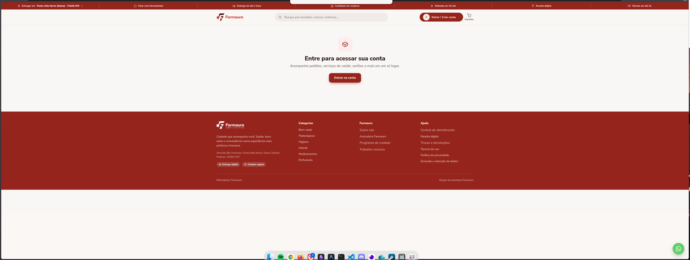
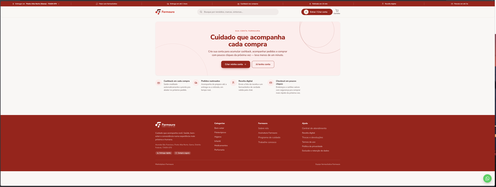

# Chat farmaura (Claude Code) — 2026-09-21 (536fa4af-11f9-4ded-a52d-4f22e16328bd)

- Diretório: `/home/noname/Documentos/desenvolvimento/dev`
- Sessão: `536fa4af-11f9-4ded-a52d-4f22e16328bd`
- Log de execução: [[_Logs_Execucao/2026-09-21/claude-farmaura-536fa4af|abrir]]

## Turno 1 · 2026-09-21 06:00
🔧 [[_Logs_Execucao/2026-09-21/claude-farmaura-536fa4af#Turno 1 · 2026-09-21 06:00|ver execução deste turno]]

Você

⚡ /contexto farmaura

Claude

Governança e padrões compartilhados lidos. Agora vou ler as decisões recentes, pendências, documentação, e as categorias de segurança/padrões/infra do farmaura (modo `full`).

Agora vou ler as pendências e as pastas de segurança/padrões/integrações restantes do modo `full`.

Pendências lidas por completo. Agora vou ler as pastas de segurança, integrações e padrões técnicos do farmaura (parte do modo `full`).

Agora as pastas de infraestrutura e integrações.

Contexto completo do **Farmaura** carregado. Aqui está o resumo, pronto para começar a programar:

## O que é

Marketplace farmacêutico em produção desde 2026-07-22 (`drogariafarmaura.com.br`, servidor `lumos-prd`, também `lumos-dev` como staging). Frontend React/Vite com duas superfícies estritamente segregadas — `farmaura/react/marketplace/` (cliente) e `farmaura/react/internal/` (farmacêutico/operações), mais `farmaura/react/shared/` — e backend próprio em `farmaura-api/` (FastAPI + Pydantic v2 + SQLAlchemy async + PostgreSQL 17 + Valkey).

## Arquitetura que qualquer mudança precisa respeitar

- Camadas: `api/v1/` → `services/` → `repositories/` → `models/`, DI via `Depends` ([padrao-camadas-backend-di-fastapi](dev-obsidian/farmaura/03_Padroes_Politicas/padrao-camadas-backend-di-fastapi.md)). Duas exceções documentadas: `delivery_pricing_service.py` (cross-service) e `fiscal_scheduler.py`/`fiscal_worker.py` (sessão própria).
- **RLS multi-tenant via GUCs de sessão** é o padrão central de isolamento (Postgres, não só aplicação) — qualquer tabela/tenant nova precisa entrar em `row_level_security.py`.
- **Backend é sempre fonte única de verdade** — nunca confiar em cálculo/validação do client (preço, estoque, cupom, elegibilidade).
- Schema muda **só via Alembic** desde 2026-07-23 — nunca direto no ORM. Cuidado: `bootstrap_database.py` local nunca estampa `alembic_version` num volume novo (gap conhecido, contornar com `stamp`+`upgrade`).
- Integração externa com efeito real (pagamento, fiscal, e-mail) segue outbox fora da transação + trava de ambiente fail-closed (padrão consolidado a partir de NFC-e/Asaas).

## Estado muito recente (tudo de 2026-09-20, ainda não em produção)

Sessão grande: NFC-e real (SVRS/DF, homologação), Asaas preparado pra sandbox, Nominatim auto-hospedado, tema claro/escuro por usuário, modal "completar cadastro" com estado no servidor, endereço com coordenada real no mapa, entregas com rota OSRM real + anexo de parada por proximidade no despacho, repositório multiplataforma Windows/Linux.

**Cadeia de 5 migrations pendentes em produção** (nenhuma aplicada ainda, todas testadas em dev): `20260919_01` (pick_locations) → `20260920_01` (ui_theme) → `20260920_02` (coordenadas de endereço) → `20260920_03` (PDV↔Order) → `20260920_04` (profile_nudge) → `20260920_05` (NFC-e). Qualquer deploy do backend novo **sem** aplicar essa cadeia quebra login, cadastro de endereço e mais. Também pendente subir `farmaura-nominatim` em staging/produção antes do próximo deploy.

## Riscos de segurança em aberto mais relevantes

- **Crítico histórico (corrigido)**: [cashback-wallet-vazamento-cross-tenant-via-pdv](dev-obsidian/farmaura/04_Seguranca_Riscos/cashback-wallet-vazamento-cross-tenant-via-pdv.md) — padrão a nunca repetir (`customer_id` do payload sem validar contra tenant).
- Ainda abertos, ALTO: [webhook-asaas-ip-allowlist-valida-ip-interno-errado](dev-obsidian/farmaura/04_Seguranca_Riscos/webhook-asaas-ip-allowlist-valida-ip-interno-errado.md), [cupom-pdv-bypass-limite-uso-fluxo-duas-fases](dev-obsidian/farmaura/04_Seguranca_Riscos/cupom-pdv-bypass-limite-uso-fluxo-duas-fases.md), [pdv-complete-sale-sem-guarda-estado](dev-obsidian/farmaura/04_Seguranca_Riscos/pdv-complete-sale-sem-guarda-estado.md), [bootstrap-vaza-dados-financeiros-para-cliente-e-caixa](dev-obsidian/farmaura/04_Seguranca_Riscos/bootstrap-vaza-dados-financeiros-para-cliente-e-caixa.md).
- Índice completo por severidade: [auditoria-2026-08-17-resumo-consolidado](dev-obsidian/farmaura/04_Seguranca_Riscos/auditoria-2026-08-17-resumo-consolidado.md).

## Pendências transversais que valem checar antes de mexer

- Idempotência ainda sem persistência real ([conectar-valkey-a-rate-limit-e-idempotencia](dev-obsidian/farmaura/06_Pendencias/conectar-valkey-a-rate-limit-e-idempotencia.md)).
- Timezone do container é UTC, não Brasília (parcialmente corrigido só em "ofertas do dia").
- Dois idiomas de erro concorrentes (`DomainError` vs `HTTPException`), mensagens em inglês ainda por traduzir em ~19 services.
- SDK Itaú da maquininha ainda bloqueado (driver simulado, não usar com cliente real).
- CPFs do seed são inválidos (afeta qualquer teste que precise gravar cartão/promoções).

## Arquivos de código para começar

Como o pedido foi geral (`/contexto farmaura`, sem área/módulo), o ponto de entrada é a tabela de domínios do [Hub.md](dev-obsidian/farmaura/Hub.md) — cada domínio tem rota em `farmaura-api/app/api/v1/`, serviço em `app/services/`, repositório em `app/repositories/` (Catálogo, Carrinho/Pedidos, Prescrições, Estoque, PDV, CRM, Entrega, Fiscal, Chat, Portal, Auth, Lojas/Fornecedores/Equipe, Orçamentos). No frontend, as telas ficam em `farmaura/react/marketplace/screens/` ou `farmaura/react/internal/screens/`, com componentes/API client compartilhados em `farmaura/react/shared/`.

**O que exatamente você quer implementar ou alterar?** Com o módulo/área definido eu abro os arquivos reais correspondentes antes de começar.

---

## Turno 2 · 2026-09-21 06:11
🔧 [[_Logs_Execucao/2026-09-21/claude-farmaura-536fa4af#Turno 2 · 2026-09-21 06:11|ver execução deste turno]]

Você

Dentro do marketplace está com um bug, quando o usuario está logado mas sai do usuario ou o container reinicia e ele fica no link "http://127.0.0.1:3000/account?tab=profile" por exemplo ele não vai automaticamente para a tela inicial, ele fica preso no link e com a tela toda branca, ajuste para que isso não aconteça

Claude

Confirmado o bug: `AccountScreen` acessa `user.name`/`user.email` em hooks executados antes do guard `if (!user)`, então quando a sessão é inválida (logout ou reinício do container invalidando o token), o componente lança uma exceção não tratada e o React desmonta a árvore inteira — sem error boundary, isso vira a tela branca presa na mesma URL. Vou corrigir.

Fix aplicado. Agora vou validar no navegador real, reproduzindo o cenário exato: logado em `/account?tab=profile`, sessão invalidada (simulando logout/reinício de container), e conferir que não fica mais em tela branca.

Build concluído. Agora vou recriar o container e testar o fluxo real no navegador.

google-chrome está disponível, e há um cache do Puppeteer. Vou usar o Chrome headless diretamente para reproduzir o cenário real: injetar um token inválido no localStorage e navegar para `/account?tab=profile`.

Puppeteer já está cacheado localmente. Vou usar via `npx` no scratchpad para automatizar a verificação real no Chrome.

Só o `account-screen.jsx` tinha o padrão inseguro, e já está corrigido (as ocorrências restantes usam `user &&`). Nenhum outro screen tem esse problema.

## Resumo

**Causa raiz**: em `farmaura/react/marketplace/screens/account-screen.jsx`, o `AccountScreen` acessava `user.name`/`user.email` num `useState` e num `useEffect` (linhas 548-551) **antes** do guard `if (!user)` (linha 559). Quando a sessão fica inválida — logout, ou o container reiniciando e invalidando o token guardado — `restoreSession()` põe `user = null`, e o React tentava ler propriedades de `null`, lançando uma exceção não tratada em render. Como não existe nenhum error boundary no app, isso desmonta a árvore inteira: tela branca, sem navegação nenhuma, presa na mesma URL.

**Correção**: troquei os acessos por `user && user.name` / `user && user.email` (e no array de dependências do `useEffect`), deixando os hooks seguros com `user` nulo e permitindo que a execução chegue ao `if (!user)` já existente — que renderiza a tela "Entre para acessar sua conta" com botão de login, o mesmo padrão já usado em todas as outras telas protegidas do marketplace (cashback, favoritos, assinaturas, checkout, chat).

**Verificação real**: rebuild do container `farmaura` (porta 3000) e teste com Chrome headless simulando exatamente o cenário relatado — token de sessão inválido no `localStorage` + acesso direto a `/account?tab=profile`. Antes seria uma tela branca; agora renderiza corretamente o header, o aviso de login e o footer, sem nenhum erro de página no console.

Confirmei também que nenhum outro screen do marketplace tem esse mesmo padrão de acesso inseguro antes do guard — era específico do `account-screen.jsx`.

---

## Turno 3 · 2026-09-21 06:33
🔧 [[_Logs_Execucao/2026-09-21/claude-farmaura-536fa4af#Turno 3 · 2026-09-21 06:33|ver execução deste turno]]

Você

Execute o hook para salvar o transcript

Claude

Encontrei o transcript da sessão atual. Vou montar o JSON de entrada e rodar o hook manualmente.

Hook executado com sucesso. O transcript da sessão atual foi reconstruído em `dev-obsidian/_Logs_Chat/2026-09-21/claude-dev-536fa4af.md` (o mesmo arquivo que você abriu no editor), agora atualizado com os turnos até agora.

---

## Turno 4 · 2026-09-21 06:37
🔧 [[_Logs_Execucao/2026-09-21/claude-farmaura-536fa4af#Turno 4 · 2026-09-21 06:37|ver execução deste turno]]

Você

Agora vamos reformular a tela de entre para acessar sua conta, pois está ficando curto o conteudo e gerando espaços em branco e o visual está simples de mais, coloque algo para incentivar a criação de contas e compras /impeccable

Claude

Boa variedade de ícones já disponíveis. Agora vou ver como a home screen apresenta os diferenciais reais (cashback, entrega, receita digital) para reaproveitar conteúdo genuíno, e como o CSS trata seções hero/aura.

It's exported. Vou ver como o `care-screen.jsx` usa (hero com aura sobre fundo rosé) — é um bom precedente para uma tela de "entre/crie conta" com mais presença visual.

Agora vou dar suporte a `mode=register` na `LoginScreen` para o CTA de criar conta poder pular direto pra aba certa.

Agora o bloco principal — reformular o `if (!user)` na `AccountScreen`.

Agora vou verificar as classes CSS usadas e então rebuildar/testar visualmente (desktop + mobile).

All classes existem. Vou rebuildar o container e verificar visualmente em desktop e mobile.

Vou confirmar que o botão "Criar minha conta" realmente abre a aba de cadastro (não só a de login).

Perfeito — o CTA "Criar minha conta" já pula direto para o formulário de cadastro ("Vamos começar"), com o retorno pra `/account?tab=profile` preservado depois do login. Limpando os arquivos temporários de verificação.

## Resumo

Reformulei a tela "Entre para acessar sua conta" (`AccountScreen`, estado sem usuário logado) em `farmaura/react/marketplace/screens/account-screen.jsx`:

- **Hero com aura**: card rosé-soft com `AuraLayer` (o mesmo dispositivo decorativo já usado no hub de Cuidado), eyebrow "Sua conta Farmaura", título e texto explicando o ganho real de ter conta.
- **Dois CTAs**: "Criar minha conta" (pula direto pra aba de cadastro via `?mode=register`, novo suporte adicionado à `LoginScreen`) e "Já tenho conta" — antes só havia um botão genérico "Entrar na conta".
- **Grade de 4 benefícios reais**: cashback automático, rastreio de pedido, receita digital validada por farmacêutico e checkout com endereço/cartão salvos — tudo funcionalidade já existente no produto, nada inventado.
- Resolve o espaço em branco vertical reclamado, sem inventar nenhum componente novo: reaproveitei só tokens/classes já existentes no design system (`fa-card`, `fa-eyebrow`, `fa-h1`, `fa-lead`, `fa-iconbox`, `fa-grid`, `AuraLayer`).

Testado com rebuild real do container (porta 3000) e Chrome headless: desktop (1440px) e mobile (390px) sem overflow nem erro de console, e cliquei no CTA "Criar minha conta" confirmando que abre o formulário de cadastro corretamente com o retorno para `/account?tab=profile` preservado.

Uma nota da própria skill: há uma versão mais nova do Impeccable disponível (instalada v4.1.1, atual v4.3.1) — rodar `npx impeccable update` quando quiser, não fiz isso agora pra não afetar esta sessão.

---

## Turno 5 · 2026-09-21 06:50
🔧 [[_Logs_Execucao/2026-09-21/claude-farmaura-536fa4af#Turno 5 · 2026-09-21 06:50|ver execução deste turno]]

Você

exxecute o hook

Claude

Hook executado com sucesso — o log em `dev-obsidian/_Logs_Chat/2026-09-21/claude-dev-536fa4af.md` foi atualizado (agora com 157 linhas) com os turnos mais recentes, incluindo o fix do bug de tela branca e a reformulação da tela de login/conta.

---

## Turno 6 · 2026-09-21 07:13
🔧 [[_Logs_Execucao/2026-09-21/claude-farmaura-536fa4af#Turno 6 · 2026-09-21 07:13|ver execução deste turno]]

Você

Remova os cards abaixo pois não gostei

↳ mensagem enviada enquanto eu ainda respondia

E coloque a logo da farmaura no fundo como uma marca dagua igual é no login

Claude

Agora aplico o marcador d'água na tela e ajusto o z-index do conteúdo para ficar por cima.

Agora rebuild e verificação visual (desktop + mobile).

Feito — removi a grade de 4 cards e adicionei o isotipo da Farmaura como marca d'água no fundo do card, no mesmo estilo da tela de login (mesma opacidade controlada por `--fa-aura`, atrás do texto). Criei uma classe própria (`.fa-account-gate-mark` em `marketplace.css`) em vez de reutilizar a versão full-bleed do login, já que aqui o elemento é um card contido, não a página inteira.

Testado (rebuild real, Chrome headless, desktop 1440px e mobile 390px): sem erro de console, marca d'água visível e legível atrás do texto nos dois tamanhos.

Um ponto que reparei: com os cards fora, voltou um respiro grande em branco entre o card e o rodapé (o mesmo problema de espaço vazio do relato original) — quer que eu ajuste isso de alguma forma (reduzir o padding inferior, centralizar verticalmente, ou é pra deixar assim mesmo por enquanto)?

---

## Turno 7 · 2026-09-21 07:34
🔧 [[_Logs_Execucao/2026-09-21/claude-farmaura-536fa4af#Turno 7 · 2026-09-21 07:34|ver execução deste turno]]

Você

Execute o hook

Claude

Hook executado — log atualizado (197 linhas) em `dev-obsidian/_Logs_Chat/2026-09-21/claude-dev-536fa4af.md`.

---

## Turno 8 · 2026-09-21 07:41
🔧 [[_Logs_Execucao/2026-09-21/claude-farmaura-536fa4af#Turno 8 · 2026-09-21 07:41|ver execução deste turno]]

Você

Aumente a logo,e aumente também a altura do card

Claude

Agora rebuild e verificação visual.

Feito — logo maior (`min(80%, 640px)`, era `min(60%, 420px)`) e card mais alto (`minHeight: clamp(420px, 56vh, 620px)`, com o conteúdo centralizado verticalmente dentro dele). Testei em desktop e mobile, sem overflow nem erro.

Ainda sobra um respiro em branco entre o card e o rodapé nos dois tamanhos — quer que eu resolva isso agora ou deixamos assim por enquanto?

---

## Turno 9 · 2026-09-21 09:02
🔧 [[_Logs_Execucao/2026-09-21/claude-farmaura-536fa4af#Turno 9 · 2026-09-21 09:02|ver execução deste turno]]

Você

Deixe a logo mais transparente para que os textos não se confundam como está atualmente

Claude

Rebuild e verificação.

Confirma bem no mobile também — bem discreto, sem atrapalhar a leitura. Limpando os arquivos temporários.

Reduzi a opacidade da marca d'água em duas etapas (de `--fa-aura * .4` para `--fa-aura * .06`, efetivamente de 20% pra 3% de opacidade) até ela virar só uma textura de fundo bem sutil, sem mais competir com o título e o texto por cima. Confirmado em desktop e mobile.

---

## Turno 10 · 2026-09-21 09:09
🔧 [[_Logs_Execucao/2026-09-21/claude-farmaura-536fa4af#Turno 10 · 2026-09-21 09:09|ver execução deste turno]]

Você

Aumente o tamanho da logo e ficou muito transparente que quase não é visivel, ajuste

Claude

Bem melhor — logo maior e agora visível como marca d'água, sem competir com o texto. Confirmando no mobile também.

Ajustado: logo aumentada (`min(96%, 760px)`, era `min(80%, 640px)`) e opacidade subiu de `.06` para `.1` no multiplicador do `--fa-aura` — agora dá pra ver a marca d'água claramente nos dois breakpoints, sem voltar a brigar com o texto por cima.

---
