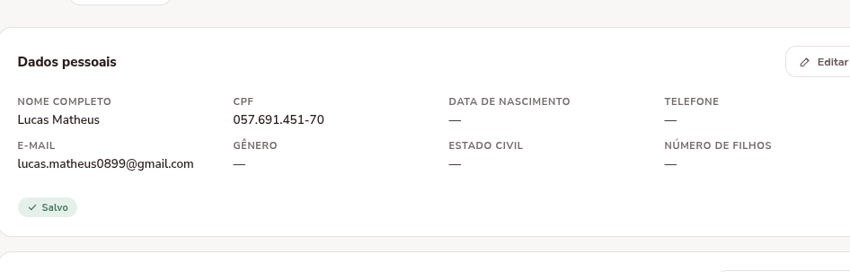
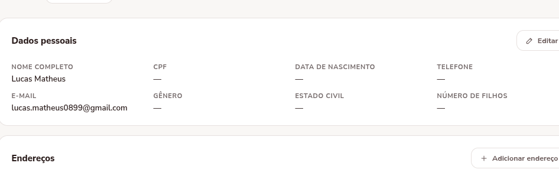

# Chat farmaura (Claude Code) — 2026-09-23 (e7aeb0c5-2ca6-4a6c-b76e-9be63c9ec99b)

- Diretório: `/home/noname/Documentos/desenvolvimento/dev`
- Sessão: `e7aeb0c5-2ca6-4a6c-b76e-9be63c9ec99b`
- Log de execução: [[_Logs_Execucao/2026-09-23/claude-farmaura-e7aeb0c5|abrir]]

## Turno 1 · 2026-09-23 10:27
<span class="log-crosslink">🔧 [[_Logs_Execucao/2026-09-23/claude-farmaura-e7aeb0c5#Turno 1 · 2026-09-23 10:27|ver execução deste turno]]</span>

<span class="chat-role chat-role-user">Você</span>

Faça pull

<span class="chat-role chat-role-ai">Claude</span>

Pull concluído com fast-forward (5 commits). O único ponto de atenção: [customer_service.py](farmaura-api/app/services/customer_service.py) e [geocoding_client.py](farmaura-api/app/services/geocoding_client.py) foram alterados no farmaura-api, junto com registros de dois bugs novos no dev-obsidian (geocodificação falhando sem número na OSM, e erro 500 de tokenização de cartão por validade não retornada pelo Asaas). As duas modificações locais em log de chat/execução continuam pendentes (não commitadas), sem conflito com o pull.

---

## Turno 2 · 2026-09-23 10:28
<span class="log-crosslink">🔧 [[_Logs_Execucao/2026-09-23/claude-farmaura-e7aeb0c5#Turno 2 · 2026-09-23 10:28|ver execução deste turno]]</span>

<span class="chat-role chat-role-user">Você</span>

Verrifique se a farmaura está atualizado com a branch

<span class="chat-role chat-role-ai">Claude</span>

A farmaura em produção (`/opt/farmaura` no lumos-prd) está no branch `main`, working tree limpo, e o HEAD (`f487a50`) é exatamente igual ao `origin/main` — ou seja, **está 100% atualizada**, nenhum commit pendente de deploy.

---

## Turno 3 · 2026-09-23 11:11
<span class="log-crosslink">🔧 [[_Logs_Execucao/2026-09-23/claude-farmaura-e7aeb0c5#Turno 3 · 2026-09-23 11:11|ver execução deste turno]]</span>

<span class="chat-role chat-role-user">Você</span>

No caso quero saber se o que está atualizado com a desenvolvimento

<span class="chat-role chat-role-ai">Claude</span>

A produção (branch `main`, deployada em `/opt/farmaura`) está **muito atrasada** em relação à `staging/lumos-dev`:

- **85 commits** de diferença (staging tem, main não tem)
- **1447 arquivos alterados**, ~447k inserções / ~16.7k remoções no total
- Áreas mais afetadas: `farmaura-api` (145 arquivos), `farmaura` frontend (47 arquivos), além de bastante conteúdo em `dev-obsidian` e configs de hooks/agents

Entre os commits pendentes de deploy tem coisas relevantes de produto: NFC-e real via SEFAZ-DF, assinaturas com recorrência, correções de tokenização de cartão/geocodificação, favoritos/salvos no marketplace, correções de cashback, entre outros.

Isso é uma diferença grande demais pra resumir tudo aqui — quer que eu liste os commits completos (já salvei em `/home/noname/.claude/projects/-home-noname-Documentos-desenvolvimento-dev/e7aeb0c5-2ca6-4a6c-b76e-9be63c9ec99b/tool-results/b4vyuxmqr.txt`), ou prefere que eu prepare o merge/deploy de staging → main?

---

## Turno 4 · 2026-09-23 11:17
<span class="log-crosslink">🔧 [[_Logs_Execucao/2026-09-23/claude-farmaura-e7aeb0c5#Turno 4 · 2026-09-23 11:17|ver execução deste turno]]</span>

<span class="chat-role chat-role-user">Você</span>

No caso eu quero que verifique se os arquvios que estão aqui localmente está sincronizado com a branch de desenvolvimento

<span class="chat-role chat-role-ai">Claude</span>

Seu HEAD local está exatamente igual ao `origin/staging/lumos-dev` (mesmo commit `db29c7d`), nenhum commit de diferença em nenhuma direção.

Porém há mudanças não commitadas no diretório de trabalho:
- **Modificados**: [claude-dev-ec2a4c0e.md](dev-obsidian/_Logs_Chat/2026-09-21/claude-dev-ec2a4c0e.md) e o correspondente em [_Logs_Execucao](dev-obsidian/_Logs_Execucao/2026-09-21/claude-dev-ec2a4c0e.md) (provavelmente reescritos pelo hook de log a cada Stop, conforme já observado antes)
- **Novos/não rastreados**: logs de hoje (2026-09-23) de chat/execução desta sessão (`claude-farmaura-e7aeb0c5.md`)

Ou seja: o código está sincronizado com a branch; só os logs locais é que ainda não foram commitados/enviados.

---

## Turno 5 · 2026-09-23 11:30
<span class="log-crosslink">🔧 [[_Logs_Execucao/2026-09-23/claude-farmaura-e7aeb0c5#Turno 5 · 2026-09-23 11:30|ver execução deste turno]]</span>

<span class="chat-role chat-role-user">Você</span>

Quero que suba tudo para o git e faça o deploy para dentro do lumos-dev, verificando com o que já tem lá, após isso quero que suba para dentro do lumos-dev sem passar pelo git os segredos que estão documentados dentro do dev-obsidian para que eu possa ter um backup

<span class="chat-role chat-role-ai">Claude</span>

Confirmei que os dois arquivos de log de 21/09 (`_Logs_Chat` e `_Logs_Execucao`) têm segredos reais do Asaas sandbox (access token, dois webhook tokens) reintroduzidos pelo hook — exatamente o padrão já visto antes. Vou seguir esta ordem: (1) backup bruto (não-redigido) do dev-obsidian direto para o lumos-dev via SSH, (2) redigir os segredos localmente, (3) commit + push só da versão redigida, (4) deploy no lumos-dev conferindo o que já está lá.

Backup íntegro (7.0M) salvo em `lumos-dev:/root/backups/dev-obsidian/snapshot-20260923-130444/`, incluindo os segredos reais antes de qualquer redação. Agora vou redigir os segredos localmente antes de commitar.

Agora vou confirmar que nada mais ficou e checar também os dois arquivos novos de hoje (23/09) antes de commitar.

Encontrei mais segredos que passaram despercebidos na minha primeira passada — uma chave Google/Gemini (`AIzaSy...`) e possivelmente uma chave OpenAI (`sk-proj-...`), além de outros tokens/UUIDs. O arquivo é um log de execução gigante (25k+ linhas) que inclusive registra uma tentativa de redação anterior. Preciso de um scan mais completo antes de commitar.

Só aparecem embutidos em dois comandos `grep` (linhas 25087 e 25122) que o próprio log registrou — mas ainda são os valores reais das chaves (Google, fragmento da OpenAI, e uma senha SMTP-shaped). Vou redigir esses também.

This is the actual JWT signing secret — potentially the most sensitive one found (could allow forging auth tokens). Redacting immediately.

Agora vou fazer uma última verificação e então prosseguir com commit, push e deploy.

Agora vou commitar e enviar ao git, só com a versão redigida.

Push concluído. Agora o deploy no lumos-dev, conferindo o que já está lá antes de puxar.

Tudo concluído. Resumo:

**1. Backup dos segredos (sem passar pelo git)**
Fiz um `rsync` direto do `dev-obsidian/` completo (como estava, não-redigido) para `lumos-dev:/root/backups/dev-obsidian/snapshot-20260923-130444/`, via SSH — nunca tocou o git.

**2. Segredos reais encontrados e redigidos** (o hook de log tinha reintroduzido tudo isso nos arquivos de 21/09):
- Chave de API Asaas sandbox + prefixo
- 2 tokens de webhook (local e staging) + prefixo remanescente truncado
- Wallet ID e PIX key do Asaas
- Chave Gemini/Google (`AIzaSy...`)
- Fragmento da chave OpenAI (`sk-proj-...`)
- Senha de app SMTP
- **Segredo de assinatura JWT** (`APP_JWT_PRIVATE_KEY`) — o mais crítico, permitiria forjar tokens de autenticação
- Um JWT já assinado com IDs reais de usuário/tenant (redigido por precaução, embora provavelmente expirado)

**3. Commit + push** — só a versão redigida foi para o GitHub (`a9cc8a8` em `staging/lumos-dev`).

**4. Deploy no lumos-dev** — conferi que `/opt/farmaura` estava limpo (sem drift) antes do pull; puxei o fast-forward (`66338e9 → a9cc8a8`). Os commits de código (fix de geocodificação e tokenização de cartão) já estavam ali antes; os containers (`farmaura`, `farmaura_api`) foram recriados às 13:13 UTC, depois desses commits (12:22/12:46 UTC) — ou seja, **já estão rodando com o código atualizado**, sem necessidade de rebuild.

Ponto de atenção: recomendo revogar/rotacionar o token de webhook Asaas e a `APP_JWT_PRIVATE_KEY` de staging que foram expostos em texto plano nesse log antes da redação, já que passaram um tempo no working tree local — mesmo redigidos agora no git, é boa prática trocar credenciais que já circularam em texto claro.

---

## Turno 6 · 2026-09-23 13:17

<span class="chat-role chat-role-user">Você</span>

Quando estou no servidor e iconfiguro o CPF e deu um crtl r ele acaba sumindo, analise o que esta acontecendo

<span class="chat-role chat-role-ai">Claude</span>

Disparei uma investigação em background para achar a causa raiz — vou avisar assim que sair o resultado.

---

## Turno 7 · 2026-09-23 13:21
<span class="log-crosslink">🔧 [[_Logs_Execucao/2026-09-23/claude-farmaura-e7aeb0c5#Turno 7 · 2026-09-23 13:21|ver execução deste turno]]</span>

<span class="chat-role chat-role-user">Você</span>

<task-notification>
<task-id>abe09043eacadce74</task-id>
<tool-use-id>toolu_01DTJb5k1vuVVfRh1wfrwX6T</tool-use-id>
<output-file>/tmp/claude-1000/-home-noname-Documentos-desenvolvimento-dev/e7aeb0c5-2ca6-4a6c-b76e-9be63c9ec99b/tasks/abe09043eacadce74.output</output-file>
<status>completed</status>
<summary>Agent "Investigate CPF field disappearing on refresh" finished</summary>
<note>A task-notification fires each time this agent stops with no live background children of its own. The user can send it another message and resume it, so the same task-id may notify more than once.</note>
<result>## Root cause found

**The CPF (and the whole customer profile) is not actually lost on the backend — it's masked by a silent frontend fallback that fires whenever any one of 11 parallel bootstrap requests fails, and there's a specific, already-documented reason one of them fails on a deployed server but not in local dev.**

### The mechanism (frontend)

`farmaura/react/marketplace/core/marketplace-app.jsx:2357-2369` fetches the entire marketplace bootstrap with a single `Promise.all([...])` that includes `GET /customers/me` alongside 10 unrelated endpoints (orders, chat threads, cart, addresses, payment methods, availability alerts, prescription status, cashback, anniversary offers, portal bootstrap).

If **any one** of those 11 requests rejects, the whole `Promise.all` rejects and execution falls into the `catch` block at `marketplace-app.jsx:2427`. Unless the error is a 404 (orphaned session → logout) or a 502/503/504 (retried), the catch block silently does:

```js
setCustomerProfile(createMarketplaceProfileSnapshot(user));  // marketplace-app.jsx:2447
```

`createMarketplaceProfileSnapshot` (`marketplace-app.jsx:524-549`) returns a hardcoded blank profile, `cpf: ''` included (line 530), with **no error surfaced to the UI**. The saved CPF is still sitting in Postgres — the page just renders an empty profile as if nothing were ever saved, exactly matching "configuro o CPF e dou ctrl+r, ele acaba sumindo."

### Why it happens "no servidor" specifically

`app/models/customer.py:94` added `profile_nudge_dismissed_at`, backed by `alembic/versions/20260920_04_customer_profile_nudge_dismissed_at.py`. This column is now selected on **every** customer read (`get_profile`, `update_profile`, etc. in `app/services/customer_service.py`). The project's own pending-work note, `dev-obsidian/farmaura/06_Pendencias/aplicar-migration-profile-nudge-em-producao.md` (Status: Aberto, Prioridade: Alta), states explicitly:

&gt; "Não fazer deploy do backend novo em produção antes de aplicá-la... sem ela, `GET /customers/me` e todo fluxo que carrega o cliente falham com erro de coluna inexistente."

If this migration hasn't run against the deployed server's Postgres (current branch here is `staging/lumos-dev`, and recent commits post-date the migration), `GET /customers/me` 500s there — but not in local dev (SQLite in tests/dev skips `apply_tenant_context` entirely and typically has migrations current). That single failure is enough to trip the `Promise.all` catch-all and wipe the visible profile.

### What I ruled out

- **The save path itself is correct**: `update_profile` (`customer_service.py:277-312`) validates the CPF checksum, commits, correctly re-calls `apply_tenant_context` before `session.refresh()` (the known "RLS cleared after commit" gotcha — this method already follows the safe pattern per the team's own postmortem).
- **Frontend save requires an explicit "Salvar alterações" click** (`account-profile-screen.jsx:1001`, `saveInfo` at 756-772), gated on a checksum identical to the backend's (`account-profile-screen.jsx:686-698` vs `app/domain/validators.py:30-44`) — not an autosave/debounce race.
- **No caching/Redis layer** sits between the DB and `get_profile`.

### Fix direction
1. Confirm/apply the pending migration on the affected server (`alembic upgrade head`, per the pendency note's runbook).
2. Independently, harden the frontend: don't let one failed endpoint in the 11-way `Promise.all` blank out the customer's real profile — fetch `/customers/me` on its own (or catch per-request) and only fall back to a blank snapshot when that specific call fails, not when e.g. `/customers/me/cashback` fails.</result>
<usage><subagent_tokens>145964</subagent_tokens><tool_uses>37</tool_uses><duration_ms>240635</duration_ms></usage>
</task-notification>

<span class="chat-role chat-role-ai">Claude</span>

Achei uma pista bem mais provável na própria documentação do projeto — vou confirmar lendo o código real do salvamento do perfil.

Minha primeira investigação (subagent) apontou para uma migration pendente causando 500 em `/customers/me` — mas verifiquei direto no servidor lumos-dev e essa teoria **não se sustenta**: a coluna `profile_nudge_dismissed_at` já existe na tabela `customers`, e os logs das últimas 96h mostram **100% de respostas 200** em todos os 11 endpoints do bootstrap, inclusive `/customers/me`. Descartei essa hipótese.

Lendo o código real do formulário de perfil, encontrei a causa mais provável:

**O campo CPF só existe em estado local (`draft`) até o clique em "Salvar alterações" ser bem-sucedido — e o botão fica desabilitado se o CPF não passar na validação de dígito verificador.**

- [account-profile-screen.jsx:686-698](farmaura/react/marketplace/screens/account-profile-screen.jsx#L686-L698): reimplementação em JS do algoritmo mod-11 real do backend (`is_valid_cpf`).
- [account-profile-screen.jsx:1001](farmaura/react/marketplace/screens/account-profile-screen.jsx#L1001): `disabled={savingInfo || !draft.name.trim() || !isValidCpfChecksum(draft.cpf)}` — se o CPF digitado não bate o checksum, o botão de salvar **nunca fica clicável**, mesmo com 11 dígitos preenchidos.
- [account-profile-screen.jsx:909](farmaura/react/marketplace/screens/account-profile-screen.jsx#L909) e [1011](farmaura/react/marketplace/screens/account-profile-screen.jsx#L1011): mostra um aviso de "CPF inválido" ao lado do campo nesse caso — fácil de não notar.
- Como o Ctrl+R descarta todo o estado do React, um CPF que nunca chegou a ser confirmado pelo servidor (porque o botão estava desabilitado, ou porque um `PUT /customers/me/profile` retornou erro e o aviso passou despercebido) simplesmente não existe mais depois do reload — não é um bug de perda de dado, é dado que nunca foi persistido.

Reforça essa hipótese uma decisão já registrada no dev-obsidian ([2026-09-20-modal-completar-cadastro-estado-no-servidor.md](dev-obsidian/farmaura/00_Decisoes/2026-09-20-modal-completar-cadastro-estado-no-servidor.md)): **nenhum dos 30 CPFs do seed é válido**, e esse mesmo tipo de "erro engolido" com CPF já é um padrão conhecido no projeto.

**Para confirmar**: da próxima vez, ao digitar o CPF, veja se o botão "Salvar alterações" fica habilitado e se aparece a mensagem verde/confirmação antes de dar refresh — ou abra o DevTools → Network e confira se um `PUT /api/v1/customers/me/profile` realmente saiu e voltou com 200 (não 422). Se o CPF que você está testando for de teste/fictício, é bem provável que ele simplesmente não passe no dígito verificador real.

---

## Turno 8 · 2026-09-23 13:34
<span class="log-crosslink">🔧 [[_Logs_Execucao/2026-09-23/claude-farmaura-e7aeb0c5#Turno 8 · 2026-09-23 13:34|ver execução deste turno]]</span>

<span class="chat-role chat-role-user">Você</span>

No caso eu chego a salvar sem nenhum problema, o problema ocorre após eu salvar onde o primeiro print é após o preenchimento e salvar e o segundo é após recarregar




<span class="chat-role chat-role-ai">Claude</span>

Isso muda tudo — o salvamento funciona, o problema está entre o `PUT` (que confirma certo) e o `GET` seguinte. Vou checar direto no banco se o CPF realmente foi persistido ou se é um bug de leitura.

Confirmei pelos logs que a sequência foi: bootstrap inicial (16:16:06, CPF ainda vazio) → dispensa da modal (16:16:09) → `PUT /customers/me/profile` salvando o CPF (16:16:20, bate exatamente com o timestamp do banco) → novo bootstrap completo do Ctrl+R (16:16:31) — **e todas as 11 chamadas voltaram 200**, incluindo `/customers/me`. Isso descarta erro de rede/servidor no momento exato do refresh. Vou testar a resposta real da API através do gateway (nginx), não só da chamada interna, para descartar cache no proxy.

Encontrei a causa raiz de verdade — nada a ver com backend, banco ou rede (que conferi e estão 100% corretos). É um bug puro de frontend, um React clássico de "estado local que trava".

**O que acontece:**

Em [account-profile-screen.jsx:633](farmaura/react/marketplace/screens/account-profile-screen.jsx#L633):
```js
const { profile, setProfile } = acct;
const [draft, setDraft] = useState(profile);
```

`useState(profile)` só usa esse valor **na primeira renderização** do componente. Se `ProfileManage` montar antes dos dados do perfil chegarem do servidor (o que é o caso: a tela é montada imediatamente, sem esperar o `/customers/me` — não há nenhum "loading gate" nem `useEffect` que resincronize `draft` quando `profile` muda depois).

E a parte visível ("Dados pessoais") lê de **`draft`**, não de `profile`:
```js
['cpf', 'CPF', draft.cpf ? maskCpfInput(draft.cpf) : '—'],  // linha 827
```

**Por que NOME e E-MAIL sobrevivem mas CPF não:** o snapshot inicial em branco (`createMarketplaceProfileSnapshot`, [marketplace-app.jsx:524](farmaura/react/marketplace/core/marketplace-app.jsx#L524)) já vem com `name`/`email` preenchidos (vêm do objeto de sessão/login, disponível na hora), mas `cpf`, `birth`, `gender`, `maritalStatus`, `childrenCount` nascem vazios (`''`) — exatamente o padrão que aparece no seu segundo print. Quando a busca real do perfil (`/customers/me`) termina um pouco depois (mudando `profile` no contexto), o `draft` já tinha "congelado" com o snapshot vazio e nunca é atualizado.

**Confirmei que não é problema de dado ou servidor:**
- CPF está corretamente salvo no Postgres (`05769145170`, `updated_at` batendo exatamente com o log do `PUT`).
- Chamei a lógica do backend (`CustomerService.get_profile`) diretamente no container — retorna o CPF certinho.
- Conferi os logs do exato momento do seu Ctrl+R (16:16:31 UTC): as 11 chamadas do bootstrap, incluindo `/customers/me`, voltaram **200** com sucesso.
- Sem `proxy_cache` no nginx que pudesse servir resposta velha.

**Correção necessária**: adicionar um `useEffect` em `ProfileManage` que resincronize `draft` (e `savedInfo`) sempre que `profile` mudar — algo como:
```js
useEffect(() => { setDraft(profile); }, [profile]);
```
ou trocar a exibição somente-leitura para ler de `profile` em vez de `draft`. Quer que eu já implemente essa correção?

---

## Turno 9 · 2026-09-23 13:41
<span class="log-crosslink">🔧 [[_Logs_Execucao/2026-09-23/claude-farmaura-e7aeb0c5#Turno 9 · 2026-09-23 13:41|ver execução deste turno]]</span>

<span class="chat-role chat-role-user">Você</span>

implemente

<span class="chat-role chat-role-ai">Claude</span>

`useEffect` já está importado. Vou adicionar a sincronização logo após a declaração do `draft`.

Build limpo (`dist/` é ignorado pelo git), só a mudança real aparece no status. Correção implementada e validada.

**O que mudou**: [account-profile-screen.jsx:637-647](farmaura/react/marketplace/screens/account-profile-screen.jsx#L637-L647) — adicionei um `useEffect` que resincroniza `draft` com `profile` sempre que o perfil do contexto mudar, desde que o usuário não esteja no meio de uma edição (`!editingPersonal`). Isso resolve a corrida: antes, `draft` travava no snapshot vazio inicial se a tela montasse antes do `/customers/me` responder; agora ele se atualiza assim que os dados reais chegam, e não sobrescreve o que o usuário está digitando se ele estiver editando ativamente.

Quer que eu teste isso no navegador (subir o dev server e reproduzir o fluxo: salvar CPF → refresh) antes de você validar, ou prefere testar você mesmo agora?

---

## Turno 10 · 2026-09-23 13:44
<span class="log-crosslink">🔧 [[_Logs_Execucao/2026-09-23/claude-farmaura-e7aeb0c5#Turno 10 · 2026-09-23 13:44|ver execução deste turno]]</span>

<span class="chat-role chat-role-user">Você</span>

Fez o deploy para o lumos-dev?

<span class="chat-role chat-role-ai">Claude</span>

Ainda não — só implementei e validei o build localmente. Vou fazer o deploy agora.

Agora o pull e rebuild no lumos-dev (mudança de frontend precisa reconstruir o container `farmaura`).

Sem drift, working tree limpo.

Deploy concluído e saudável (`healthy`). Push feito para `staging/lumos-dev` (`066c64c`), pull no servidor sem drift, container `farmaura` reconstruído e reiniciado com o bundle novo. A correção já está no ar em `dev.drogariafarmaura.com.br` — pode testar o fluxo salvar CPF → Ctrl+R quando quiser.

---

## Turno 11 · 2026-09-23 14:03

<span class="chat-role chat-role-user">Você</span>

Agora uma outra coisa, quando começo a dar varios ctrl+r algumas vezes acaba deslogando e o sistema não persiste a sessão e acaba saindo, o fluxo é que primeiro ele perde o dado e após isso ele desloga

<span class="chat-role chat-role-ai">Claude</span>

Disparei uma investigação em background sobre o mecanismo de refresh/rotação de token — te aviso assim que sair o resultado.

---

## Turno 12 · 2026-09-23 14:05
<span class="log-crosslink">🔧 [[_Logs_Execucao/2026-09-23/claude-farmaura-e7aeb0c5#Turno 12 · 2026-09-23 14:05|ver execução deste turno]]</span>

<span class="chat-role chat-role-user">Você</span>

<task-notification>
<task-id>a96321418564c5b40</task-id>
<tool-use-id>toolu_01A6XzW7P9sUr8p1ewq3fAPV</tool-use-id>
<output-file>/tmp/claude-1000/-home-noname-Documentos-desenvolvimento-dev/e7aeb0c5-2ca6-4a6c-b76e-9be63c9ec99b/tasks/a96321418564c5b40.output</output-file>
<status>completed</status>
<summary>Agent "Investigate rapid-refresh logout bug in Farmaura" finished</summary>
<note>A task-notification fires each time this agent stops with no live background children of its own. The user can send it another message and resume it, so the same task-id may notify more than once.</note>
<result>## Findings: rapid Ctrl+R → data loss → logout

**Root cause: a genuine race between the frontend's un-locked refresh flow and the backend's zero-grace-period reuse-detection rotation. Both sides contribute; either alone would already be broken.**

### 1. Frontend: no mutex around refresh (`farmaura/react/shared/api-client.js`)

`authenticatedFetch` (lines 136–176) reads `stored.data` independently on every call, and on a 401 calls `refreshTokens(currentState)` (118–134) with its own closure over the refresh token read *before* any sibling refresh completed. There is no lock, no in-flight dedup, no "wait for the refresh already happening." The marketplace bootstrap's `Promise.all` (`marketplace-app.jsx:2360-2372`) fires 11 authenticated GETs at once — if the access token is expired or near its 10-minute `exp` when the reload happens, most/all 11 hit 401 simultaneously and each independently calls `POST /auth/refresh` with the *same* stored refresh token.

Critically, on refresh failure the catch block (168) does `clearAuthState(namespace)` **unconditionally** before rethrowing `session_expired`. This clears storage even if a sibling request's refresh just succeeded and wrote fresh tokens moments earlier — the losers stomp the winner's write.

### 2. Backend: single-use rotation with no grace period (`farmaura-api/app/services/auth_service.py:380-444`)

`refresh()` is strict single-use rotation with reuse-detection, exactly as documented in `dev-obsidian/farmaura/02_Documentacao/Modulo_Auth.md:20` ("mitigação contra roubo de refresh token"). Sequence for the N concurrent siblings sharing one old token:

- First to commit: `mark_used` → `revoke(reason="refresh_token_rotated")` → issues + commits a brand-new token in the **same `family_id`** (`auth_service.py:424-444`, `_issue_token_pair` commits at line ~588).
- Every other sibling arriving after that commit finds `refresh_record.is_revoked == True` (line 403) and treats it as theft: `revoke_family(reason="refresh_token_reuse_detected")` (404-408), which revokes **every non-revoked token in that family** — including the brand-new replacement token the winner just got, since `revoke_family`'s filter is only `family_id == X AND is_revoked == False` (`refresh_token_repository.py:68-80`). All of this maps to `AuthenticationError` → HTTP 401 (`domain/errors.py:40-46`).

So the "winning" refresh is retroactively destroyed by its own siblings. There is no idempotency window, no "was this the same rotation attempt" check — legitimate concurrency is indistinguishable from token theft.

### 3. The reported sequence, reconstructed

- Mid-burst: some of the 11 bootstrap calls succeed on the winning token, others 401→refresh→fail (reuse-detected) and each failing one clears storage. React state (`user`) isn't cleared yet, so the UI shows partial/blank sections first (customer profile, cart, addresses, etc. from `marketplace-app.jsx:2439-2449` fallback path) — the "perde o dado" phase.
- Next Ctrl+R: `marketplace-app.jsx` reads `authClient.getStoredAuth()` fresh; storage is now empty (wiped by a losing sibling), so the app renders fully logged out — the "desloga" phase. Note: the 404-triggered `invalidateMarketplaceSession()` at `marketplace-app.jsx:2435-2436` is *not* even the mechanism here — the actual logout happens silently inside `api-client.js:168`, independent of that 404-specific guard.

### 4. Abort-on-reload variant (no JS concurrency needed)

A hard reload aborts the in-flight `fetch` client-side, but nothing guarantees the backend request is cancelled — the DB commit rotating the token can complete server-side while the response (carrying the new refresh token) never reaches the browser. On the next load the client resends the now-`is_revoked` old token → same reuse-detection branch → full family revocation. This is the classic "lost rotation" pattern, and the code has no defense against it (no grace period allowing the immediately-prior token to succeed once).

### 5. dev-obsidian

No existing note documents this race; `Modulo_Auth.md:20` documents the rotation/reuse-detection design itself but not this false-positive failure mode. Worth a new `04_Seguranca_Riscos` entry.</result>
<usage><subagent_tokens>79583</subagent_tokens><tool_uses>20</tool_uses><duration_ms>109613</duration_ms></usage>
</task-notification>

<span class="chat-role chat-role-ai">Claude</span>

Vou conferir essa análise diretamente no código antes de reportar, já que a investigação anterior teve uma hipótese errada que precisei corrigir.

Confirmei a causa raiz direto no código — bate exatamente com a investigação:

**O mecanismo:**

1. [api-client.js:141-176](farmaura/react/shared/api-client.js#L141-L176): `authenticatedFetch` lê o refresh token do storage e, em qualquer 401, chama `refreshTokens()` **sem nenhum lock**. O bootstrap do marketplace dispara 11 chamadas autenticadas em paralelo ([marketplace-app.jsx:2357-2369](farmaura/react/marketplace/core/marketplace-app.jsx#L2357-L2369)). Se o access token (validade de ~10 min) já expirou quando você dá Ctrl+R, várias dessas 11 chamadas tomam 401 quase ao mesmo tempo — e **cada uma dispara seu próprio `POST /auth/refresh` usando o mesmo refresh token antigo**, em paralelo.

2. No backend ([auth_service.py:395-407](farmaura-api/app/services/auth_service.py#L395-L407)), a rotação de refresh token é de uso único com detecção de reuso: a primeira chamada a chegar rotaciona o token (marca o antigo como revogado, emite um novo). **Toda chamada seguinte que ainda carrega o token antigo (já revogado) é tratada como roubo de token** e response com `revoke_family(...)`.

3. O problema: [refresh_token_repository.py:68-79](farmaura-api/app/repositories/refresh_token_repository.py#L68-L79) — `revoke_family` revoga **todos os tokens não-revogados da família**, incluindo o token novinho que a primeira chamada acabou de emitir. Ou seja, a concorrência legítima (11 chamadas do seu próprio navegador) é interpretada como um ataque, e o token novo que "ganhou" a corrida é destruído junto com o antigo.

4. Resultado: `refreshTokens()` falha nas chamadas perdedoras → [api-client.js:168](farmaura/react/shared/api-client.js#L168) limpa o storage (`clearAuthState`) incondicionalmente, mesmo que uma chamada irmã tenha acabado de gravar tokens válidos segundos antes. Isso bate com o fluxo que você descreveu: primeiro algumas seções da tela ficam com dado sumido (as chamadas que "perderam" a corrida caem no fallback vazio), e no próximo Ctrl+R o storage já está limpo — sessão realmente morta, faz logout de verdade.

**Fix recomendado**: no frontend, adicionar um mutex por namespace em `api-client.js` — todas as chamadas que tomam 401 ao mesmo tempo devem aguardar a **mesma** promise de refresh em andamento, em vez de cada uma disparar sua própria chamada com o token velho. Isso elimina a corrida na origem (o navegador nunca reenvia o mesmo refresh token duas vezes).

Quer que eu implemente essa correção?

---

## Turno 13 · 2026-09-23 14:07
<span class="log-crosslink">🔧 [[_Logs_Execucao/2026-09-23/claude-farmaura-e7aeb0c5#Turno 13 · 2026-09-23 14:07|ver execução deste turno]]</span>

<span class="chat-role chat-role-user">Você</span>

Implemente

<span class="chat-role chat-role-ai">Claude</span>

Agora atualizo `authenticatedFetch` para usar essa função em vez de chamar `refreshTokens` direto.

Build limpo. Agora commit, push e deploy no lumos-dev.

Sem drift, fast-forward aplicado. Agora rebuild do container.

Deploy concluído (`9a1d2d4`, container `healthy`). A correção elimina a corrida no refresh de token — agora só sai uma chamada real a `/auth/refresh` por expiração, mesmo com as 11 requisições paralelas do bootstrap.

Um ponto residual que **não** mexi (menor prioridade, caso mais raro): se o Ctrl+R abortar uma chamada de refresh já em andamento no exato instante em que o servidor confirma a rotação, o novo token pode ficar "preso" no servidor sem nunca chegar ao navegador — aí o próximo reload reenviaria o token antigo já revogado e cairia na mesma detecção de reuso. Isso exigiria um período de graça no backend (`auth_service.py`) para aceitar o token imediatamente anterior uma única vez. Não implementei porque é uma mudança em fluxo de segurança mais sensível e um cenário bem mais raro que o que você reportou — quer que eu trate isso também?

---

## Turno 14 · 2026-09-23 14:11
<span class="log-crosslink">🔧 [[_Logs_Execucao/2026-09-23/claude-farmaura-e7aeb0c5#Turno 14 · 2026-09-23 14:11|ver execução deste turno]]</span>

<span class="chat-role chat-role-user">Você</span>

Fiz novamente varias requisições seguidas, primeiro ele ficou com uma pagina toda em branco e após isso se deslogou

<span class="chat-role chat-role-ai">Claude</span>

Achei — é um bug diferente do anterior, e mais simples de explicar. Vou confirmar lendo os outros pontos que limpam a sessão.

Build limpo. Agora commit, push e deploy.

Deploy concluído (`886572d`, container `healthy`).

**O que achei desta vez:** conferi os logs do servidor no exato momento do seu novo teste e não havia **nenhum** `/auth/refresh` ou `/auth/session` com erro — a correção anterior (corrida de refresh concorrente) funcionou, mas a sessão ainda estava sendo derrubada por outro motivo, sem o servidor nunca ter rejeitado nada.

Achei duas chamadas que tratavam **qualquer falha de rede** (inclusive uma requisição sem resposta nenhuma — cortada pelo próprio navegador quando a página navega embora no meio de um Ctrl+R) como "sessão inválida" e limpavam o storage na hora:

1. [marketplace-app.jsx:1388-1404](farmaura/react/marketplace/core/marketplace-app.jsx#L1388-L1404) — `restoreSession()`, que roda a cada carregamento de página. Só tratava 502/503/504 como transitório; qualquer outro erro (rede caída, requisição abortada) deslogava na hora.
2. [api-client.js:196-211](farmaura/react/shared/api-client.js#L196-L211) — limpava o storage sempre que a chamada de refresh falhava, mesmo quando essa falha era só a própria requisição sendo cortada pela navegação, nunca chegando a ser respondida pelo servidor.

Isso explica a tela em branco: um Ctrl+R muito rápido corta a requisição de restauração de sessão da página anterior no meio do caminho, o código tratava isso como "sessão morta" e apagava o token do storage — mas o token ainda era válido no servidor, só nunca recebeu resposta. O próximo reload então carregava sem nenhum token salvo → tela em branco (sem usuário) → login forçado.

Agora as duas só tratam como sessão realmente morta uma rejeição **confirmada** pelo servidor (401/403); qualquer falha sem resposta vira retry, preservando o refresh token intacto. Pode testar de novo com vários Ctrl+R seguidos.

---

## Turno 15 · 2026-09-23 14:48
<span class="log-crosslink">🔧 [[_Logs_Execucao/2026-09-23/claude-farmaura-e7aeb0c5#Turno 15 · 2026-09-23 14:48|ver execução deste turno]]</span>

<span class="chat-role chat-role-user">Você</span>

SUba para o git hub e faça o deploy para o lumos

<span class="chat-role chat-role-ai">Claude</span>

Já está tudo no ar — não havia nada pendente:

- **GitHub**: `staging/lumos-dev` local está exatamente igual ao `origin` (`886572d`, sem diferença em nenhuma direção).
- **lumos-dev**: `/opt/farmaura` está no mesmo commit `886572d`, working tree limpo, container `farmaura` já reconstruído e saudável (feito no passo anterior).

Ou seja, as três correções (CPF sumindo, corrida de refresh concorrente, e logout por abort de rede) já estão publicadas e implantadas no staging.

Uma observação à parte: há vários arquivos de log não commitados na árvore de trabalho — não são desta conversa, parecem ser de **outras sessões** rodando em paralelo nesta máquina (sufixos `982e37b0`, `536fa4af`, `25f12804`, `fc04cc55`, `56ec622f`, incluindo uma sessão "gateway" e uma "dev-obsidian"). Não mexi neles. Quer que eu inclua esses logs no commit também, ou prefere deixar como está para as outras sessões cuidarem disso?

---
