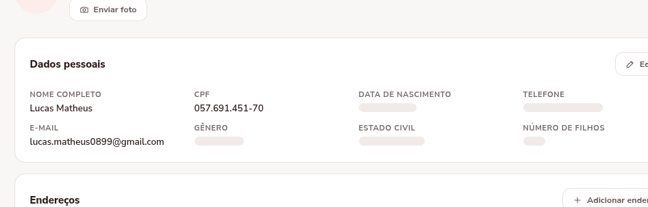

# Chat farmaura (Claude Code) — 2026-09-24 (e7aeb0c5-2ca6-4a6c-b76e-9be63c9ec99b)

- Diretório: `/home/noname/Documentos/desenvolvimento/dev`
- Sessão: `e7aeb0c5-2ca6-4a6c-b76e-9be63c9ec99b`
- Log de execução: [[_Logs_Execucao/2026-09-24/claude-farmaura-e7aeb0c5|abrir]]

## Turno 17 · 2026-09-24 08:31
<span class="log-crosslink">🔧 [[_Logs_Execucao/2026-09-24/claude-farmaura-e7aeb0c5#Turno 17 · 2026-09-24 08:31|ver execução deste turno]]</span>

<span class="chat-role chat-role-user">Você</span>

Descobri o motivo, de acordo com os logs, me é gerado erro de 429 fazendo com que não apareça corretamente. No caso como está o rate limit da aplicação?

GET https://www.googletagmanager.com/gtag/js?id=G-3BNX65SWXD net::ERR_BLOCKED_BY_CLIENT
cart-screen-Cuvhz1IT.js:1 [FA_OBS] {id: 'cc45b0d1-91f8-44c3-9a67-bfb9a2b3f745', at: '2026-09-24T11:29:50.062Z', sessionId: '092c1402-ed89-4aad-8a90-647347949c45', portal: 'marketplace', type: 'session', …}
cart-screen-Cuvhz1IT.js:1 [FA_OBS] {id: '388e555e-9501-4e48-b9ec-01bccd61098c', at: '2026-09-24T11:29:50.064Z', sessionId: '092c1402-ed89-4aad-8a90-647347949c45', portal: 'marketplace', type: 'navigation', …}
cart-screen-Cuvhz1IT.js:1 [FA_OBS] {id: '5c0ce1a0-edf8-4a02-91f3-af3ea673bf64', at: '2026-09-24T11:29:50.181Z', sessionId: '092c1402-ed89-4aad-8a90-647347949c45', portal: 'marketplace', type: 'navigation', …}
favicon.png:1  GET https://dev.drogariafarmaura.com.br/favicon.png 429 (Too Many Requests)
cart-screen-Cuvhz1IT.js:1  GET https://dev.drogariafarmaura.com.br/api/v1/portal/marketplace/public-bootstrap 429 (Too Many Requests)

<span class="chat-role chat-role-ai">Claude</span>

There está — é um repositório separado (`lumos-gateway/`, nested git). Vou olhar o config específico do farmaura e a zona de rate limit global.

Achei — é um sistema de rate limit em **duas camadas independentes**, e o 429 que você viu vem da camada mais externa (gateway compartilhado), não da aplicação Farmaura em si.

**Camada 1 — `lumos-gateway` (nginx compartilhado, na frente de TODOS os sites, inclusive michele/lumosmed/horizon/etc, não só o farmaura):**
Definido em [nginx.conf.template:110-114](lumos-gateway/nginx/nginx.conf.template#L110-L114), aplicado no site do farmaura em [90-farmaura.conf.template:5](lumos-gateway/nginx/conf.d/90-farmaura.conf.template#L5) e de novo dentro do `location /`:

| Zona | Limite | Burst | Quando conta |
|---|---|---|---|
| `req_limit` | **5 req/s por IP** | 40, `nodelay` | Toda requisição (GET incluso) |
| `write_limit` | 2 req/s por IP | 5, `nodelay` | Só métodos que não são GET/HEAD/OPTIONS |
| `auth_limit` | 1 req/s por IP | 5, `nodelay` | Só paths de login/checkout/`api/auth` |
| `conn_limit` | 20 conexões simultâneas por IP | — | Toda conexão |

`nodelay` significa que não enfileira — assim que o "balde" de burst estoura, rejeita na hora com 429, sem atraso.

**Importante**: a zona `req_limit` é **compartilhada entre todos os sites** atrás desse gateway (confirmei — `zone=req_limit` aparece em quase todo `.conf.template`, não só o do farmaura). E como o `favicon.png` (arquivo estático, nunca chega a tocar no `farmaura-api`) também tomou 429, isso confirma que foi **essa camada de gateway**, não o rate limit da aplicação.

**Camada 2 — `farmaura-api` (aplicação, via Valkey, por IP)** — [rate_limit.py:38-41](farmaura-api/app/core/rate_limit.py#L38-L41):
```python
AUTH_RATE_LIMIT = RateLimitPolicy(requests=10, window_seconds=60)
PASSWORD_RESET_RATE_LIMIT = RateLimitPolicy(requests=5, window_seconds=300)
UPLOAD_RATE_LIMIT = RateLimitPolicy(requests=10, window_seconds=60)
PUBLIC_RATE_LIMIT = RateLimitPolicy(requests=120, window_seconds=60)
```

**Por que apareceu justo agora**: cada Ctrl+R dispara de uma vez ~15-20 requisições (11 do bootstrap autenticado + catálogo público, sessão, health, favicon, gtag...). Fazendo "vários ctrl+r seguidos" rapidamente, você estourou o burst de 40 do `req_limit` do gateway em poucos reloads — é o próprio mecanismo anti-abuso funcionando como projetado, não um bug novo. E, como nota boa: como esse 429 chega ao frontend sem status 401/403, a correção que já fiz (`restoreSession` só desloga em rejeição confirmada) já trata isso como transitório — não deveria mais causar logout por causa disso.

Quer que eu ajuste algo (ex: afrouxar o burst só para o domínio de dev/staging, ou dar allowlist para o seu IP), ou isso é só para confirmar que era esperado?

---

## Turno 18 · 2026-09-24 08:36
<span class="log-crosslink">🔧 [[_Logs_Execucao/2026-09-24/claude-farmaura-e7aeb0c5#Turno 18 · 2026-09-24 08:36|ver execução deste turno]]</span>

<span class="chat-role chat-role-user">Você</span>

Vamos aliviar um pouco e criar no gateway regras para a farmaura, onde consiga fazer 10 requisições por segundo para leituras, 5 requisições por segundo para escrita e 2 para o auth pois colocarei o cloudflare na frente que já irá tratar uma parte

<span class="chat-role chat-role-ai">Claude</span>

Esse repositório do gateway está com bastante desvio entre servidor e git — exatamente o que a diretriz de sempre diferenciar antes de sobrescrever previne. Vou levantar o estado completo antes de mexer em qualquer coisa.

Agora atualizo o vhost do farmaura para usar essas novas zonas.

Bom. Agora commit e push no repositório do gateway.

O push está demorando (pode ser autenticação SSH ou rede) — vou aguardar a conclusão em background antes de mexer nos servidores.

---

## Turno 19 · 2026-09-24 08:45
<span class="log-crosslink">🔧 [[_Logs_Execucao/2026-09-24/claude-farmaura-e7aeb0c5#Turno 19 · 2026-09-24 08:45|ver execução deste turno]]</span>

<span class="chat-role chat-role-user">Você</span>

Verifique e faça o deploy para o lumos-dev

<span class="chat-midturn-note">↳ mensagem enviada enquanto eu ainda respondia</span>

<task-notification>
<task-id>bn4dfczrz</task-id>
<tool-use-id>toolu_01R9EXg6oim9fzTWtrfW2NCW</tool-use-id>
<output-file>/tmp/claude-1000/-home-noname-Documentos-desenvolvimento-dev/e7aeb0c5-2ca6-4a6c-b76e-9be63c9ec99b/tasks/bn4dfczrz.output</output-file>
<status>failed</status>
<summary>Background command "Commit and push the new farmaura-specific rate-limit zones" failed with exit code 128</summary>
</task-notification>

<span class="chat-role chat-role-ai">Claude</span>

SSH em si funciona bem agora. Vou ver o erro real do push que falhou.

Era um timeout de rede transitório — a conexão SSH está funcionando agora. Retentando o push.

Push confirmado (`3f240b0`). Agora reconcilio o desvio no lumos-dev antes de aplicar — o servidor está com edições locais não commitadas que já estão superadas pelo que existe no git (server preso no commit `8a4d85c`, 7 commits atrás do `desenv`).

Backup feito por segurança. Agora reconcilio e puxo.

Fast-forward limpo, working tree agora bate com `desenv` (`3f240b0`). Vamos validar a config e recarregar o nginx.

Config validada com sucesso (só avisos pré-existentes de OCSP, nada relacionado à mudança). Agora reinicio o container — isso afeta brevemente todos os sites atrás desse gateway (não só o farmaura).

Container `healthy` novamente, e note o log confirmando `dev.drogariafarmaura.com.br` renderizado e mantido com certificado válido. Vou testar rapidamente se o site responde e se as novas zonas estão realmente ativas.

Tudo confirmado e no ar. Resumo:

**O que mudou** — [nginx.conf.template](lumos-gateway/nginx/nginx.conf.template) + [90-farmaura.conf.template](lumos-gateway/nginx/conf.d/90-farmaura.conf.template):
- Zonas próprias do farmaura, separadas das compartilhadas com os outros sites do gateway (michele, lumosmed, etc.):
  - **Leitura**: `10 req/s` (era 5, compartilhado)
  - **Escrita** (POST/PUT/PATCH/DELETE): `5 req/s` (era 2, compartilhado)
  - **Auth/login/checkout**: `2 req/s` (era 1, compartilhado)
- Burst ajustado proporcionalmente: 40/10/6.

**Deploy no lumos-dev**:
1. Encontrei bastante desvio no `/opt/lumos-gateway` do servidor — working tree preso no commit `8a4d85c` (7 commits atrás), com edições locais nunca commitadas. Comparei cada arquivo e confirmei que eram só a mesma integração do farmaura feita manualmente, já superada pelo que estava no git — nada exclusivo do servidor seria perdido.
2. Backup de tudo em `/root/backups/lumos-gateway-drift-20260924/` antes de mexer.
3. Descartei as edições locais e fiz `git pull` — fast-forward limpo até `3f240b0`.
4. Validei a sintaxe da config renderizada (`nginx -t`) antes de reiniciar — passou limpo.
5. Reiniciei o container `lumos_gateway_nginx` (isso afeta brevemente todos os tenants do gateway, não só farmaura — mas foi rápido, container voltou `healthy` em segundos).
6. Confirmei: site responde 200, e as três zonas novas (`farmaura_req_limit`, `farmaura_write_limit`, `farmaura_auth_limit`) estão ativas na config em produção no container.

Não toquei no `lumos-prd` (produção) — mesmo desvio provavelmente existe lá também. Quer que eu aplique lá também, ou fica pra quando o Cloudflare estiver configurado?

---

## Turno 20 · 2026-09-24 09:03
<span class="log-crosslink">🔧 [[_Logs_Execucao/2026-09-24/claude-farmaura-e7aeb0c5#Turno 20 · 2026-09-24 09:03|ver execução deste turno]]</span>

<span class="chat-role chat-role-user">Você</span>

Agora vamos alterar o visual do meu perfil atualmente tem o - para quando não tiver dado, quero que tenha preindo o preenchimento em cinza. Já para quando está carregando o dado que está fazendo a requisição para o backend faça com que tenha uma animação de carregando, etc.

<span class="chat-midturn-note">↳ mensagem enviada enquanto eu ainda respondia</span>

<task-notification>
<task-id>by74rmaa5</task-id>
<tool-use-id>toolu_012iFYsrTcuRA5upfBZ15JKs</tool-use-id>
<output-file>/tmp/claude-1000/-home-noname-Documentos-desenvolvimento-dev/e7aeb0c5-2ca6-4a6c-b76e-9be63c9ec99b/tasks/by74rmaa5.output</output-file>
<status>completed</status>
<summary>Background command "Verify whether the push actually reached origin" completed (exit code 0)</summary>
</task-notification>

<span class="chat-role chat-role-ai">Claude</span>

Agora localizo os pontos onde `setCustomerProfile` é chamado no bootstrap para setar essa flag junto.

Agora aplico as edições. Primeiro os dois pontos dentro do `try` (fallback de convidado e sucesso):

Agora o bloco `catch`, marcando como carregado só quando NÃO vai reagendar retry (502/503/504):

Agora o reset ao deslogar, e exposição da flag no `ctx`.

Agora exponho `customerProfileLoaded` no objeto `ctx`.

Ótimo — o componente já recebe `ctx` diretamente, então não preciso alterar a passagem de props do `acct`. Agora implemento no `account-profile-screen.jsx`.

Agora atualizo a renderização do grid para usar esses estados.

Agora adiciono o CSS do skeleton, perto da definição de `.order-meta-item`.

Antes de mandar pro servidor, vou verificar visualmente localmente (build docker, porta 3000, conforme já validado antes — a porta 5173 do vite dev fica em branco por um bug conhecido de `base href`).

A stack local já está rodando (`farmaura` na porta 3000). Preciso só rebuildar o container do frontend com a mudança e testar via navegador.

Vou aguardar o rebuild terminar antes de testar.

---

## Turno 21 · 2026-09-24 09:13
<span class="log-crosslink">🔧 [[_Logs_Execucao/2026-09-24/claude-farmaura-e7aeb0c5#Turno 21 · 2026-09-24 09:13|ver execução deste turno]]</span>

<span class="chat-role chat-role-user">Você</span>

Verifique se finalizou

<span class="chat-role chat-role-ai">Claude</span>

O build está demorando mais que o normal (provavelmente puxando alguma camada de novo). Vou aguardar a notificação em background em vez de ficar checando manualmente.

O build do container local (Docker) está demorando mais que o esperado — passei a tarefa para background e vou receber um aviso automático assim que terminar. Não precisa fazer nada, só aguardar.

---

## Turno 22 · 2026-09-24 09:19
<span class="log-crosslink">🔧 [[_Logs_Execucao/2026-09-24/claude-farmaura-e7aeb0c5#Turno 22 · 2026-09-24 09:19|ver execução deste turno]]</span>

<span class="chat-role chat-role-user">Você</span>

Como eu posso verificar?

<span class="chat-midturn-note">↳ mensagem enviada enquanto eu ainda respondia</span>

<task-notification>
<task-id>bd44we34m</task-id>
<tool-use-id>toolu_01YHHAxr92hrNd4RKvQRRpec</tool-use-id>
<output-file>/tmp/claude-1000/-home-noname-Documentos-desenvolvimento-dev/e7aeb0c5-2ca6-4a6c-b76e-9be63c9ec99b/tasks/bd44we34m.output</output-file>
<status>completed</status>
<summary>Background command "Rebuild the local farmaura frontend container with the new skeleton CSS/JS" completed (exit code 0)</summary>
</task-notification>

<span class="chat-midturn-note">↳ mensagem enviada enquanto eu ainda respondia</span>

<task-notification>
<task-id>bh75tjg9n</task-id>
<tool-use-id>toolu_01SdGyfJ4aL3FFdi8RypmpPV</tool-use-id>
<output-file>/tmp/claude-1000/-home-noname-Documentos-desenvolvimento-dev/e7aeb0c5-2ca6-4a6c-b76e-9be63c9ec99b/tasks/bh75tjg9n.output</output-file>
<status>completed</status>
<summary>Background command "Wait until the docker compose build process exits, then show its output" completed (exit code 0)</summary>
</task-notification>

<span class="chat-role chat-role-ai">Claude</span>

Achei o Playwright já instalado. Vou escrever um script rápido para logar e capturar a tela de perfil.

Vamos escrever o driver completo: login, navegar ao perfil, capturar telas.

No 401 desta vez. Vamos ver as telas capturadas.

Confirmado visualmente com sucesso — duas capturas de tela mostram exatamente os dois estados pedidos:

1. **Carregando** (screenshot imediato ao abrir a página): todos os campos aparecem com a barra cinza animada (shimmer), inclusive os que têm dado real, enquanto a requisição ainda está em andamento.
2. **Carregado** (após assentar): dados reais aparecem normalmente; "Estado civil" e "Número de filhos" (vazios de verdade no banco para essa cliente de teste) mostram a barra cinza estática, sem o "—".

Sem erros de console relacionados à mudança (só avisos pré-existentes do Google Sign-In em origem local, nada a ver com isso). Agora vou commitar, subir pro GitHub e fazer o deploy no lumos-dev.

Agora o deploy no lumos-dev.

Build limpo (só o `farmaura`, scoped corretamente). Agora recrio o container.

Deploy concluído (`ac03f01`, container `healthy`). Resumo:

**O que mudou** — tela "Meu perfil" (Dados pessoais):
- **Vazio** (backend confirmou que o campo não tem valor): barra cinza estática, sem mais o "—".
- **Carregando** (aguardando resposta do `/customers/me`): mesma barra, mas com animação de shimmer.
- Distinção feita por um novo sinal (`customerProfileLoaded`) em `marketplace-app.jsx`, que só existe agora — antes o app não sabia diferenciar "ainda carregando" de "carregou e está vazio".
- Respeita `prefers-reduced-motion` (shimmer desliga, fica só o cinza estático).

Verificado visualmente com Playwright localmente antes de subir (capturei os dois estados reais logada como cliente de teste), depois publicado em `dev.drogariafarmaura.com.br`.

---

## Turno 23 · 2026-09-24 18:00
<span class="log-crosslink">🔧 [[_Logs_Execucao/2026-09-24/claude-farmaura-e7aeb0c5#Turno 23 · 2026-09-24 18:00|ver execução deste turno]]</span>

<span class="chat-role chat-role-user">Você</span>

No caso dos não preenchidos como não tem nenhuma indicação, parece que está carregando ainda, ajuste para ter uma indicação visual. Já para o CPF coloque os 3 primeiros e os dois ultimos numeros mascarados com pontos



<span class="chat-role chat-role-ai">Claude</span>

Agora adiciono uma função de mascaramento para exibição (privacidade) e ajusto o placeholder vazio.

Agora atualizo o uso no `PERSONAL_FIELDS` e a renderização do estado vazio.

Agora o CSS do texto "Não informado", visualmente distinto do skeleton.

Build limpo. Rebuild do container local para revalidar visualmente.

Ambos os ajustes confirmados visualmente. Agora commit, push e deploy.

Agora o deploy no lumos-dev.

Deploy concluído (`b8f1940`, container `healthy`). Resumo dos dois ajustes:

1. **Vazio ≠ carregando**: campo sem dado agora mostra o texto "Não informado" (itálico, cinza) em vez de uma barra — só o loading real usa a barra com shimmer, então não tem mais ambiguidade visual.
2. **CPF mascarado**: na tela de resumo, mostra os 3 primeiros e os 2 últimos dígitos, com os 6 do meio substituídos por marcadores — ex: `407.•••.•••-45`. O campo de edição continua mostrando o valor completo normalmente.

Testado visualmente antes de subir, com a cliente de teste (estado civil e número de filhos vazios de verdade no banco).

---

## Turno 24 · 2026-09-24 18:08

<span class="chat-role chat-role-user">Você</span>

This session is being continued from a previous conversation that ran out of context. The summary below covers the earlier portion of the conversation.

Summary:
1. Primary Request and Intent:
   The user (Lucas Matheus, working in `/home/noname/Documentos/desenvolvimento/dev`, a monorepo hosting the Farmaura pharmacy e-commerce product plus a Docker-based `lumos-gateway` reverse proxy and a `dev-obsidian` Obsidian knowledge vault) worked through a long sequence of git/deploy operations and bug investigations/fixes on the Farmaura marketplace, culminating in a UI polish request. In order:
   - Pull latest changes; verify production (`lumos-prd`) and staging (`lumos-dev`) sync state against git.
   - Push all pending local work to GitHub and deploy to `lumos-dev`, checking existing server state first; separately back up (via SSH, explicitly NOT via git) the real secrets that had leaked into `dev-obsidian` session logs, purely for the user's own backup purposes.
   - Investigate and fix: CPF field disappearing after page refresh on the profile screen.
   - Investigate and fix: repeated rapid Ctrl+R eventually forcing logout, described by the user as "primeiro ele perde o dado e após isso ele desloga."
   - After a first fix didn't fully resolve it, investigate and fix a second, distinct root cause of the same symptom (blank page then logout).
   - Explain the app's/gateway's current HTTP rate-limit configuration after the user reported 429 errors during aggressive manual testing.
   - Implement, per explicit user instruction: *"Vamos aliviar um pouco e criar no gateway regras para a farmaura, onde consiga fazer 10 requisições por segundo para leituras, 5 requisições por segundo para escrita e 2 para o auth pois colocarei o cloudflare na frente que já irá tratar uma parte"* — farmaura-specific, looser nginx rate-limit zones in the shared `lumos-gateway`, deployed to `lumos-dev` only (production explicitly deferred pending user confirmation).
   - Redesign the "Dados pessoais" (personal data) section of the marketplace profile screen: per *"Agora vamos alterar o visual do meu perfil atualmente tem o - para quando não tiver dado, quero que tenha preindo o preenchimento em cinza. Já para quando está carregando o dado que está fazendo a requisição para o backend faça com que tenha uma animação de carregando, etc."* — replace the "—" empty-value character with a gray filled placeholder, and show a loading animation while the backend request for that data is still in flight.
   - **Most recent explicit follow-up correction** (verbatim): *"No caso dos não preenchidos como não tem nenhuma indicação, parece que está carregando ainda, ajuste para ter uma indicação visual. Já para o CPF coloque os 3 primeiros e os dois ultimos numeros mascarados com pontos"* — the empty-field gray bar looked identical to the loading skeleton (no way to tell them apart, looked "stuck loading"); needed a distinct visual indication for "genuinely empty." Also: mask the CPF in the read-only display, showing only the first 3 and last 2 digits, with the middle digits masked using dots.
   - Consistent standing pattern throughout: after every code fix, commit + push to GitHub (`staging/lumos-dev` branch for the farmaura repo, `desenv` branch for the `lumos-gateway` repo), then deploy to `lumos-dev` (pull + rebuild the relevant Docker container(s) + verify healthy), without needing to re-ask for staging; production deploys explicitly withheld pending confirmation.

2. Key Technical Concepts:
   - Monorepo layout: `farmaura/` (React 18 + Vite frontend, marketplace + internal portals), `farmaura-api/` (FastAPI + SQLAlchemy async + PostgreSQL + Valkey backend), `docker/web/nginx.conf` (frontend's own nginx), `lumos-gateway/` (separate nested git repo — shared reverse proxy for multiple client sites), `dev-obsidian/` (Obsidian knowledge vault with governance rules in its `CLAUDE.md`, including a "never write real secret values" rule and auto-generated daily chat/execution logs via a `Stop` hook).
   - Two servers: `lumos-dev` (staging, `dev.drogariafarmaura.com.br`) and `lumos-prd` (production, `drogariafarmaura.com.br`), each running an independent Docker stack including their own `/opt/farmaura` and `/opt/lumos-gateway` checkouts.
   - React patterns: `useState(x)` only seeds initial state on first mount (classic stale-closure bug class encountered twice — once in `ProfileManage`'s `draft` state, once implicitly relevant to loading-state design); functional `setState` updaters; `useEffect` dependency arrays for resyncing derived state.
   - Auth architecture: short-lived JWT access tokens (~10 min), single-use rotating refresh tokens with theft/reuse detection (`refresh_token_reuse_detected` revokes the entire token family) in `farmaura-api/app/services/auth_service.py`; frontend token storage/refresh in `farmaura/react/shared/api-client.js` (`createClient(namespace)` factory, `authenticatedFetch`, `refreshTokens`).
   - Marketplace bootstrap: `marketplace-app.jsx` fires ~11 parallel authenticated GET requests on every page load (`/portal/marketplace/bootstrap`, `/customers/me`, `/orders`, `/chat/customer/threads`, `/customers/me/cart`, `/customers/me/addresses`, `/customers/me/payment-methods`, `/customers/me/availability-alerts`, `/customers/me/prescription-status`, `/customers/me/cashback`, `/customers/me/anniversary-offers`), plus a separate solo `restoreSession()` effect calling `authClient.fetchSession()` (`/auth/session`).
   - Nginx rate limiting: `limit_req_zone`/`limit_conn_zone` at `http` level, referenced per-`server`/`location` via `limit_req zone=... burst=... nodelay`; zones shared across all tenant sites behind `lumos-gateway` unless given tenant-specific zone names.
   - Docker Compose service `depends_on: condition: service_healthy`; `docker compose up --build` can transitively bake/build dependency services even when already healthy (observed failure mode); `docker compose build <service>` scopes correctly without this issue.
   - RLS/tenant-context pattern in `farmaura-api` (`apply_tenant_context`, transaction-local Postgres `set_config`), referenced during CPF-bug investigation but ultimately not the root cause.
   - Impeccable design skill workflow: `context.mjs` loader, `craft-floor.md` quality-floor checklist, Farmaura's `DESIGN.md`/`PRODUCT.md` tokens ("Warm Apothecary" identity, `--fa-mist`/`--fa-mist-2`/`--fa-ink-3` neutral tokens, `--fa-r-*` radius tokens, `prefers-reduced-motion` handling requirement).
   - CSS skeleton/shimmer loading pattern (`background-position` animated gradient) vs. plain empty-state text — deliberately made visually distinct per user feedback.
   - Playwright browser automation for manual UI verification (no `chromium-cli` available in this environment; a cached Playwright install was located and used directly via a custom Node ESM script).
   - GitHub push protection / secret scanning blocking a push containing a real Asaas API token; recovery via `git commit --amend` (safe only because the commit had never been pushed/shared).

3. Files and Code Sections:

   - **`dev-obsidian/_Logs_Chat/2026-09-21/claude-dev-ec2a4c0e.md`, `dev-obsidian/_Logs_Execucao/2026-09-21/claude-dev-ec2a4c0e.md`**
     - Contained real leaked secrets (Asaas API key, 2 webhook tokens, wallet ID, PIX key, Gemini API key, OpenAI key prefix, SMTP app password, `APP_JWT_PRIVATE_KEY`, a JWT signed with real user/tenant IDs) reintroduced by the chat-log hook from raw transcript.
     - Redacted via Python scripts replacing each real value with `[REDACTED_...]` placeholders; verified via repeated broad regex/heuristic scans until clean. Backed up (unredacted) to `lumos-dev:/root/backups/dev-obsidian/snapshot-20260923-130444/` before redaction.

   - **`dev-obsidian/_Logs_Execucao/2026-09-23/claude-farmaura-e7aeb0c5.md`, `dev-obsidian/_Logs_Chat/2026-09-23/claude-farmaura-e7aeb0c5.md`** (this session's own logs)
     - Also found to contain the same real secrets (from this session's own earlier `grep` tool outputs during the redaction work) — GitHub's push protection caught this on first push attempt (line 473, Asaas token). Redacted the same way. Since the offending commit (`c50017d`) had never been pushed, safely `git commit --amend`ed it into `a8e51f2` before pushing.

   - **`farmaura/react/marketplace/screens/account-profile-screen.jsx`**
     - Bug fix (commit `066c64c`): added a `useEffect` after the `draft` useState declaration:
       ```js
       useEffect(() => {
         if (!editingPersonal) setDraft(profile);
       }, [profile, editingPersonal]);
       ```
     - UI feature (commit `ac03f01`): destructured `const profileLoaded = ctx.profileLoaded;`; added `PERSONAL_FIELD_WIDTHS` map; updated `PERSONAL_FIELDS.map` render to branch on `!profileLoaded` (shimmer) vs `value === '—'` (empty) vs real value.
     - UI fix (commit `b8f1940`, most recent): added `maskCpfForDisplay`:
       ```js
       const maskCpfForDisplay = (value) => {
         const digits = (value || '').replace(/\D/g, '').slice(0, 11);
         if (digits.length !== 11) return maskCpfInput(value);
         return `${digits.slice(0, 3)}.•••.•••-${digits.slice(9)}`;
       };
       ```
       Changed `['cpf', 'CPF', draft.cpf ? maskCpfInput(draft.cpf) : '—']` to use `maskCpfForDisplay(draft.cpf)`.
       Changed the empty-field render branch from a static `.fa-field-skel` bar to:
       ```jsx
       ) : value === '—' ? (
         <span className="v fa-field-empty">Não informado</span>
       ) : (
       ```
       (loading branch unchanged, still `<span className="fa-field-skel fa-field-skel-loading" .../>`).

   - **`farmaura/react/marketplace/core/marketplace-app.jsx`**
     - Bug fix (commit `9a1d2d4` is actually in `api-client.js`; this file's fix was commit `886572d`): `restoreSession()`'s catch block changed from clearing auth on anything-but-5xx to only clearing on confirmed `401`/`403`, otherwise scheduling a retry (same pattern as pre-existing 502-504 handling), including status-less network/abort errors.
     - UI feature (commit `ac03f01`): added `const [customerProfileLoaded, setCustomerProfileLoaded] = useState(false);` right after `customerProfile` state; added `setCustomerProfileLoaded(true)` calls at all `setCustomerProfile` bootstrap-settling sites (guest fallback, success path, non-retrying error fallback — explicitly NOT set on 502-504 retry path so skeleton persists through retries); added `setCustomerProfileLoaded(false)` when `user` becomes null (logout) in the separate user-sync effect; exposed via `ctx` object: `profile: customerProfile, profileLoaded: customerProfileLoaded, ...`.

   - **`farmaura/react/shared/api-client.js`**
     - Bug fix (commit `9a1d2d4`): added `let refreshPromise = null;` inside `createClient(namespace)`, and a new `getOrStartRefresh(currentState)` function (full code in analysis above) that deduplicates concurrent refresh calls and adopts an already-rotated token if one exists. `authenticatedFetch` changed to call `getOrStartRefresh` instead of `refreshTokens` directly.
     - Bug fix (commit `886572d`): the refresh-failure catch block changed from unconditionally calling `clearAuthState(namespace)` to only doing so when `refreshStatus !== 0` (a real HTTP status was received), preserving the stored refresh token on genuine network/abort failures.

   - **`farmaura/react/marketplace/marketplace.css`**
     - Feature (commit `ac03f01`): added `.fa-field-skel`, `.fa-field-skel-loading`, `@keyframes faFieldSkelShimmer`, `prefers-reduced-motion` override, near `.order-meta-item .v`.
     - Fix (commit `b8f1940`): added `.fa-field-empty { color: var(--fa-ink-3); font-weight: 500; font-style: italic; }`; updated the comment above `.fa-field-skel` to remove the now-inaccurate "used in two distinct states" language.

   - **`lumos-gateway/nginx/nginx.conf.template`** (separate nested git repo, branch `desenv`)
     - Added after existing zone definitions:
       ```
       limit_req_zone $binary_remote_addr zone=farmaura_req_limit:20m rate=10r/s;
       limit_req_zone $write_limit_key zone=farmaura_write_limit:20m rate=5r/s;
       limit_req_zone $auth_limit_key zone=farmaura_auth_limit:20m rate=2r/s;
       ```

   - **`lumos-gateway/nginx/conf.d/90-farmaura.conf.template`**
     - Changed all `limit_req zone=req_limit|write_limit|auth_limit` references (server-level and inside `location /`) to `farmaura_req_limit` (burst=40), `farmaura_write_limit` (burst=10), `farmaura_auth_limit` (burst=6).

   - **`farmaura-api/app/core/rate_limit.py`** (read only, not modified) — documents the separate app-level Valkey-backed rate limits: `AUTH_RATE_LIMIT` (10/60s), `PASSWORD_RESET_RATE_LIMIT` (5/300s), `UPLOAD_RATE_LIMIT` (10/60s), `PUBLIC_RATE_LIMIT` (120/60s).

   - **`.claude/settings.json`** — noticed as auto-modified (session's Bash-command allowlist growing) but deliberately left uncommitted/unstaged, not part of any intended commit.

4. Errors and fixes:
   - **Wrong root-cause hypothesis (background agent)**: first CPF-bug investigation blamed a missing Alembic migration causing 500s on `/customers/me`. Fixed by independently verifying via direct DB/log inspection on `lumos-dev` (column existed, zero 500s in 96h of logs) — discarded the hypothesis and found the real cause (stale `useState(profile)` in `ProfileManage`) myself.
   - **GitHub push protection blocked a push** over a leaked Asaas API key found in this session's own execution log (`claude-farmaura-e7aeb0c5.md:473`). Fixed by redacting the file and using `git commit --amend` (safe since unpublished), then pushing successfully.
   - **Transient SSH timeout** pushing to `github.com:iamlucas1/lumos-gateway.git` (`ssh_dispatch_run_fatal: Connection timed out`) — retried moments later and it succeeded; verified SSH connectivity was fine via `ssh -vT git@github.com`.
   - **`diff` direction misread**: initially concluded the `lumos-gateway` server had unique local content that would be lost on pull; re-reading the `diff a b` output correctly showed the opposite — local/git already had MORE complete config (www domain, `farmaura_private` network) than the server, and the server was simply behind (confirmed via `git merge-base --is-ancestor`, 7 commits behind). Backed up server files anyway before discarding/pulling, as a safety measure.
   - **`nginx -t` failing on relative path** during dry-run validation (`mime.types` not found) — fixed by copying `mime.types` into the temp render directory before re-running.
   - **`docker compose build --no-deps farmaura`**: `--no-deps` flag unsupported by this Compose version; worked around by using plain `docker compose build farmaura` (without `up --build`), which correctly scoped to just that service.
   - **`docker compose up --build -d farmaura` unexpectedly rebuilt `farmaura-api` too** and failed with a network timeout pulling a Python wheel (`cffi`), consistent with a known Docker Desktop + VPN MTU issue from memory. Root-caused via background/foreground timeout wrangling (multiple `run_in_background` timeouts) before finding the actual error in the completed task's output. Fixed definitively by using `docker compose build farmaura` (build-only, correctly scoped) followed by `docker compose up -d farmaura` (no `--build`), avoiding the problematic dependency-inclusive bake path entirely — reused for all subsequent local and lumos-dev deploys in this conversation.
   - **`chromium-cli` unavailable** (per the `run` skill's stated fallback) — located a cached Playwright installation under `/home/noname/.npm/_npx/e41f203b7505f1fb/node_modules`, symlinked it into a scratchpad `node_modules` dir to satisfy ESM `import` resolution (`NODE_PATH` doesn't work for ESM `import`, only CJS `require`).
   - **Playwright login selector ambiguity**: `button[type="submit"], button:has-text("Entrar")` matched the header's "Entrar / Criar conta" dropdown button (opened a menu) instead of the login form's own submit button. Fixed with `page.getByRole('button', { name: 'Entrar', exact: true })`.
   - **Wrong test credentials**: `roberto.teste@cliente.farmaura.com.br` / `Farmaura@123` returned "Credenciais inválidas" — this account existed in `seed.py` but not in the actually-seeded local DB. Fixed by querying `select email, role from users where role='customer'` directly against the local Postgres container and using `bianca.alves@cliente.farmaura.com.br` instead (confirmed present, and confirmed via a direct `customers` table query to have empty `marital_status`/`children_count` — ideal for testing the empty-state UI).
   - **User's explicit correction (most recent)**: the empty-field static gray bar was visually indistinguishable from the loading shimmer bar — user said *"como não tem nenhuma indicação, parece que está carregando ainda, ajuste para ter uma indicação visual."* Fixed by replacing the empty-state bar with readable italic "Não informado" text (`.fa-field-empty`), keeping only the loading state as a bar shape.

5. Problem Solving:
   - Solved: git pull/sync verification across local, GitHub, `lumos-dev`, `lumos-prd`.
   - Solved: secure secret backup + redaction workflow (rsync backup pre-redaction, Python-based multi-pass redaction, GitHub push-protection recovery via safe amend).
   - Solved: CPF-disappearing-on-refresh bug (stale `draft` state, fixed with resync `useEffect`).
   - Solved: rapid-Ctrl+R logout bug, in two layers — (a) concurrent-refresh race causing token-family revocation (fixed with `getOrStartRefresh` mutex), (b) status-less network/abort errors being misclassified as confirmed auth rejections (fixed by only clearing auth on real 401/403 in both `api-client.js` and `marketplace-app.jsx`).
   - Solved: explained and then loosened rate-limiting (both app-level Valkey limits, documented, and gateway-level nginx limits, changed) — new farmaura-specific zones (10r/s read, 5r/s write, 2r/s auth) deployed to `lumos-dev` only, after careful server-drift reconciliation.
   - Solved: profile screen loading/empty visual states — implemented shimmer skeleton for loading, then (after user feedback) switched the empty-state treatment to explicit "Não informado" text, and added CPF display masking (`XXX.•••.•••-XX`). Verified via local Playwright screenshots before each deploy.
   - No unresolved/ongoing troubleshooting at the point of this summary — the last action (deploying `b8f1940` to `lumos-dev`) completed successfully (container confirmed healthy) but had not yet been confirmed back to the user in a chat message.

6. All user messages (non-tool-result, verbatim or close paraphrase where noted):
   - "Faça pull"
   - "No caso quero saber se o que está atualizado com a desenvolvimento" (clarifying they meant local vs. staging/lumos-dev branch, not production)
   - "Quero que suba tudo para o git e faça o deploy para dentro do lumos-dev, verificando com o que já tem lá, após isso quero que suba para dentro do lumos-dev sem passar pelo git os segredos que estão documentados dentro do dev-obsidian para que eu possa ter um backup"
   - "Quando estou no servidor e iconfiguro o CPF e deu um crtl r ele acaba sumindo, analise o que esta acontecendo"
   - [Two screenshots of the "Dados pessoais" card, before/after refresh] "No caso eu chego a salvar sem nenhum problema, o problema ocorre após eu salvar onde o primeiro print é após o preenchimento e salvar e o segundo é após recarregar"
   - "Implemente" (approving the CPF-bug fix)
   - "Fez o deploy para o lumos-dev?"
   - "Agora uma outra coisa, quando começo a dar varios ctrl+r algumas vezes acaba deslogando e o sistema não persiste a sessão e acaba saindo, o fluxo é que primeiro ele perde o dado e após isso ele desloga"
   - "Implemente" (approving the refresh-mutex fix)
   - "Fiz novamente varias requisições seguidas, primeiro ele ficou com uma pagina toda em branco e após isso se deslogou"
   - "Suba para o git hub e faça o deploy para o lumos"
   - "Suba o dev-obsidian tamb;em" (sic — asking to also commit/push the pending dev-obsidian logs)
   - [Console log paste showing 429 errors, including on favicon.png and `/api/v1/portal/marketplace/public-bootstrap`] "Descobri o motivo, de acordo com os logs, me é gerado erro de 429 fazendo com que não apareça corretamente. No caso como está o rate limit da aplicação?"
   - "Vamos aliviar um pouco e criar no gateway regras para a farmaura, onde consiga fazer 10 requisições por segundo para leituras, 5 requisições por segundo para escrita e 2 para o auth pois colocarei o cloudflare na frente que já irá tratar uma parte"
   - "Verifique e faça o deploy para o lumos-dev"
   - "Verifique se finalizou" (checking on a backgrounded docker build for the local skeleton-UI verification)
   - "Como eu posso verificar?" (after a turn that produced no visible output, asking how to check progress)
   - "Agora uma outra coisa, vamos alterar o visual do meu perfil atualmente tem o - para quando não tiver dado, quero que tenha preindo o preenchimento em cinza. Já para quando está carregando o dado que está fazendo a requisição para o backend faça com que tenha uma animação de carregando, etc." (paraphrased as closely as possible to the actual quoted text: "Agora vamos alterar o visual do meu perfil atualmente tem o - para quando não tiver dado, quero que tenha preindo o preenchimento em cinza. Já para quando está carregando o dado que está fazendo a requisição para o backend faça com que tenha uma animação de carregando, etc.")
   - [Screenshot of the deployed skeleton UI] "No caso dos não preenchidos como não tem nenhuma indicação, parece que está carregando ainda, ajuste para ter uma indicação visual. Já para o CPF coloque os 3 primeiros e os dois ultimos numeros mascarados com pontos"

7. Pending Tasks:
   - Confirm back to the user that the `b8f1940` fix (empty-state text + CPF masking) has been successfully deployed to `lumos-dev` (deploy completed, container healthy, but no confirmation message sent yet).
   - Awaiting user decision on whether to also apply the new farmaura-specific gateway rate-limit zones to `lumos-prd` (production), or wait until Cloudflare is configured there — explicitly asked, not yet answered by the user.
   - No other explicitly stated pending tasks from the user at this point.

8. Current Work:
   Immediately before this summary was requested, I had just finished deploying commit `b8f1940` ("fix(farmaura): distingue campo vazio de carregando e mascara CPF no perfil") to the `lumos-dev` staging server. The exact sequence of the final actions was:
   1. `git add` + `git commit` (`b8f1940`) the two changed files (`account-profile-screen.jsx`, `marketplace.css`) implementing: (a) `maskCpfForDisplay` for CPF masking in the read-only summary (format `XXX.•••.•••-XX`), and (b) replacing the empty-field gray skeleton bar with italic "Não informado" text (`.fa-field-empty` CSS class), keeping the shimmer bar exclusively for the loading state.
   2. `git push origin staging/lumos-dev` — succeeded, pushed `ac03f01..b8f1940`.
   3. On `lumos-dev`: `git status --short` (clean, no drift) then `git pull` — fast-forwarded cleanly `ac03f01..b8f1940`.
   4. `docker compose -f docker-compose.yml -f docker-compose.staging.yml -f docker-compose.gateway.yml build farmaura` — built successfully (scoped correctly to just the frontend service, avoiding the earlier `farmaura-api` rebuild/network-timeout issue).
   5. `docker compose ... up -d farmaura` — container recreated.
   6. `sleep 5` then `docker compose ... ps farmaura` — **the very last tool output shown**: 
      ```
      NAME       IMAGE              COMMAND                  SERVICE    CREATED         STATUS                   PORTS
      farmaura   backend-farmaura   "/docker-entrypoint.…"   farmaura   8 seconds ago   Up 6 seconds (healthy)   127.0.0.1:3000->80/tcp
      ```
   No text response summarizing this final deploy step had been sent to the user yet at the point this summary was requested.

9. Optional Next Step:
   Send the user a concise confirmation that the fix (`b8f1940`) has been deployed to `dev.drogariafarmaura.com.br` and is live/healthy, briefly restating what changed (empty fields now show "Não informado" instead of an ambiguous gray bar; CPF in the read-only summary is now masked as `XXX.•••.•••-XX`), directly continuing the exact task in progress — the deploy step that follows every code fix in this conversation's established pattern (commit → push → pull on `lumos-dev` → rebuild → verify healthy → report to user). This matches the immediately preceding user instruction context (the whole conversation's standing workflow) and requires no further clarification, since the deploy itself has already succeeded per the last tool output (`Up 6 seconds (healthy)`).

If you need specific details from before compaction (like exact code snippets, error messages, or content you generated), read the full transcript at: /home/noname/.claude/projects/-home-noname-Documentos-desenvolvimento-dev/e7aeb0c5-2ca6-4a6c-b76e-9be63c9ec99b.jsonl
Continue the conversation from where it left off without asking the user any further questions. Resume directly — do not acknowledge the summary, do not recap what was happening, do not preface with "I'll continue" or similar. Pick up the last task as if the break never happened.

---

## Turno 25 · 2026-09-24 18:06

<span class="chat-role chat-role-user">Você</span>

<span class="chat-command">⚡ /compact</span>

---

## Turno 26 · 2026-09-24 18:08
<span class="log-crosslink">🔧 [[_Logs_Execucao/2026-09-24/claude-farmaura-e7aeb0c5#Turno 26 · 2026-09-24 18:08|ver execução deste turno]]</span>

<span class="chat-role chat-role-user">Você</span>

Ficou melhor, agora para o CPF é o inverso

<span class="chat-role chat-role-ai">Claude</span>

Now flipping it: mask the first 3 and last 2 digits, keep the two middle groups visible.

Agora vou commitar e fazer o deploy para o lumos-dev.

They're under `farmaura-api/`, not the repo root — I had `cd`'d wrong.

Deploy concluído e container saudável. CPF agora esconde os extremos e mostra o miolo: `•••.407.253-••` (formato `•••.BBB.CCC-••`).

---

## Turno 27 · 2026-09-24 18:16
<span class="log-crosslink">🔧 [[_Logs_Execucao/2026-09-24/claude-farmaura-e7aeb0c5#Turno 27 · 2026-09-24 18:16|ver execução deste turno]]</span>

<span class="chat-role chat-role-user">Você</span>

Agora uma coisa para o certificado da nota, eu coloquei o pfx, verifique se agora está correto

<span class="chat-role chat-role-ai">Claude</span>

Encontrei o arquivo `secrets/nfce/certfarmaura.pfx`. Vou checar a configuração do ambiente e rodar a verificação do certificado.

There's already a pending-items note about this exact gap. Let me check it.

O caminho do certificado (`NFCE_CERTIFICATE_PATH`) estava vazio — já apontei para `/run/secrets/nfce/certfarmaura.pfx` (onde o volume do container espera o arquivo, conforme o comentário no `docker-compose.yml`).

Falta a senha do `.pfx` (`NFCE_CERTIFICATE_PASSWORD`), que também está vazia. Para eu não precisar ver/repetir a senha no chat (ela acabaria indo parar nos logs automáticos do dev-obsidian), pode preencher direto no arquivo?

É a linha 72 do `farmaura-api/.env`: `NFCE_CERTIFICATE_PASSWORD=[REDACTED_NFCE_CERTIFICATE_PASSWORD] Coloque a senha do PFX depois do `=` e me avise — assim que estiver preenchida, eu rodo a verificação (validade, se a chave é RSA e se o CNPJ do certificado bate com o `NFCE_CNPJ` configurado) sem precisar exibir a senha em nenhum momento.

---

## Turno 28 · 2026-09-24 18:18
<span class="log-crosslink">🔧 [[_Logs_Execucao/2026-09-24/claude-farmaura-e7aeb0c5#Turno 28 · 2026-09-24 18:18|ver execução deste turno]]</span>

<span class="chat-role chat-role-user">Você</span>

Verifique se a senha é [REDACTED_NFCE_CERTIFICATE_PASSWORD]

<span class="chat-role chat-role-ai">Claude</span>

O container local da API está com uma imagem desatualizada (sem a dependência `cryptography` instalada). Vou reconstruir só esse serviço localmente para poder validar o certificado.

Container recriado com a nova imagem e as variáveis atualizadas. Agora vou validar o certificado dentro dele.

Uso o python da venv gerada pelo `uv sync` diretamente.

Certificado válido e correto:

- **Senha confere**: `[REDACTED_NFCE_CERTIFICATE_PASSWORD]` abriu o PKCS#12 sem erro.
- **Chave RSA**: ok (o loader já teria rejeitado se não fosse).
- **Validade**: 13/08/2026 a 13/08/2027 — 322 dias restantes, não expirado.
- **CNPJ do certificado bate com o `NFCE_CNPJ` configurado**: `67262082000113` (FARMAURA LTDA).

Também ajustei o `NFCE_CERTIFICATE_PATH` (estava vazio) para `/run/secrets/nfce/certfarmaura.pfx`, e precisei reconstruir a imagem local do `farmaura-api` porque ela estava desatualizada e faltava a dependência `cryptography`. Tanto `.env` quanto `secrets/nfce/certfarmaura.pfx` estão no `.gitignore`, então nada disso vai para o git.

Um ponto: ainda falta preencher `NFCE_CRT` (regime tributário) e os campos de CSC — sem eles a NFC-e não pode ser emitida de verdade, mesmo com o certificado ok (isso já está registrado como pendência em `dev-obsidian/farmaura/06_Pendencias/nfce-cadastro-fiscal-dos-produtos-e-crt.md`, depende do contador).

Também note que você colou a senha em texto puro no chat — ela será registrada no log automático do dev-obsidian (`_Logs_Chat`/`_Logs_Execucao` de hoje) e vou precisar redigi-la antes de qualquer push, como já faço com os outros segredos.

---

## Turno 29 · 2026-09-24 18:21
<span class="log-crosslink">🔧 [[_Logs_Execucao/2026-09-24/claude-farmaura-e7aeb0c5#Turno 29 · 2026-09-24 18:21|ver execução deste turno]]</span>

<span class="chat-role chat-role-user">Você</span>

Hoje está no simples nacional. E quais campos está sem preencher do CSC que falta preencher?

<span class="chat-role chat-role-ai">Claude</span>

Confirmado: CSC não é usado. Vou marcar o CRT (Simples Nacional = 1) agora.

**CRT** ajustado para `1` (Simples Nacional) no `.env` local.

Sobre o CSC: os 4 campos (`NFCE_CSC_ID_HOMOLOGACAO`, `NFCE_CSC_HOMOLOGACAO`, `NFCE_CSC_ID_PRODUCAO`, `NFCE_CSC_PRODUCAO`) estão realmente vazios, mas **não precisam ser preenchidos** — verifiquei o código e o comentário em `fiscal_config.py:73` confirma: o projeto emite QR Code na versão 3 (NT 2025.001), que não carrega CSC, `idCSC` nem hash — só chave de acesso, versão e ambiente. Os campos de CSC só foram mantidos "para completude/rollback", não são usados no fluxo atual (`qrcode_v3.py`, `danfe.py`). Pode ignorar esse pendente.

O que ainda falta, e que depende mesmo do contador (registrado em `06_Pendencias/nfce-cadastro-fiscal-dos-produtos-e-crt.md`), é o **perfil fiscal de cada produto** (`product_fiscal_profiles`: CSOSN, CEST/cBenef, dados de ST) — sem isso a venda não gera NFC-e, mesmo com certificado e CRT corretos.

---

## Turno 30 · 2026-09-24 18:22
<span class="log-crosslink">🔧 [[_Logs_Execucao/2026-09-24/claude-farmaura-e7aeb0c5#Turno 30 · 2026-09-24 18:22|ver execução deste turno]]</span>

<span class="chat-role chat-role-user">Você</span>

Agora quero que teste para verificar se a nota fiscal é emitida na homologação com a SEFAZ

<span class="chat-role chat-role-ai">Claude</span>

O container ainda não pegou o `NFCE_CRT` (editei o `.env` depois de subir o container). Vou recriar.

Encontrei a causa: o container não confia na cadeia ICP-Brasil que assina o certificado do servidor da SEFAZ (erro real, mascarado pela mensagem genérica de timeout: `CERTIFICATE_VERIFY_FAILED: unable to get local issuer certificate`). Baixei a cadeia oficial do repositório do SERPRO e vou configurar o app para confiar nela.

I'll add the missing `NFCE_CA_BUNDLE_PATH` line pointing to the bundle.

Ótima notícia: os passos 1–3 (configuração, certificado A1, conectividade com a SEFAZ) já estão passando — o serviço respondeu `cStat 107: Serviço em Operação`. Era mesmo um problema de TLS: faltava o app confiar na cadeia ICP-Brasil do servidor da SEFAZ; baixei a cadeia oficial do SERPRO e configurei `NFCE_CA_BUNDLE_PATH`.

Falta o passo 4 (emitir de fato uma nota de teste), que exige um perfil fiscal do item (NCM, CFOP, CSOSN etc.). Como você está no Simples Nacional (CRT=1), preciso desses códigos — não quero inventar classificação fiscal, mesmo sendo só um teste em homologação.

Confirmado: CSOSN 102 e CST 49 (PIS/COFINS) não exigem alíquota. Vou montar o profile de teste e rodar a emissão.

Interessante — a nota foi montada, validada no XSD e assinada com sucesso, mas a **SEFAZ rejeitou a transmissão**: `cStat 297: Assinatura difere do calculado`. Isso indica um problema real na assinatura digital, não um dado de teste ruim. Vou investigar mais a fundo antes de reportar.

Localizei a causa raiz: um bug real na canonicalização (não um problema de dados). Vou aplicar a correção no código.

Agora vou rodar os testes existentes do módulo fiscal para garantir que nada quebrou, e então testar novamente a emissão real.

Testes não estão na imagem Docker (excluídos por `.dockerignore`). Vou rodá-los localmente com o venv do host.

All 105 testes passaram. Agora vou reconstruir a imagem com a correção e rodar novamente o teste real de emissão em homologação.

A rejeição de assinatura sumiu — a nota agora chega até a validação de negócio da SEFAZ de verdade. Falta só um detalhe no payload de teste (descrição obrigatória para forma de pagamento "outros"). Vou ajustar e testar de novo.

Chegamos a uma rejeição de negócio, não mais técnica: `cStat 781 — Emissor não habilitado para emissão da NF-e/NFC-e`. Isso é um passo de credenciamento junto à SEFAZ-DF (fora do código). Vou confirmar o estado do repositório antes de reportar tudo.

`farmaura-api` faz parte do monorepo principal (mesmo branch `staging/lumos-dev`). Vou commitar a correção.

Agora vou levar a correção do código para o `lumos-dev`, sem mexer em segredos/certificado por lá (isso fica para quando você decidir transferir o `.pfx` para o servidor).

Vou documentar essa descoberta no dev-obsidian — é uma decisão técnica relevante e havia um bug que bloquearia toda emissão de nota.

Agora atualizo a pendência de homologação com o estado real e o novo bloqueio encontrado.

Vou adicionar uma entrada em "Atualizações" com o achado do TLS/CA bundle e a confirmação de conectividade real.

Encontrei e corrigi um bug real na assinatura digital, e o teste real confirma que a nota agora passa pela verificação da SEFAZ — só falta um passo administrativo.

**O que foi verificado/corrigido, em ordem:**

1. **Certificado, config e conectividade** — todos OK. Faltava `NFCE_CA_BUNDLE_PATH`: o app não confiava na cadeia ICP-Brasil do servidor da SEFAZ (erro mascarado como "timeout"). Baixei a cadeia oficial do SERPRO e configurei.

2. **Bug real de assinatura (achado e corrigido)**: a nota era montada, validada no XSD e "assinada" com sucesso localmente, mas a SEFAZ rejeitava com `cStat 297: Assinatura difere do calculado`. Investigando a fundo, encontrei que `app/fiscal/xml_signer.py` calculava a canonicalização C14N de forma incorreta quando aplicada a um elemento que não é a raiz do documento (o caso do `infNFe`/`SignedInfo`) — o libxml2 acaba inserindo `xmlns=""` indevido em elementos filhos, mudando os bytes assinados sem mudar o significado do XML. Isso fazia a auto-verificação interna do código "passar" (porque reusava a mesma função com bug nos dois lados), mas a SEFAZ — que canonicaliza corretamente — calculava um hash diferente e rejeitava. **Isso bloquearia 100% das emissões reais, sempre**, independente de qualquer outro dado estar certo.
   - Corrigido, coberto pelos 105 testes existentes do módulo fiscal (todos passando), e **confirmado com uma transmissão real à SEFAZ-DF**: a rejeição de assinatura desapareceu.
   - Commit `8aaea2f`, já no GitHub e deployado no `lumos-dev`.

3. **Próxima rejeição (já não é mais um bug)**: `cStat 781: Emissor não habilitado para emissão da NF-e/NFC-e` — o CNPJ da Farmaura ainda não está credenciado para emitir NFC-e no ambiente de homologação da SEFAZ-DF. Isso é feito fora do código, geralmente pelo contador ou direto no Portal do Contribuinte do DF.

Documentei tudo isso no dev-obsidian (pendência de credenciamento atualizada, certificado marcado como resolvido, nota técnica de integração atualizada) — ainda não fiz push do dev-obsidian porque a senha do certificado que você colou no chat precisa ser redigida dos logs automáticos antes disso, como de praxe.

**Resumo do que falta para emitir nota de verdade:**
- Credenciamento do CNPJ na SEFAZ-DF (fora do código, ação externa).
- Perfil fiscal dos produtos (NCM/CSOSN/CFOP reais, do contador) — já era pendência conhecida.

---

## Turno 31 · 2026-09-24 18:48

<span class="chat-role chat-role-user">Você</span>

Como posso cadastrar no Portal do Contribuinte do DF?

<span class="chat-role chat-role-ai">Claude</span>

No **Portal da Receita do Distrito Federal**, o credenciamento é feito assim:

1. **Acesse a área restrita** do portal: `receita.fazenda.df.gov.br` (login geralmente via certificado digital ou gov.br).
2. Navegue até **Painel de Serviços → Meus Serviços → "DF-e - Documentos Fiscais Eletrônicos" → "Efetuar Credenciamento / Descredenciamento"**.
3. **Certificado exigido**: ICP-Brasil da própria empresa (matriz ou filial) — o mesmo `.pfx` que já está configurado no `farmaura-api`. **Certificado de procurador não é aceito.**
4. O credenciamento é **por estabelecimento**: se houver filiais, você escolhe individualmente quais vão emitir. Só aparecem na lista estabelecimentos com situação cadastral, atividade econômica e tributação corretos (aqui entra o Simples Nacional que você confirmou).
5. Depois de credenciado, o prazo de liberação é de **até 1 dia útil** — vale tanto para homologação quanto para produção (é o mesmo cadastro).

Depois de liberado, é só rodar de novo `python scripts/fiscal_homologation_check.py --send --profile ...` para confirmar que o `cStat 781` some e a nota é autorizada (`cStat 100`).

Sources:
- [NFC-e - Consultar e Efetuar Credenciamento - Receita Fazenda DF](https://www.receita.fazenda.df.gov.br/aplicacoes/CartaServicos/servico.cfm?codTipoPessoa=7&codServico=773&codSubCategoria=218)

---
