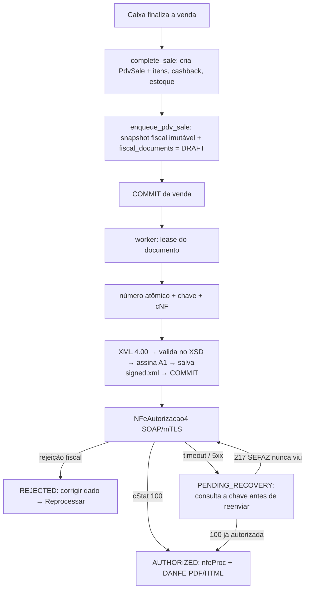
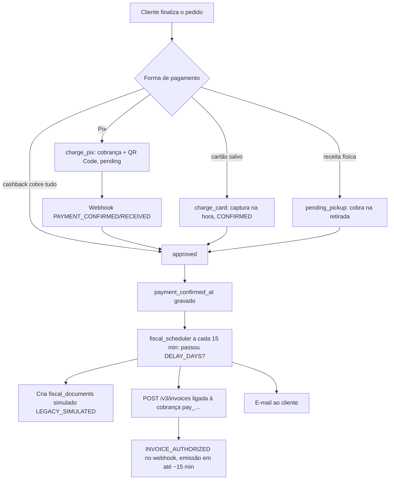

# Fluxo de pagamento e geração de nota fiscal (ponta a ponta)

Mapa único de **como uma venda vira pagamento e como vira nota fiscal** hoje. Há **dois caminhos** diferentes, com mecanismos e maturidade diferentes. Detalhes: [[Modulo_Fiscal]], [[Modulo_PDV]], [[Modulo_Carrinho_Pedidos]], [[../05_Integracoes_Infra/Asaas|Asaas]], [[../05_Integracoes_Infra/SEFAZ_NFCe_SVRS_DF|SEFAZ_NFCe_SVRS_DF]]. Docs técnicos no repositório: `farmaura-api/docs/fiscal/NFCE.md` e `farmaura-api/docs/asaas/ASAAS.md`.

| | **Balcão (PDV)** | **Marketplace (online)** |
|---|---|---|
| Pagamento | Dinheiro / Pix / débito / crédito na maquininha, ou cartão salvo cobrado no Asaas (`marketplace_card`) | Pix ou cartão salvo, sempre pelo Asaas |
| Documento fiscal | **NFC-e real** (SEFAZ-DF via SVRS) | **Documento simulado** (`LEGACY_SIMULATED`) + nota de serviço agendada no Asaas |
| Quando | Na hora, logo após a venda (assíncrono, segundos) | Diferido: `APP_FISCAL_ISSUANCE_DELAY_DAYS` após o pagamento (padrão 7 = janela do CDC) |
| Maturidade | Testado offline; homologação real pendente ([[../06_Pendencias/nfce-homologacao-real-pendente-credenciais|pendência]]) | Preparado para sandbox; nada executado ([[../06_Pendencias/asaas-sandbox-pendencias-apos-preparacao|pendências]]) |
| Adequação | Documento correto para varejo de mercadoria | **NFS-e é nota de serviço**: validar com o contador ([[../06_Pendencias/nfce-marketplace-documentos-simulados|pendência]]) |

## 1. Balcão: venda → NFC-e

- **A venda nunca depende da SEFAZ**: nenhuma rede dentro da transação; falha fiscal não desfaz nem duplica a venda.
- **Sem perfil tributário completo do produto, ou sem `NFCE_ENABLED`, a nota não sai** (a venda continua). Sem o módulo ligado nenhum documento é criado.
- **Venda com taxa de entrega não emite** até decisão contábil ([[../06_Pendencias/nfce-pdv-troco-taxa-entrega-cashback-e-card|pendência]]).
- Estados: `DRAFT → VALIDATING → SIGNING → SENDING → AUTHORIZED` (+ `REJECTED`, `DENIED`, `PENDING_RECOVERY`, `ERROR`, `CANCELED`). `CANCELED`/`DENIED` são finais.
- Depois de autorizada: imprimir (HTML 80 mm ou PDF), baixar XML, enviar por e-mail, **cancelar** (gerente/admin, até 30 min), **consultar a SEFAZ**, e (admin) **inutilizar** numeração. Tudo no painel **Fiscal (NFC-e)** e no modal do balcão.
- Produção só com `FISCAL_ENV=producao` **e** `FISCAL_PRODUCTION_ENABLED=true`. Contingência offline **não** habilitada ([[../06_Pendencias/nfce-contingencia-offline-assinatura-qr-v3|pendência]]).

## 2. Marketplace: pedido → pagamento → nota

- `gateway_payment_id` (`pay_…`) é a chave que liga **pedido ↔ webhook ↔ nota**.
- Cobrança de cartão/Pix leva `dueDate`; cartão leva também `remoteIp` (exigências da API do Asaas).
- Falha na nota **não falha o pedido**: fica no log (`asaas invoice skipped/failed …`).
- O documento **simulado** existe porque o marketplace ainda não tem NFC-e/NF-e real; o cliente pode "baixá-lo" e ele **não é válido fiscalmente**.

## 3. Ambientes

| Ambiente | Asaas | SEFAZ |
|---|---|---|
| Dev/docker/staging | **só sandbox** (a API de produção é recusada por código) | homologação |
| Produção | `APP_ENV=production` + chave real | `FISCAL_ENV=producao` + `FISCAL_PRODUCTION_ENABLED=true` (bloqueada hoje) |

## 4. Como testar

- Asaas: [[../07_POPs_Processos/testar-asaas-sandbox|POP testar Asaas no sandbox]] — chave do sandbox, webhook público, `--charge`, `--invoice`; Pix só se confirma pelo painel do sandbox.
- NFC-e: [[../07_POPs_Processos/emitir-nfce-em-homologacao|POP emitir NFC-e em homologação]] — certificado A1, emitente, perfil tributário, `fiscal_homologation_check.py`.
- Testes automatizados sem Docker (Windows): [[../07_POPs_Processos/executar-testes-python-sem-docker-no-windows|POP]].

## 5. O que ainda falta (visão consolidada)

1. Credenciais e primeira execução real (Asaas sandbox e SEFAZ homologação).
2. Perfil tributário dos produtos e CRT (contador).
3. Decisão sobre a nota do marketplace (simulada × NFC-e/NF-e × NFS-e do Asaas).
4. Migration `20260920_05` em Postgres real, `uv lock`, build do front ([[../06_Pendencias/aplicar-migration-nfce-fiscal-em-producao|migration]], [[../06_Pendencias/nfce-schemas-pl-010f-uv-lock-e-front-nao-buildado|lock e front]]).
5. Contingência offline (fórmula do QR v3) e IP real atrás do gateway ([[../04_Seguranca_Riscos/webhook-asaas-ip-allowlist-valida-ip-interno-errado|nota de segurança]]).

## Atualizações

- 2026-09-20: nota criada — visão única dos dois caminhos (balcão/NFC-e e marketplace/Asaas) depois do módulo NFC-e e do preparo do sandbox. Decisões: [[../00_Decisoes/2026-09-20-nfce-real-svrs-df-homologacao|NFC-e]], [[../00_Decisoes/2026-09-20-asaas-sandbox-guarda-remoteip-e-nota-no-formato-real|Asaas]].
