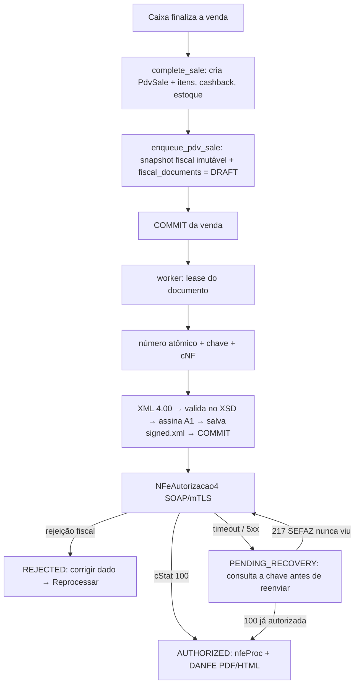
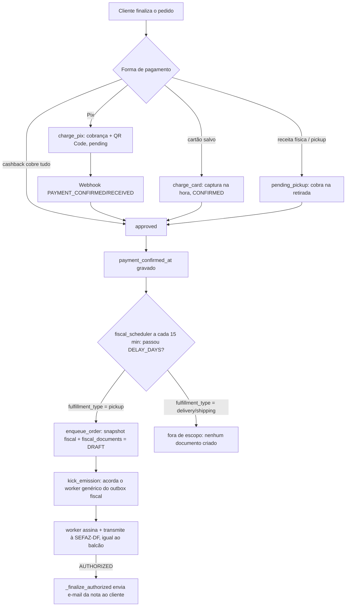

# Fluxo de pagamento e geração de nota fiscal (ponta a ponta)

Mapa único de **como uma venda vira pagamento e como vira nota fiscal** hoje. Há **dois caminhos** diferentes, com mecanismos e maturidade diferentes. Detalhes: [[Modulo_Fiscal]], [[Modulo_PDV]], [[Modulo_Carrinho_Pedidos]], [[../05_Integracoes_Infra/Asaas|Asaas]], [[../05_Integracoes_Infra/SEFAZ_NFCe_SVRS_DF|SEFAZ_NFCe_SVRS_DF]]. Docs técnicos no repositório: `farmaura-api/docs/fiscal/NFCE.md` e `farmaura-api/docs/asaas/ASAAS.md`.

| | **Balcão (PDV)** | **Marketplace — retirada (`pickup`)** | **Marketplace — entrega (`delivery`/`shipping`)** |
|---|---|---|---|
| Pagamento | Dinheiro / Pix / débito / crédito na maquininha, ou cartão salvo cobrado no Asaas (`marketplace_card`) | Pix ou cartão salvo, sempre pelo Asaas | Pix ou cartão salvo, sempre pelo Asaas |
| Documento fiscal | **NFC-e real** (SEFAZ-DF via SVRS) | **NFC-e real** (SEFAZ-DF via SVRS, mesmo motor do PDV) | **Nenhum documento** (fica sem nota até decisão do contador sobre frete/`indPres`) |
| Quando | Na hora, logo após a venda (assíncrono, segundos) | Diferido: `APP_FISCAL_ISSUANCE_DELAY_DAYS` após o pagamento (padrão 7 = janela do CDC) | — |
| Maturidade | Testado offline; homologação real pendente ([[../06_Pendencias/nfce-homologacao-real-pendente-credenciais|pendência]]) | Testado (50/50 nos testes de fluxo); homologação real bloqueada pelo certificado A1 ([[../06_Pendencias/certificado-a1-farmaura-ainda-nao-fornecido|pendência]]) | Sem implementação |
| Adequação | Documento correto para varejo de mercadoria | Documento correto para varejo de mercadoria — Asaas saiu do caminho fiscal, só cobra pagamento | Pendente decisão contábil ([[../06_Pendencias/nfce-marketplace-documentos-simulados|pendência]]) |

> Até 2026-09-22, todo pedido de marketplace usava um caminho único: documento simulado (`LEGACY_SIMULATED`) + NFS-e (nota de **serviço**, errada para venda de mercadoria) agendada no Asaas. Isso foi substituído para pedidos `pickup` — ver [[../00_Decisoes/2026-09-22-nfce-real-para-pedidos-marketplace-pickup|ADR]]. O código antigo (`issue_for_order`/`_schedule_asaas_invoice`) continua existindo, sem nenhum chamador, só para servir documentos `LEGACY_SIMULATED` já persistidos antes dessa data.

## 1. Balcão: venda → NFC-e

- **A venda nunca depende da SEFAZ**: nenhuma rede dentro da transação; falha fiscal não desfaz nem duplica a venda.
- **Sem perfil tributário completo do produto, ou sem `NFCE_ENABLED`, a nota não sai** (a venda continua). Sem o módulo ligado nenhum documento é criado.
- **Venda com taxa de entrega não emite** até decisão contábil ([[../06_Pendencias/nfce-pdv-troco-taxa-entrega-cashback-e-card|pendência]]).
- Estados: `DRAFT → VALIDATING → SIGNING → SENDING → AUTHORIZED` (+ `REJECTED`, `DENIED`, `PENDING_RECOVERY`, `ERROR`, `CANCELED`). `CANCELED`/`DENIED` são finais.
- Depois de autorizada: imprimir (HTML 80 mm ou PDF), baixar XML, enviar por e-mail, **cancelar** (gerente/admin, até 30 min), **consultar a SEFAZ**, e (admin) **inutilizar** numeração. Tudo no painel **Fiscal (NFC-e)** e no modal do balcão.
- Produção só com `FISCAL_ENV=producao` **e** `FISCAL_PRODUCTION_ENABLED=true`. Contingência offline **não** habilitada ([[../06_Pendencias/nfce-contingencia-offline-assinatura-qr-v3|pendência]]).

## 2. Marketplace: pedido → pagamento → nota

- `gateway_payment_id` (`pay_…`) segue sendo a chave que liga **pedido ↔ webhook ↔ pagamento**; a nota fiscal, para `pickup`, não depende mais dele — usa o mesmo outbox/worker do PDV (`app/fiscal/`), direto à SEFAZ-DF.
- Cobrança de cartão/Pix leva `dueDate`; cartão leva também `remoteIp` (exigências da API do Asaas) — isso não mudou, o Asaas continua sendo o gateway de **pagamento**.
- `Order.payment_method` (código bruto do checkout) mapeia para o `tpag` fiscal via `ONLINE_PAYMENT_METHOD_TO_TPAG` (`app/domain/fiscal.py`).
- Pedidos `pickup` sem vínculo de estoque (`inventory_item_id`) ou sem `ProductFiscalProfile` cadastrado bloqueiam a emissão (mesma regra do balcão) — o pedido em si não é afetado, só a nota fica pendente até o dado ser corrigido.
- Pedidos `delivery`/`shipping` **não geram nenhum documento fiscal hoje** (nem simulado, nem real) — ver [[../06_Pendencias/nfce-marketplace-documentos-simulados|pendência]].

## 3. Ambientes

| Ambiente | Asaas | SEFAZ |
|---|---|---|
| Dev/docker/staging | **só sandbox** (a API de produção é recusada por código) | homologação |
| Produção | `APP_ENV=production` + chave real | `FISCAL_ENV=producao` + `FISCAL_PRODUCTION_ENABLED=true` (bloqueada hoje) |

## 4. Como testar

- Asaas: [[../07_POPs_Processos/testar-asaas-sandbox|POP testar Asaas no sandbox]] — chave do sandbox, webhook público, `--charge`, `--invoice`; Pix só se confirma pelo painel do sandbox.
- NFC-e: [[../07_POPs_Processos/emitir-nfce-em-homologacao|POP emitir NFC-e em homologação]] — certificado A1, emitente, perfil tributário, `fiscal_homologation_check.py`.
- Testes automatizados sem Docker (Windows): [[../07_POPs_Processos/executar-testes-python-sem-docker-no-windows|POP]].

## 5. O que ainda falta (visão consolidada)

1. Certificado A1 real da FARMAURA LTDA (`.pfx`/`.p12`) — sem ele, nenhuma emissão real (balcão ou marketplace) passa de `SIGNING`, nem em homologação ([[../06_Pendencias/certificado-a1-farmaura-ainda-nao-fornecido|pendência]]).
2. `NFCE_CRT` e os códigos CSC de homologação (contador/portal SEFAZ-DF) — sem CRT, o motor assume regime normal (CST) em vez de Simples Nacional (CSOSN) na validação por produto.
3. Perfil tributário (NCM/CFOP/CST ou CSOSN) de cada produto — depende do item 2 para saber qual conjunto de campos vale.
4. Decisão sobre a nota de pedidos `delivery`/`shipping` (tratamento fiscal do frete e `indPres` de venda não presencial) — [[../06_Pendencias/nfce-marketplace-documentos-simulados|pendência]].
5. Migration `20260920_05` em Postgres real, `uv lock`, build do front ([[../06_Pendencias/aplicar-migration-nfce-fiscal-em-producao|migration]], [[../06_Pendencias/nfce-schemas-pl-010f-uv-lock-e-front-nao-buildado|lock e front]]); também a migration `20260922_01` (`orders.payment_method`) ([[../06_Pendencias/aplicar-migration-order-payment-method-em-producao|pendência]]).
6. Contingência offline (fórmula do QR v3) e IP real atrás do gateway ([[../04_Seguranca_Riscos/webhook-asaas-ip-allowlist-valida-ip-interno-errado|nota de segurança]]).

**Já resolvido (2026-09-22)**: `NFCE_ENABLED=true` e os dados de identificação (`NFCE_CNPJ`, `NFCE_IE`, `NFCE_RAZAO_SOCIAL`, endereço completo, município/IBGE, série) aplicados em `.env` local e staging, com `stores[].cnpj`/endereço e `portal_settings.marketplace_meta` restaurados para os valores reais (ver [[../00_Decisoes/2026-09-14-identidade-juridica-real-configurada-e-bug-de-endereco-corrigido|ADR atualizado]]) — o módulo já inicia e valida normalmente nos dois ambientes; só para no certificado (item 1) e no CRT/perfil tributário (itens 2-3).

## Atualizações

- 2026-09-22: `NFCE_ENABLED=true` e identificação (CNPJ/IE/razão social/endereço/série) aplicados em `.env` local e staging para permitir teste; identidade jurídica real (que tinha voltado ao placeholder de seed por um reset de ambiente) restaurada no banco dos dois lugares. Ver [[../00_Decisoes/2026-09-14-identidade-juridica-real-configurada-e-bug-de-endereco-corrigido|ADR atualizado]].
- 2026-09-22: pedidos de marketplace com retirada em loja (`pickup`) passaram a emitir NFC-e real, direto à SEFAZ-DF, pelo mesmo motor do PDV — o Asaas saiu do caminho fiscal (continua só para pagamento). Pedidos `delivery`/`shipping` ficam sem nenhum documento até decisão do contador. Ver [[../00_Decisoes/2026-09-22-nfce-real-para-pedidos-marketplace-pickup|ADR]].
- 2026-09-20: nota criada — visão única dos dois caminhos (balcão/NFC-e e marketplace/Asaas) depois do módulo NFC-e e do preparo do sandbox. Decisões: [[../00_Decisoes/2026-09-20-nfce-real-svrs-df-homologacao|NFC-e]], [[../00_Decisoes/2026-09-20-asaas-sandbox-guarda-remoteip-e-nota-no-formato-real|Asaas]].
